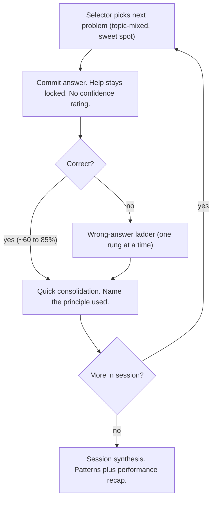
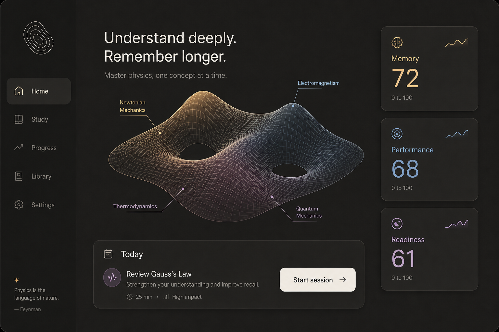
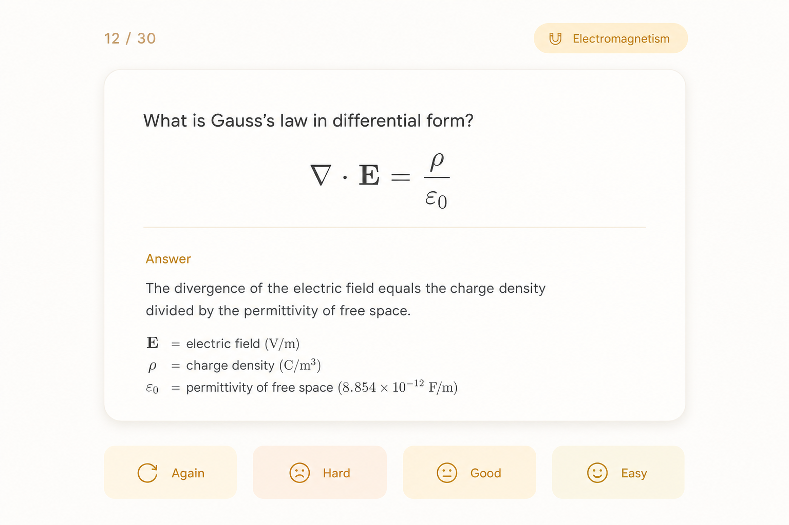
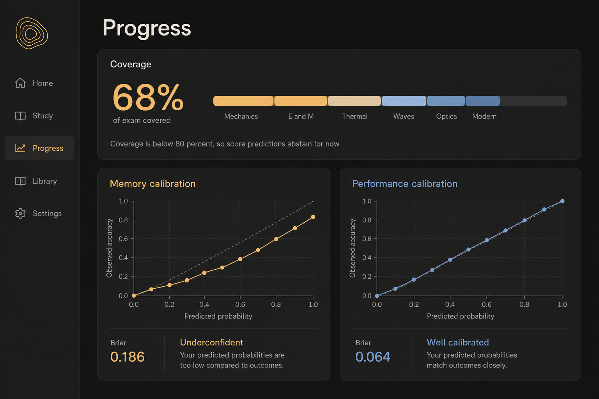
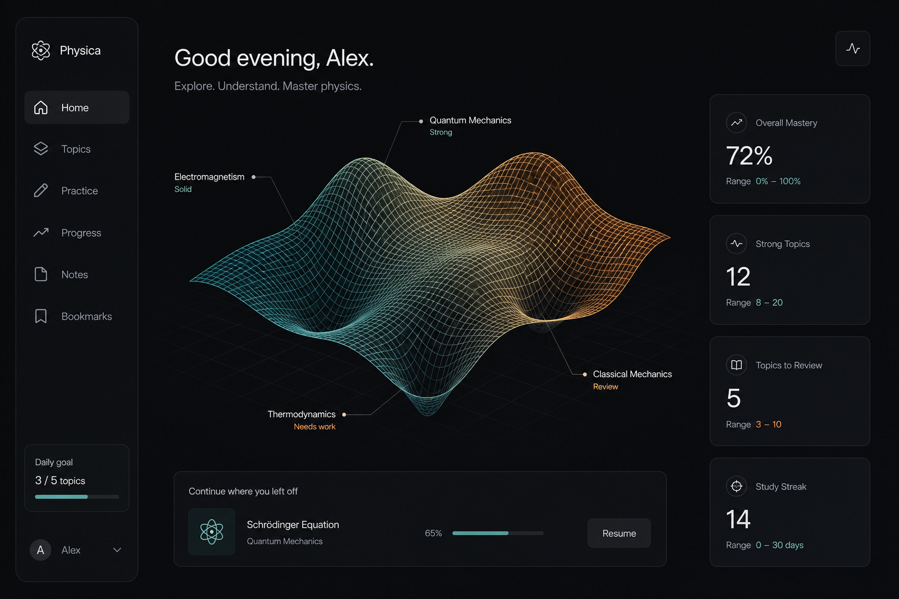

# pgrep UI/UX Foundation

**Status: designed (core).** Shared mission / constraints / exam facts live in `overview.md`. Surfaces and IA originate in `vision-and-structure.md`; the four features that fill these screens are in `features.md` and the `feature-*.md` docs.

**One line:** pgrep is _an honest physics instrument that renders your readiness beautifully._

> **Copy rule (locked, applies to all UI text):** no em-dashes, and no colon-heavy phrasing. Use periods, commas, and short labels. This doc follows the same rule.

---

## 1. Identity

- **Soul:** honest measuring instrument + editorial physics. Every number carries its own honesty. Equations are set like a good textbook, not stuffed into generic SaaS chrome.
- **Skin:** the element craft of Claude, Cursor, Apple, and Linear / modern YC-startup tooling. Restraint, generous whitespace, soft rounded geometry, one meaning-bearing accent on a calm neutral base, subtle depth, confident understated motion, content first.
- **Theme:** adaptive. Light and dark are both first-class and both must be beautiful.
- **Logo:** the nested-contour "blob" mark (top-right of the logo sheet in section 10). It reads as a miniature knowledge map, so the mark and the product tell the same story. Distilled from a Calabi-Yau / higher-dimensional manifold, kept as a clean 2D glyph that survives at 16px.

## 2. Design principles

1. **Honesty at the system level, not the component level.** Each score shows its essential honesty inline (number, likely range, how-sure, last-updated, and an honest abstain when data is thin). The deeper evidence (coverage, model calibration, the reasons) lives in its own natural home and is cross-linked. Evidence is a connected web, not a stack crammed under one number.
2. **Content leads, chrome recedes.** Calm, one thing at a time, progressive disclosure.
3. **Color means something.** The three score hues are reserved as a data language and are never used for decoration.
4. **Reframe struggle as progress.** Never punish a wrong answer, never flatter a right one.
5. **Physics is first-class.** Real math (MathJax) and figures are core content, not attachments.
6. **Clean and buildable beats aspirational.** Prefer a crisp technique that ships over a photoreal one that does not.

## 3. Design language

### 3.1 Typography

- **UI:** a premium humanist / geometric sans (Inter, SF Pro, or Geist family).
- **Numbers and data:** tabular monospaced numerals so scores, ranges, and timers read like an instrument and do not jitter as they update.
- **Math:** MathJax as a first-class citizen (the fork already ships MathJax 3). This is where the editorial-physics beauty lives, so we do not need a decorative serif in the UI. KaTeX is an optional lighter swap, not required.
- **Serif:** held in reserve for rare editorial moments (onboarding, the "why" behind a score). Optional.

### 3.2 Color palette

Neutrals are warm (Anthropic-flavored). The dark canvas is a warm dark grey, not a void black. Accents are pastel and Nord-flavored.

| Role                          | Light                          | Dark                   |
| ----------------------------- | ------------------------------ | ---------------------- |
| Canvas                        | `#FBFAF8`                      | `#262624` (warm grey)  |
| Surface / card                | `#FFFFFF`                      | `#302F2C`              |
| Elevated                      | `#F5F2EC`                      | `#3A3835`              |
| Border (hairline)             | `#E8E4DA`                      | `#45433E`              |
| Text                          | `#262624`                      | `#ECEAE3`              |
| Muted text                    | `#6E6B64`                      | `#A5A199`              |
| **Memory** (pastel amber)     | text `#A9752A`, fill `#EBCB8B` | `#EBCB8B`              |
| **Performance** (pastel blue) | text `#5E81AC`, fill `#81A1C1` | `#81A1C1`              |
| **Readiness** (Nord lilac)    | text `#7E6593`, fill `#C4A7D6` | `#C4A7D6`              |
| Primary action (monochrome)   | `#262624` on `#FBFAF8`         | `#ECEAE3` on `#262624` |
| Success                       | `#A3BE8C`                      | `#A3BE8C`              |
| Caution                       | `#D08770`                      | `#D08770`              |
| Error                         | `#BF616A`                      | `#BF616A`              |

Reserved meanings, everywhere: **amber = Memory, blue = Performance, lilac = Readiness.** State colors (success, caution, error) are a separate set and never collide with the score language. Interactive elements (buttons, links, focus rings) are **monochrome**, so the only meaning-bearing color on screen is the data.

### 3.3 Shape, depth, spacing

- Rounded "squircle" cards, hairline borders plus very soft shadows.
- An 8pt spacing grid, generous negative space, one primary action per screen.

### 3.4 Motion

- Calm spring motion, roughly 200 to 300ms, confident rather than bouncy.
- The manifold morphs smoothly as stats change.
- Nothing freezes the screen for more than 100ms (a spec speed rule).

### 3.5 Voice

**Honest instrument, lightly human.** Truth first. Warmth comes from reframing (for example "in-session accuracy understates your learning"), never from empty praise. No em-dashes, no colon-heavy phrasing.

## 4. Navigation shell

- **Desktop:** a quiet left rail. `Home`, `Study`, `Progress`, `Library`, `Settings`.
- **Mobile:** a bottom tab bar with the companion subset. `Home`, `Study`, `Progress`.
- **Diagnostic** is a first-run and re-runnable flow, not a permanent tab. **Exam mode** and **Focus drill** live inside `Study`.

## 5. The knowledge manifold (Home hero)

The hero of the app is a **3D wireframe manifold**, a clean mathematical surface plot rather than photoreal terrain. It is both an overview and a launchpad.

**Encoding (how it conforms to your stats):**

- **Height** = Performance (can you do the problems).
- **Glow / hue** = Memory (can you recall it).
- **Holes** = knowledge gaps. **Fog / bare wireframe** = uncovered topics. Low coverage makes the surface visibly incomplete, which is honest by construction. You cannot fake readiness over a hole.
- Topic **footprint** tracks the exam blueprint weight, so the layout teaches what matters.

**Behavior:**

- Tap a region to drill into that topic (this is the Focus drill entry from `feature-interleaving.md`).
- **Buildability:** default to the clean wireframe / displaced-plane surface (Three.js), with a 2D top-down contour projection as the reliable fallback and small-screen mode. A future **Bridge** toggle can lift a second Memory surface above the Performance surface to visualize the memory-to-performance gap directly (see section 10).
- **Honesty pairing:** the manifold is the emotional overview. The exact numbers, ranges, and coverage always coexist beside it and in Progress.

## 6. Honesty as a system

**Score card anatomy (Home).** Each of Memory, Performance, Readiness shows:

- the point number in tabular figures,
- a **likely range** (for example "64 to 74"), never a bare number,
- a **how-sure** read,
- **last-updated**,
- and an **abstain state** when data is thin ("Not enough evidence yet") that names what is missing and links to it.

**The evidence web.** Coverage, model calibration, and the reasons behind a score are not crammed under the number. They live in Progress and are cross-linked. Readiness is **gated by coverage**. When coverage is below the line, Readiness abstains and points at the coverage element.

**Calibration is model calibration (locked, per `feature-calibration.md`).** We do **not** capture user confidence and there is **no predict-before-answer step**. Calibration is shown honestly in the dashboard as reliability diagrams plus a Brier score for Memory and Performance.

## 7. Surfaces

### 7.1 Home (Readiness)

The command center. The manifold hero, the three score cards, a single **Today** card (the one best next action plus `Start session`), and a quiet streak. See `assets/ux/v2-home-dark.png`.

### 7.2 Study

The training and measuring instrument, and the home of features F1 (interleaving order), F3 (productive failure), and the Cards / Problems doors.

**Session launcher:** `Start today's session` (interleaved, recommended), `Focus drill` (one topic), `Exam mode` (timed mock).

**The problem arc (Problems door, performance, blue accent):**

- **Commit gate:** select an answer and `Commit`. Help unlocks only after commit. There is no confidence control. See `assets/ux/v2-commit-dark.png`.
- **Wrong-answer ladder:** `Nudge` (name the kind of problem, never the answer), then **L2 Break it down** (sub-goal decomposition plus self-explanation), then `Sibling worked example` (same principle, different problem), then `Reveal plus explain-back`. A visible hint budget, giveaway-safe, and a static fallback when AI is off.
- **L2 detail:** the decomposition is pre-computed and stored with the problem (ordered sub-goals plus a small rubric each). At hint time the learner produces each sub-goal plus a one-line reason, then `Show the step` reveals the stored sub-goal for self-comparison (AI off), or the rubric grades and probes the gap (AI on). The final answer never appears until Reveal. See `assets/ux/v2-ladder-dark.png`.
- **Cards door (memory, amber accent):** retrieval then reveal then FSRS grade (`Again`, `Hard`, `Good`, `Easy`). Math is set beautifully. See `assets/ux/v2-cards-light.png`.
- **Exam mode:** timed, real PGRE proportions, zero help. A large countdown, a question navigator, a flag toggle, and a clear "no hints" line. This is the readiness-measuring instrument. See `assets/ux/v2-exam-dark.png`.
- **Session synthesis:** patterns across the session plus a performance recap. Calibration itself lives in Progress, not here.

### 7.3 Progress (the evidence ledger)

Where honesty lives. A **Coverage** element (percent of exam covered, per-topic, that gates Readiness and states the abstain rule), and **model calibration** (reliability diagram plus Brier for Memory and Performance, with a plain-language read such as "well calibrated" or "underconfident"), plus per-topic mastery and trends. See `assets/ux/v2-progress-dark.png`.

### 7.4 Library (content, forced generation)

`Author a seed`. The learner writes one conceptual card in their own words, then the AI conforms siblings to that style. Every generated card cites a **named source**, shows a verification status, and passes a gold-set gate before entering the deck. See `assets/ux/v2-library-dark.png`.

### 7.5 Settings

AI on/off (the AI-off path always works), sync, target retention, test date, appearance (light / dark / system), account.

### 7.6 Diagnostic

First-run and re-runnable adaptive placement that seeds the manifold. Topics are placed as strong or rusty, with no cold bucket in core, since the persona is post-undergrad.

## 8. Component patterns (reusable)

- **Score card** (number, range, how-sure, last-updated, abstain).
- **Study card frame** (minimal chrome, progress, topic chip, exit).
- **Choice list** (five choices A to E, monochrome default, blue select for problems).
- **Hint rung** (calm card, budget indicator, `Show the step`, never leaks the answer).
- **Coverage bar** (segmented by topic, abstain note).
- **Reliability diagram** (predicted vs observed, diagonal reference, Brier).
- **Manifold** (wireframe default, 2D contour fallback, Bridge toggle later).

## 9. Adaptive and mobile

Both themes are first-class (section 3.2). Mobile is the companion subset: a readiness glance (manifold thumbnail plus the three scores with ranges) and a session that mirrors desktop. Authoring, deep Progress, and Library are desktop-first. See `assets/ux/v2-mobile-dark.png`.

## 10. Tech stack alignment (build targets)

Confirmed against the fork so the design is buildable as specified.

- **Desktop frontend:** Svelte 5 plus TypeScript in `ts/`, on the forked engine, with `aqt` (PyQt) as a thin host. Styling is the existing SCSS plus CSS-variable theming (`ts/lib/sass`), light and dark via the `.night-mode` class. It is not Tailwind and not React. pgrep adds new tokens (the warm neutrals and the Nord pastel accents) into that variable system.
- **Math:** the fork ships **MathJax 3** (`ts/mathjax`). Use it. KaTeX is an optional lighter swap, not required.
- **2D charts and the contour view:** **D3 7** is already in the stack (Anki's stats graphs use it). Reliability diagrams, coverage bars, and the 2D top-down manifold fallback all use D3. No new dependency.
- **3D manifold:** the one net-new frontend dependency. A WebGL library (Three.js or similar) for the wireframe surface. The 2D D3 contour is the reliable zero-new-dep fallback and the small-screen default, which is exactly the 2D and 3D toggle in section 5.
- **Mobile:** native, not web. Custom SwiftUI (iOS) and Compose (Android) over a new `rslib/ffi` crate (see `technical-architecture.md`). The tokens and layouts are platform-agnostic and get reproduced natively. The manifold uses native 3D (SceneKit or Metal) or the 2D fallback. So the Claude Design prompts cover the desktop web surfaces, and the mobile screens are a native translation of the same system.
- **Data model fit:** the ladder reads `solution_decomposition` (stored sub-goals plus rubrics) on the new Problem notetype, and a commit writes an Attempt note (see `technical-architecture.md` section d). The UI here matches that model.

### Dependencies (final decisions)

**Approved additions:**

- **Three.js** (`three` + `@types/three`, MIT) for the 3D manifold and the future Bridge view. Installed in build layer L2 when the manifold component imports it. The 2D D3 contour stays the fallback, so the app never hard-depends on WebGL.
- **Fonts (self-hosted, OFL):** **Inter** for UI (with tabular lining figures for scores and timers) plus **JetBrains Mono** for data and the exam timer. Deliver via Fontsource variable packages (`@fontsource-variable/inter`, `@fontsource-variable/jetbrains-mono`) or vendored woff2. Add `--font-ui` and `--font-mono` tokens in `ts/lib/sass`. Geist and Geist Mono are the alternative pairing if we want the Vercel edge.
- **Lucide** icons (`lucide-static`, ISC) for pgrep's new surfaces, imported via the existing `.svg?component` pattern in `ts/lib/components/icons.ts`. Anki's existing `@mdi` usage stays untouched.

**Already in the stack, no add:** D3 7 (reliability diagrams, coverage bars, and the 2D contour via `d3-contour`), MathJax 3 (equations), Svelte 5 motion primitives `spring` and `tween`, `bootstrap-icons` plus `@mdi/svg`.

**Skipped (with reason):** Threlte (raw Three.js is enough for one viz), KaTeX (keep MathJax, revisit only if the review loop profiles slow), charting frameworks (reuse the `ts/routes/graphs` D3 conventions), motion libraries (Svelte built-ins suffice).

**Install and verify path (yarn 4, vendored toolchain):** `out/extracted/node/bin/yarn add <pkg>`, then `just fix-minilints` to refresh `ts/licenses.json`, then `just lint` (`check:svelte`, `check:typescript`, `check:eslint`) plus a web build. Licenses: Three.js MIT, Inter and JetBrains Mono OFL, Lucide ISC. All compatible with AGPL.

**API docs during build:** use Context7 (`resolve-library-id` then `query-docs`) for Three.js, Svelte 5, D3, and Lucide. Verified working: it returns the exact PlaneGeometry height-displacement, wireframe, and per-vertex-color pattern the manifold needs.

**Conflict check (verified against the registry and the fork):** pinned versions three 0.185, `@fontsource-variable/inter` and `jetbrains-mono` 5.2.x, `lucide-static` 1.23, `@types/three` 0.185. `three`, both fonts, and `lucide-static` have no runtime and no peer dependencies, and none clash with existing packages. `@types/three` pulls a few type-only transitive packages into the dev tree only (harmless). Icons use the same `@poppanator/sveltekit-svg` plugin (default config already resolves node_modules SVGs for `@mdi`), so `lucide-static` works identically. The Vite build floor is `chrome77` and `safari14`; the desktop Qt webview (Chromium 77) supports WebGL2 for the manifold, and the 2D D3 contour covers any WebGL2-less context, so there is no hard conflict (scope a compat lint override on the manifold module). New font tokens are scoped to pgrep surfaces so Anki note rendering is unaffected.

**Reconciled (2026-07-01):** `build-plan.md` (L2.1) and `vision-and-structure.md` previously mentioned "predict-before-answer capture"; both are now aligned to the locked calibration decision — commit only, no confidence capture, model calibration shown in Progress.

## 11. Concept renders

These are direction-setting concept renders, not final UI. The real screens are built in `ts/` (Svelte / TS), with MathJax for math and the manifold as a Three.js surface with a 2D contour fallback.

**Home (dark, locked palette)**

**Study, commit view (no confidence, corrected)**

**Study, hint ladder at L2 (sub-goal decomposition)**

**Cards door (light mode)**

**Progress (coverage plus model calibration)**

**Library (author a seed, AI-conformed siblings, sources cited)**

**Exam mode (timed, zero help)**

**Mobile companion (readiness glance plus a session)**

**Manifold hero style (buildable wireframe) and the future Bridge toggle**

**Logo exploration (the chosen mark is the nested-contour blob, top-right)**

## 12. Corrections captured from the updated plans

- **No user-confidence capture and no predict-before-answer step** (per `feature-calibration.md`). Earlier concepts that showed a "how sure are you" control are superseded.
- **Commit-before-help stays**, but it belongs to productive failure (F3), not calibration.
- **Calibration is model calibration**, shown in Progress as reliability diagrams plus Brier, not a per-session confidence recap.
- **Ladder L2 is sub-goal decomposition plus self-explanation** over stored sub-goals, with reveal-and-self-compare (AI off) or rubric grading (AI on).
- **Forced generation** authors one conceptual seed per topic unit, then AI conforms siblings, with provenance and a gold-set gate.

## 13. Open items

- Exact manifold interaction (rotation, level-of-detail, the 2D and 3D toggle threshold).
- Whether the Bridge (two-surface) view is a Home toggle or a Progress element.
- Final type family selection and licensing.
- Diagnostic screen flow (v0 scope).
- Small-screen density for the manifold thumbnail.

_Sources: `overview.md`, `vision-and-structure.md`, `features.md`, `feature-interleaving.md`, `feature-productive-failure.md`, `feature-calibration.md`, `feature-forced-generation.md`; the project spec (honesty rule, speed rules, three scores); the brainstorming session that produced the concept renders in `assets/ux/`._
