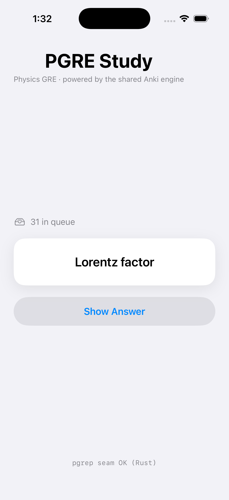

# pgrep - Wednesday proof

Physics GRE. No AI (that is Friday). Scroll through; each section shows the proof.

**Commit:** `ebf6664d0` (a fork of Anki, built from source). Show it live with
`git rev-parse HEAD`.

---

## 1. A real change inside Anki's Rust engine

A new review-card order - **points at stake** - that sorts due cards by topic
weight times student weakness, inside the engine's gather-then-limit pass.
File: `rslib/src/scheduler/queue/builder/points_at_stake.rs`.

```rust
//! Graded invariants:
//! - We only *reorder* the in-memory `Vec<DueCard>`. We never mutate `due`,
//!   `interval`, or `memory_state`, and never write collection data or create
//!   an undo entry. FSRS scheduling state is a read-only input to the scorer,
//!   so scheduling, undo, and sync are untouched.

/// Desirable-difficulty band, expressed as predicted retrievability R.
const IN_BAND_LOW: f64 = 0.60;
const IN_BAND_HIGH: f64 = 0.85;
/// Never emit more than this many consecutive cards of the same category.
const MAX_CONSECUTIVE_SAME_CATEGORY: usize = 3;
```

**Tests: 3 Rust unit tests + 1 Python test, all passing.**
The Python end-to-end test is `pylib/tests/test_pgrep_selector.py` (sets a deck's
order to `REVIEW_CARD_ORDER_POINTS_AT_STAKE` and asserts worth-ordering).

```
$ just test-rust
cargo-nextest ... check:rust_test
Build succeeded in 104.74s.

$ just test-py
check:pytest ... Build succeeded.
```

The same selector runs on the phone too (see section 5: the first card is not
first in seed order).

---

## 2. Forked, and building from source

```
$ just clean && just run
...
Build succeeded in 82.46s.
Starting Anki 26.05...
2026-07-02 14:00:01 INFO aqt.mediasrv: Serving on http://127.0.0.1:40000
2026-07-02 14:00:09 DEBUG aqt.mediasrv: GET /pgrep      <- opens straight into pgrep
```

The app opens directly into the pgrep UI (not Anki's deck browser). Anki's own
screens stay reachable via Tools > Open Anki screens.

---

## 3. Three scores, shown honestly (no made-up numbers)

- **Memory** - real, from the engine (per-topic FSRS retrievability). Shows a
  point, a likely range, and a how-sure read. Abstains when data is thin.
- **Performance** - abstains: no model yet (that is Friday).
- **Readiness** - abstains: needs performance data and 70% topic coverage first.


_Capture your Home after seeding and save it here as `desktop-home.png`._

---

## 4. A real review loop on the exam deck

Study > Cards runs the real FSRS loop (Again / Hard / Good / Easy) on the PGRE
deck. Study > Problems commits before revealing help.


_Capture Study > Cards and save it here as `desktop-study.png`._

---

## 5. The phone reviews the same deck (one shared engine)



Same 31-card PGRE deck the desktop seeds, on the same Rust engine. The footer
`pgrep seam OK (Rust)` confirms the live engine; the first card ("Lorentz
factor") is not first in seed order, which shows the points-at-stake selector
running on the phone. Two-way sync is not required Wednesday; reviewing the same
deck is.

---

## 6. Desktop installer (clean machine)

```
file:    anki-26.05-mac-apple.dmg
size:    220 MB   arch: apple silicon (arm64)
signing: ad-hoc (Gatekeeper: right-click > Open the first time)
path:    out/installer/dist/anki-26.05-mac-apple.dmg
```

Rebuild from the current commit before the clean-machine install:

```
just wheels
out/pyenv/bin/python qt/tools/build_installer.py --version 26.05 build \
  --aqt_wheel out/wheels/aqt-*.whl --anki_wheel out/wheels/anki-*.whl --skip_fcitx
out/pyenv/bin/python qt/tools/build_installer.py --version 26.05 package
```

On a fresh macOS account: open the dmg, drag to Applications, right-click > Open,
confirm it launches into pgrep.

---

## Wednesday checklist

- Forked + building from source - section 2
- Real Rust change + 3 Rust tests + 1 Python test - section 1
- Review loop on the exam deck - section 4
- Honest Memory score (range + give-up rule) - section 3
- Installer on a clean machine - section 6
- Phone builds + runs, loads the same deck, real review - section 5
