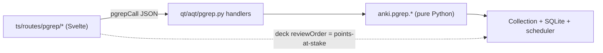

# L2 Coordination — Frontend to Backend API Contract

**Status: coordination contract for Build Layer L2 (locked for this layer).**

This is the shared contract the four L2 desktop surfaces build against so the
parallel implementers never collide and every surface calls the engine the same
way. It is grounded in the real fork (`technical-architecture.md` (c), the
`mediasrv` routing, and the L1 API surface merged into `l2-core`).

Read with: `l1-coordination-schema.md` (topic tags, blueprint, attempt-log seam),
`scoring-and-readiness.md` §1 (Memory math), `feature-interleaving.md` (two-door
session), `feature-productive-failure.md` (ladder), `ux-foundation.md` (surfaces).

> **UI scope note (this layer):** the UI is deliberately light. Plain, functional
> Svelte pages, minimal SCSS, no manifold / Three.js / D3, no new frontend deps.
> The value proven here is the real engine loop, the honest Memory math, and the
> installer. Copy rule (no em-dashes, no colon-heavy text) and the speed rule (no
> UI freeze over 100 ms) still apply.

---

## 0. Hard constraints (every surface inherits)

- **No AI. No confidence capture. No predict-before-answer.** Anywhere.
- **Never mutate `due` / `interval` / `memory_state`.** Ordering is reused via the
  L1 selector (a review-order config), never by rewriting schedule state.
- **AI-off by construction.** All scoring is pure math over FSRS state + tags.
- **Speed:** no interaction blocks the UI over 100 ms. Bound folds/queries.

---

## 1. The two channels

pgrep surfaces talk to the engine over two channels. Both are same-origin POSTs
handled by `mediasrv` (`qt/aqt/mediasrv.py`); the webview never opens a socket.

### Channel A — protobuf backend RPCs (`@generated/backend`)

Anki's built-in mechanism. The webview POSTs a protobuf body to `/_anki/<method>`
and the raw backend runs it. A method must be listed in
`exposed_backend_list` in `qt/aqt/mediasrv.py` to be reachable. L2 uses this only
where the engine already speaks it well:

- **Per-card retrievability / FSRS state** feeds Memory. In L2 we read this in
  Python (Channel B) via the SQL UDF `extract_fsrs_retrievability(...)` rather
  than round-tripping protobuf per card, so no new backend method is needed.

**L2 does not add new `.proto` methods.** The selector already ships its
`REVIEW_CARD_ORDER_POINTS_AT_STAKE` variant (L1.1). Everything else pgrep-specific
goes over Channel B.

### Channel B — the pgrep Python bridge (JSON)

pgrep-specific reads/writes (Memory score, coverage, diagnostic placement, the
study loop, attempt append) are **pure Python** on top of the merged
`anki.pgrep.*` package. They are exposed as `mediasrv` POST handlers.

- **Server:** each handler is a plain function `pgrep_<name>()` in the new module
  `qt/aqt/pgrep.py`, added to `post_handler_list` in `qt/aqt/mediasrv.py` once (in
  scaffolding). `mediasrv` camelCases the function name, so `pgrep_memory_score`
  is reachable at `POST /_anki/pgrepMemoryScore`.
- **Wire format:** request body is JSON bytes; response is JSON bytes
  (`application/binary` content type, per `mediasrv` permission rules). Handlers
  read `flask.request.data`, call an `anki.pgrep.*` function on `aqt.mw.col`, and
  return `json.dumps(...).encode()`.
- **Client:** surfaces call the shared helper `pgrepCall(fn, args)` in
  `ts/routes/pgrep/lib/bridge.ts` (created in scaffolding), which POSTs JSON to
  `/_anki/<fn>` with the required headers and returns the parsed JSON.
- **Handlers import their `anki.pgrep.*` module lazily** (inside the function) so
  a surface that is not implemented yet never breaks app startup.



---

## 2. Shared setup the bridge relies on

- **Selector activation:** a pgrep deck's config has
  `reviewOrder = REVIEW_CARD_ORDER_POINTS_AT_STAKE` (value 13,
  `deck_config_pb2...ReviewCardOrder`). Set once by the seed helper. Then
  `col.sched.get_queued_cards(...)` returns points-at-stake order for free.
- **Attempt log:** use the merged `anki.pgrep.attempt_log` seam only:
  `append_attempt(col, event)` (write), `attempts(col, topic, window)` and
  `performance_fold(col, topic, window)` (read). Never touch attempt storage
  directly.
- **Tags / blueprint:** use `anki.pgrep.tags` (`finest_topic`, `category_for`,
  `category_of`) and `anki.pgrep.blueprint` (`BLUEPRINT_PERCENT`,
  `CATEGORY_SLUGS`, `blueprint_percent`). Do not duplicate the table.
- **Seed content (scaffolding-owned):** `anki.pgrep.seed.seed_sample_content(col)`
  idempotently ensures a `PGRE::Sample` deck of topic-tagged Basic cards spread
  across categories (so the selector, Memory, and Coverage have real data), sets
  that deck's `reviewOrder` to points-at-stake, and (once L2.1 adds the Problem
  notetype) seeds a few Problems with stored `solution_decomposition`. A Tools
  menu action "pgrep: seed sample content" triggers it.

---

## 3. Per-surface endpoints (the contract each implementer fulfills)

All request/response payloads are JSON. Fields marked (later) are declared now for
forward-compat but not computed in L2.

### L2.2 Home / Readiness  (owner of `anki.pgrep.memory`, Home page)
- `POST /_anki/pgrepMemoryScore` -> Memory only.
  - req: `{}` (whole collection) or `{ "deck_id": <int> }`.
  - res:
    ```json
    {
      "overall": { "point": 0.0-1.0 | null, "low": 0.0-1.0, "high": 0.0-1.0,
                   "abstain": false, "reason": null },
      "by_topic": [ { "category": "mechanics", "blueprint": 0.20,
                      "point": 0.0-1.0 | null, "low": .., "high": ..,
                      "n_cards": 0, "abstain": false, "reason": null } ],
      "k_mem": 5, "last_updated": <epoch|null>
    }
    ```
  - Math (`scoring-and-readiness.md` §1): per topic `mean(R)` over that topic's
    reviewed cards; overall `Sum blueprint% * Memory(topic)` over covered topics;
    range = 80% central interval of the Poisson-binomial (mean `SumR_i`, var
    `Sum R_i(1-R_i)`); a topic with `< k_mem` (default 5) reviewed cards abstains
    (`point=null`, `reason="Not enough cards yet"`). No Performance / Readiness.

### L2.1 Study  (owner of `anki.pgrep.study`, `anki.pgrep.problem`, Study pages)
- `POST /_anki/pgrepStudyStart` -> begin/scope a session.
  - req: `{ "door": "cards" | "problems", "topic": "topic::..."|null }`.
  - res: `{ "session_id": "<uuid>", "remaining": <int> }`. Applies the
    points-at-stake order (topics interleaved within the door); `topic` scopes a
    focus drill (cross-topic interleaving off).
- `POST /_anki/pgrepStudyNext` -> the next item (no help revealed).
  - Cards res: `{ "kind":"card", "card_id":N, "question_html":"...",
    "topic":"...", "remaining":N }` (answer withheld until reveal).
  - Problems res: `{ "kind":"problem", "note_id":N, "stem_html":"...",
    "choices":["A..","B.."], "topic":"...", "remaining":N }`
    (correct answer + rationales withheld; **commit gate**).
  - `{ "kind":"empty" }` when the door is exhausted.
- `POST /_anki/pgrepStudyAnswerCard` (Cards door) -> grade after reveal.
  - req: `{ "card_id":N, "rating": 1|2|3|4 }` (Again/Hard/Good/Easy).
  - Uses `col.sched.answer_card`. res: `{ "ok": true }`.
- `POST /_anki/pgrepStudyCommit` (Problems door) -> commit before any help.
  - req: `{ "note_id":N, "session_id":"..", "selected":"A".."E" }`.
  - res: `{ "correct": bool, "correct_choice":"C",
    "rationale_html":"...", "ladder": [ { "rung":"nudge"|"decompose"|
    "sibling"|"reveal", "prompt_html":"...", "reveal_html":"..." } ] }`.
    The ladder rungs come from the stored `solution_decomposition` (static, AI
    off; reveal-and-self-compare). Commit appends one Attempt note via
    `append_attempt` (topic, correct, selected_option, session_id, answered_at).
    The final answer only appears at the `reveal` rung.
- **Problem notetype** `pgrep::Problem` (created here): fields `stem`, `choices`
  (JSON array), `correct` (letter), `distractor_rationales` (JSON),
  `solution_decomposition` (JSON: ordered sub-goals + a short rubric each),
  `difficulty`, `source_ref`, `topic` mirror on tags. Generates one schedulable
  card. No confidence field.

### L2.3 Diagnostic v0  (owner of `anki.pgrep.diagnostic`, Diagnostic flow)
- `POST /_anki/pgrepDiagnosticTopics` -> topics to place.
  - res: `{ "topics": [ { "category":"mechanics", "blueprint":0.20,
    "placement":"strong"|"rusty"|null, "n_cards":N } ] }`.
- `POST /_anki/pgrepDiagnosticPlace` -> record placement.
  - req: `{ "results": [ { "category":"mechanics",
    "outcome":"correct"|"wrong" } ] }`.
  - res: `{ "topics": [ { "category":"mechanics",
    "placement":"strong"|"rusty" } ] }`. Persona is post-undergraduate, so there
    is **no cold bucket**; label each covered topic strong or rusty, seeded from
    FSRS R (and the quick check). Placement snapshot is stored in `col`'s config
    (small rolled-up state), re-runnable.

### L2.4 Progress / Coverage  (owner of `anki.pgrep.coverage`, Progress page)
- `POST /_anki/pgrepCoverage` -> coverage ledger.
  - res:
    ```json
    { "overall_pct": 0.0-1.0,
      "gate": 0.70,
      "by_topic": [ { "category":"mechanics", "blueprint":0.20,
                      "covered": true, "n_cards":N, "memory_point":0.0-1.0|null } ],
      "abstain_note": "Readiness abstains until coverage reaches the gate." }
    ```
  - `coverage = fraction of blueprint weight whose category has >= 1 reviewed
    card` (L2 definition; the Readiness `k_perf` gate lands in L5). Reuses
    `anki.pgrep.memory` per-topic point. Plain segmented bar, no D3.

---

## 4. File ownership (so the four surfaces never touch the same file)

**Scaffolding owns (written once, before the surfaces):**
- `qt/aqt/pgrep.py` (bridge handlers + `pgrep_post_handlers` list, lazy imports).
- `qt/aqt/mediasrv.py` (register the pgrep handlers into `post_handler_list`; add
  the pgrep page(s) to `is_sveltekit_page()`).
- The pgrep host window + Tools menu action (new `qt/aqt/pgrep_window.py`, wired
  from the menu setup) opening `/pgrep` in a `QWebEngineView`.
- `ts/routes/pgrep/+layout.svelte` (light nav shell: Home, Study, Progress) and
  `ts/routes/pgrep/lib/bridge.ts` (`pgrepCall`).
- `anki.pgrep.seed` (sample content) + a Tools action to run it.

**L2.1 Study owns:** `ts/routes/pgrep/study/**`, `pylib/anki/pgrep/study.py`,
`pylib/anki/pgrep/problem.py`, `pylib/tests/test_pgrep_study.py`,
`pylib/tests/test_pgrep_problem.py`.

**L2.2 Home owns:** `ts/routes/pgrep/+page.svelte` (Home content),
`pylib/anki/pgrep/memory.py`, `pylib/tests/test_pgrep_memory.py`.

**L2.3 Diagnostic owns:** `ts/routes/pgrep/diagnostic/**`,
`pylib/anki/pgrep/diagnostic.py`, `pylib/tests/test_pgrep_diagnostic.py`.

**L2.4 Progress owns:** `ts/routes/pgrep/progress/**`,
`pylib/anki/pgrep/coverage.py`, `pylib/tests/test_pgrep_coverage.py`.

Each surface adds only its own bridge handler bodies by implementing the
`anki.pgrep.*` function the scaffolding handler already calls (the handler
signatures above are fixed), so no surface edits `qt/aqt/pgrep.py` after
scaffolding. If a handler needs a tweak, coordinate through the controller.

---

## 5. Verification note for implementers

Builds run in the single shared `l2-core` worktree, so run tests **sequentially**
via the controller. Python pgrep modules are pure and fast to test with
`just test-py` (incremental). TS uses `just lint` (`check:svelte`,
`check:typescript`). Do not run `just run`/full `just check` concurrently.
