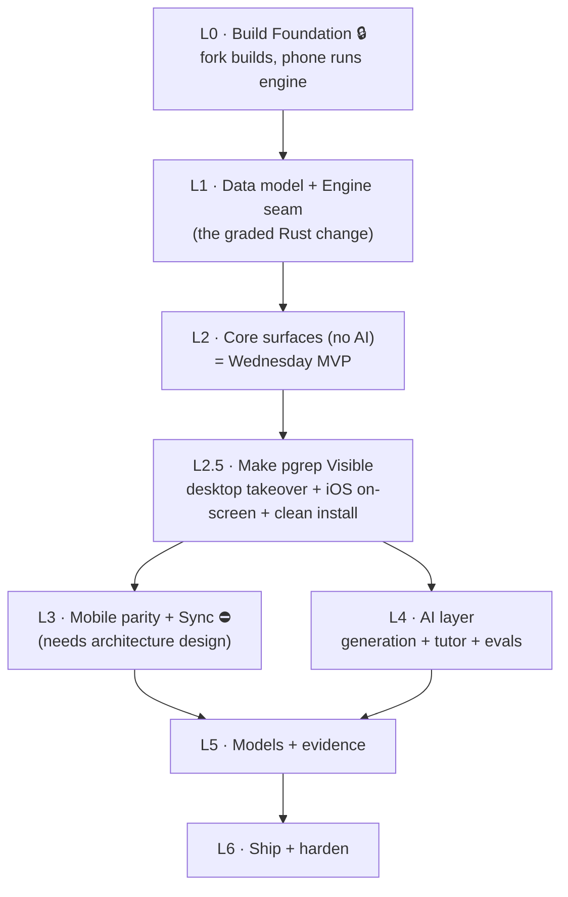

# pgrep — Build Plan & Subagent Orchestration

**Purpose:** the execution roadmap. The build is cut into **Layers (L0–L6)** you can hand to separate chats. Each layer = a self-contained unit: open a chat, point it at *this file* + the referenced design doc(s), let it orchestrate subagents through the layer's tasks (parallel where marked), pass the **exit gate**, then move to the next layer.

**How you use it:**
1. Pick the lowest-numbered layer whose **entry requirements** are green.
2. Open a fresh chat; paste the **example prompt** (bottom), swapping in that layer.
3. The chat becomes the *layer controller* — it dispatches subagents per task and runs the review gates.
4. When the layer's **exit gate** is met, start the next layer.

**Legend:** 🔒 sequential gate (nothing after it starts until it's green) · ∥ parallelizable tasks (independent files/domains) · ⛔ **design-gated** (finish the named design doc first) · ✅ design ready.

---

## Dependency map

Sequential spine: **L0 → L1 → L2 → L2.5**, then **L3 ∥ L4** (run together), then **L5 → L6**. Parallelism lives *inside* layers (see each).

> **Platform ordering (desktop-first) — the guarantee:** the **desktop app is built first and is the L2 deliverable** — an *installable, no-AI desktop app* is L2's exit gate. **Mobile parity is L3**, strictly *after* L2. You will always have a working desktop app before any mobile work begins. The "phone runs the deck" checks at **L0.3 / L2** are a **build-viability smoke test of the shared engine on a phone** (does the engine cross-compile + load a deck), **not** the mobile UI — that UI is L3. So finishing L2 = a real desktop app in hand, mobile still ahead of you.

---

## L0 — Build Foundation 🔒 (blocks everything)

- **Entry:** none. **Design ref:** `vision-and-structure.md` (architecture stance); spec "Get Anki Building First."
- **Tasks:**
  - **L0.1** Fork Anki; `just` builds desktop from source on a clean machine. *(sequential — shared build system)*
  - **L0.2** Trivial `rslib` change end-to-end (prove the seam: diff → visible in the running app).
  - **L0.3 ∥** Phone build runs the **shared engine** on device/emulator and loads a deck. *(parallel once the fork compiles)*
  - **L0.4** Dev harness: test recipes / smoke CI.
- **Exit gate:** desktop **and** phone build from source; a trivial Rust change shows up; tests run. *(The spec's hardest day-one gate — do not proceed until green.)*
- **Agents:** 1 integration agent for L0.1/L0.2 (tightly coupled); L0.3 as a parallel agent after compile.

## L1 — Data model + Engine seam (the graded Rust change) — entry: L0 ✅

- **Design ref:** `feature-interleaving.md` (selector + safe-seam + engine facts), `feature-productive-failure.md` (attempt log), `feature-forced-generation.md` (tags).
- **Coordination first (10 min):** define the shared **topic-tag field** + **attempt-log** schema (notes-as-log, "A now, C-ready" — `attempt-log-storage.md`) so the two tracks below don't collide. Then dispatch ∥.
- **Tasks:**
  - **L1.1 ∥ (Rust)** Layer-B selector: new `ReviewCardOrder` variant + selection logic (points-at-stake × 60–85% band × anti-blocking) + protobuf message + Python binding + **3 Rust tests + 1 Python test**. *Safe-seam:* reorder **within** the due set; never mutate `due`/`interval`/`memory_state`.
  - **L1.2 ∥ (Data)** two-level topic tags on notes/cards; the **Attempt log as notes** (append-only, immutable, note guid = event id, "A now, C-ready" — `attempt-log-storage.md`) feeding Performance + calibration.
- **Exit gate:** selector reorders by topic weight×weakness with anti-blocking; **undo intact, no collection corruption**; all tests green.
- **Agents:** 2 parallel implementers (Rust vs data) after the coordination task — different files, safe to parallelize.

## L2 — Core surfaces, no AI (= Wednesday MVP) ✅ COMPLETE — entry: L1 ✅

- **Deliverable: the pgrep _desktop app_.** These are the custom **desktop `ts/` pages** (Svelte 5, in the `aqt` thin host — `technical-architecture.md` (c)). **L2 ends with an installable desktop app; zero mobile dependency.**
- **Design ref:** `ux-foundation.md` (the UI: surfaces, nav, components, tokens, deps), `technical-architecture.md` (c) (desktop shell: `ts/` pages in the `aqt` host), `vision-and-structure.md`, `feature-interleaving.md` (selector + two-door session), `feature-productive-failure.md` (Problems door + ladder), `feature-calibration.md` (hook only), `three-scores.md` (§1 Memory score).
- **Coordination first:** define the frontend↔backend API (which proto/RPCs each surface calls). Then dispatch ∥.
- **Tasks (∥ — independent desktop surfaces):**
  - **L2.1 ∥** Study surface (custom reviewer; two doors Cards/Problems, topics interleaved within each; commit-before-reveal gate; no confidence capture).
  - **L2.2 ∥** Home / Readiness with the **Memory score** shown honestly (range + give-up rule; no perf/readiness yet).
  - **L2.3 ∥** Diagnostic v0 (place topics strong/rusty).
  - **L2.4 ∥** Coverage / Topic map (Progress).
- **Exit gate:** Wednesday MVP — no-AI core runs on desktop; review loop on the PGRE deck; honest Memory score; **desktop installer on a clean machine**; phone runs the deck (from L0.3).
- **Agents:** up to 4 parallel implementers (one per surface) after the API coordination task.

### L2 — status: COMPLETE (2026-07-02, merged to `main` @ `c8920769`)

Executed via subagent-driven development in a `.worktrees/l2-core` worktree, then merged to `main` (L0 + L1 + L2). Proof logs in `design/prod/proofs/`.

**Done (exit gate met):**

- **Entry check** — integrated L0 + L1.1 (selector) + L1.2 (data model) onto one base; Rust + all pgrep Python tests green. Also fixed a pre-existing gap: the `qt/installer/mac-template` git submodule was uninitialized (had been failing 2 installer tests).
- **Coordination** — `docs_pgrep/plan/l2-api-contract.md`. Two API channels: the L1 selector via a deck's `reviewOrder = POINTS_AT_STAKE` (protobuf), and a Python `anki.pgrep` JSON bridge (`qt/aqt/pgrep.py` handlers registered in `mediasrv.py`). No new `.proto` methods.
- **Scaffolding** — `qt/aqt/pgrep_window.py` + Tools-menu actions, `ts/routes/pgrep/` nav shell + `lib/bridge.ts`, and `anki.pgrep.seed` (topic-tagged sample deck + sample problems, sets points-at-stake order).
- **L2.1 Study** — two doors. Cards runs the real FSRS loop (`get_queued_cards` → `build_answer` → `answer_card`, revlog written, no corruption); Problems enforces commit-before-reveal, appends one immutable Attempt per commit, static (AI-off) wrong-answer ladder from stored `solution_decomposition` (final answer only in the reveal rung). New `pgrep::Problem` notetype. No confidence capture.
- **L2.2 Home** — honest Memory score: per-topic `mean(R)` from the engine's own `extract_fsrs_retrievability` UDF, blueprint-weighted overall (normalized over scored topics), 80% Poisson-binomial range, `k_mem` (5) abstain. No Performance / Readiness.
- **L2.3 Diagnostic v0** — places every topic strong/rusty (no cold bucket), seeded from FSRS R + a quick objective check; persisted in `col` config; re-runnable.
- **L2.4 Progress/Coverage** — coverage ledger (a category is covered when it has ≥ 1 reviewed card) + plain segmented bar; shows the 70% Readiness gate (not enforced in L2); reuses `memory.py`.
- **Selector refinement** — the parallel `f23af6834` ("truncate to top-worth before anti-blocking; hoist FSRS::new") was also merged to `main`.
- **Verification** — `just check` code targets green (rust_test incl. the selector, pytest pylib/aqt/tools, clippy, mypy, eslint, svelte, typescript); final-layer review PASS / APPROVED.
- **Installer** — real macOS `.dmg` via Briefcase (`anki-26.05-mac-apple.dmg`, ad-hoc signed), rebuilt from `main`; at `out/installer/dist/` and `~/pgrep-l2-installer/`.
- **Phone smoke (from L0.3)** — FFI host round-trip test + full `just ios-smoke` (xcframework + Simulator XCTest loading the deck) green on the L1+L2 engine.
- **Cleanup** — all layer worktrees removed (branches kept); ~40 GB reclaimed.

**Deviations / not done (intentional):**

- **UI is deliberately light** (explicit instruction to prioritize the real installer + clean build over UI). No manifold / Three.js / D3, no new frontend deps; the full `ux-foundation.md` visual system (tokens, components, manifold) is **deferred**. pgrep opens as a **Tools-menu window layered on the normal Anki app**, not as a thin host replacing Anki's main UI (`technical-architecture.md` (c) vision deferred).
- **Surfaces built sequentially**, not in true parallel: one shared worktree can't run concurrent `ninja` safely, and 4 isolated worktree builds exceeded disk headroom. The subagent-per-surface + review structure was kept.
- **Reviews** were per-surface spec+quality by the controller plus one final-layer reviewer subagent (PASS/APPROVED), rather than two separate reviewer subagents per surface.
- **Out of L2 scope (correct):** no AI, no sync, no Performance/Readiness scores (those are L3/L4/L5).
- **Human steps:** the clean-machine install and the demo screen recordings are documented in `design/prod/proofs/RECORDING.md` but must be run/recorded by a person.
- **`just check` caveat:** currently red only on untracked non-project files (`.understand-anything/*.json`, `design/prod/video/record.mjs`), not on pgrep code.
- **Not pushed:** `main` is local; `origin/main` unchanged.

## L2.5 — Make pgrep Visible (desktop takeover + iOS on-screen + clean install) — entry: L2 ✅

- **Why:** L2 shipped pgrep as a Tools-menu window layered on normal Anki (see the L2 "Deviations" block above), but `technical-architecture.md` (c) called for `aqt` as a **thin host** with pgrep surfaces **replacing** Anki's screens. L2.5 closes that deviation and hardens two proofs (visible mobile, clean install) before L3. **Full plan: `l2.5-onscreen-proof.md`.**
- **Design ref:** `l2.5-onscreen-proof.md`, `technical-architecture.md` (a) + (c).
- **Tasks:**
  - **A ∥ (Desktop takeover — Option A now, C-ready)** `just run` + the dmg open into the pgrep surface, not the deck browser; Anki's screens stay reachable via **Tools → Open Anki screens**. New `qt/aqt/pgrep_host.py` (surface-mode flag in local profile meta, default `hosted`) + a `pgrep` main-window state that hosts the `/pgrep` SPA in a PGREP-kind webview beside `MainWebView` (visibility toggle, not a reparenting stack).
  - **B ∥ (iOS visible)** new `tools/ios-run.sh` + `just ios-run`: build the app scheme, boot a Simulator, install + launch the existing `PgrepStudy` review app (today only the headless `just ios-smoke` XCTest runs it).
  - **C (Clean install)** rebuild wheels + dmg from this branch so the packaged app inherits the takeover; repeatable fresh-account install verification (`design/prod/proofs/RECORDING.md` Proof C).
- **Exit gate:** `just run` opens into pgrep (fallback works); `just ios-run` shows the review app running in the Simulator; the rebuilt dmg installs on a clean account and opens into pgrep; `just check` code targets green.
- **Deferred (bucketed):** the full `ux-foundation.md` visual system (imported later — L2.5 does not restyle surfaces); Option C (remove Anki's screens entirely) is the later one-line flip; no AI / sync / Performance / Readiness.

### L2.5 — status: COMPLETE (2026-07-02, branch `l2.5-onscreen`)

Implemented on a lightweight `l2.5-onscreen` branch off `main` (not a separate worktree, so the desktop build stays warm and `just run` in the main checkout reflects it after a restart).

**Done (exit gate met):**

- **A — Desktop takeover (Option A, C-ready):** new `qt/aqt/pgrep_host.py` (surface-mode flag in local `pm.meta`, default `hosted`) + `qt/aqt/main.py` wiring — a `pgrep` main-window state that hosts the `/pgrep` SPA in a PGREP-kind webview beside `MainWebView` (visibility toggle), `loadCollection` defaults to it, and a **Tools → Open Anki screens** fallback. `just run` and the dmg now lead with pgrep.
- **B — iOS visible:** new `tools/ios-run.sh` + `just ios-run`. Built + launched the `PgrepStudy` app on the iPhone 17 Pro Simulator; the review loop is visible with the live `pgrep seam OK (Rust)` footer (screenshot at `out/ios/pgrep-ios.png`).
- **C — Clean install:** rebuilt wheels + `out/installer/dist/anki-26.05-mac-apple.dmg` from this branch; verified the packaged bundle contains `pgrep_host.pyc` + rebuilt `main.pyc` (the takeover). `design/prod/proofs/RECORDING.md` Proof C updated.
- **Verification:** `just lint` (clippy, mypy, ruff, eslint, svelte, typescript) and `just test-py` green.

**Deviations / not done (intentional):**

- **`just check` caveat (pre-existing, broader than the L2 note):** the full `just check` format step is red on formatting debt that predates L2.5 — `check:format:dprint` on untracked `.understand-anything/*.json` **and** several already-committed planning docs (`feature-forced-generation.md`, `frontend-execution-guide.md`, and `build-plan.md` itself), plus `check:minilints` on `design/prod/video/record.mjs`. All **code** targets pass (`just lint` = clippy/mypy/ruff/eslint/svelte/typescript, and `just test-py`). L2.5's own new files (`pgrep_host.py`, `l2.5-onscreen-proof.md`, `dev-harness.md` additions, `RECORDING.md`) are dprint-clean; the pre-existing doc/artifact debt is left untouched (out of L2.5 scope).
- **Two human/visual steps:** (1) restart `just run` to see the desktop takeover live (the instance running during the build predated the change); (2) the fresh-macOS-account dmg install (creating an account + Gatekeeper approve is manual). The dmg content is verified; the visuals are the recordings.
- **Implementation detail vs plan:** a visibility toggle instead of a `QStackedWidget` (avoids reparenting `self.web`); a branch instead of a separate worktree (warm builds).
- **A→C flip** documented in `l2.5-onscreen-proof.md` (not built).
- **Not committed / not pushed:** changes live on the local `l2.5-onscreen` branch working tree (no auto-commit).

## L3 — Mobile parity + Sync — entry: L2 core ✅ · runs ∥ with L4

- **Design ref:** `technical-architecture.md` (Phase 4 — **complete**: reuse Anki's sync + self-host, iOS-via-FFI, documented conflict rule) + `attempt-log-storage.md` (the log rides note sync).
- **Tasks:** **L3.1** Mobile surfaces (Home + Study) on the shared engine · **L3.2** two-way sync + documented conflict rule + offline-then-sync.
- **Exit gate:** Friday sync (review on phone → desktop and back, no lost/double; offline works then syncs).

## L4 — AI layer — entry: L1 data + L2 study ✅ · runs ∥ with L3

- **Design ref:** `feature-forced-generation.md` ✅; `feature-productive-failure.md` ✅ (ladder incl. the **L2 sub-goal decomposition** step — now locked).
- **Tasks:**
  - **L4.0 🔒 (within L4)** Eval harness: 50-item gold set, held-out split, baseline (keyword/vector) comparison, leakage check. *(L4.1/L4.2 depend on it.)*
  - **L4.1 ∥** Forced-generation pipeline: authoring UX + AI-conform + RAG/provenance + gold-set gate + confidence→review.
  - **L4.2 ∥** Scaffold-fade tutor / wrong-answer ladder (L1 nudge → L2 sub-goal decomposition → L3 sibling worked example → L4 reveal + explain-back; stored decomposition, giveaway-verified). Locked in `feature-productive-failure.md`.
- **Exit gate:** Friday AI — every output traced to a named source; eval numbers + a passing cutoff; **beats the baseline**; app still scores with **AI off**.
- **Agents:** L4.0 first (sequential), then L4.1 ∥ L4.2.

## L5 — Models + evidence — entry: data flowing (L2 + L4)

- **Design ref:** `feature-calibration.md` (⛔ **design pending**), engine facts in `feature-interleaving.md`.
- **Tasks (∥ where independent):**
  - **L5.1 ∥** Memory calibration: Brier / log-loss on held-out revlog + reliability diagram.
  - **L5.2 ∥** Performance model: accuracy on held-out exam-style questions.
  - **L5.3** Readiness mapping (performance → score, with a range) — depends on L5.2.
  - **L5.4 ∥** Ablation harness: full / interleaving-off / plain Anki (uses the L1 switch).
  - **L5.5** Calibration dashboard (Feature 4) — depends on the attempt log + revlog + `feature-calibration.md`.
- **Exit gate:** Sunday — memory calibrated; performance measured; readiness mapped with a range; ablation reported (incl. what didn't work).

## L6 — Ship + harden — entry: all above

- **Tasks:** packaged desktop installer + phone build (signed APK / TestFlight-or-sideload); crash test ×20 (zero corruption); one-command benchmark on 50k cards (p50/p95/worst); coverage map + abstain rule.
- **Exit gate:** Sunday ship — both apps install + run clean, AI-off still scores.

---

## Design readiness (updated)

| Build layer | Design status |
|---|---|
| L0 Foundation | ✅ ready (design-light) |
| L1 Rust change | ✅ ready — `anki-rooting-and-rust.md` approved |
| L2 Core surfaces | ✅ ready — all four features designed |
| L2.5 Make pgrep Visible | ✅ ready — `l2.5-onscreen-proof.md` approved |
| L4 AI (gen + tutor) | ✅ ready — `feature-forced-generation.md` + `feature-productive-failure.md` |
| L5 Models (incl. calibration) | ✅ ready — `feature-calibration.md` |
| L3 Mobile + sync | ✅ ready — `technical-architecture.md` (Phase 4 complete) |

**All layers are now design-ready** (Phase 4 complete unblocked L3). **Build status: L0, L1, and L2 are complete and merged to `main`** (the no-AI Wednesday desktop MVP; see the L2 status block above); **L2.5 (Make pgrep Visible) is complete** on the `l2.5-onscreen` branch (desktop takeover + visible iOS + rebuilt installer; see the L2.5 status block). Sequence is L0 → L1 → L2 → L2.5, then **L3 ∥ L4 (next)**, then L5 → L6.

---

## Subagent orchestration method (per layer)

Follows `subagent-driven-development` + `dispatching-parallel-agents`:

1. **Isolate:** create a git worktree for the layer (never build on `main` without consent).
2. **Controller = the chat.** It reads this plan + the layer's design doc(s), extracts the layer's tasks into a `TodoWrite`, and provides each subagent the **full task text + context** (never "go read the plan").
3. **Per task loop:** dispatch a fresh **implementer** subagent → it asks questions first (answer them) → it implements + tests (TDD) + commits + self-reviews → **spec-compliance reviewer** subagent (must be ✅ before quality) → **code-quality reviewer** subagent → fix-and-re-review until approved → mark complete.
4. **Parallel rule:** dispatch multiple implementers **concurrently only for ∥ tasks** (different files/domains). **Never** two implementers on the same files.
5. **Between layers:** run a final reviewer over the layer, confirm the **exit gate**, then move on.
6. **Model selection:** cheap model for mechanical 1–2 file tasks; standard for multi-file integration; most capable for design/debugging/review.

---

## Example prompt (copy-paste to start a layer controller) — **L2 done; L2.5 current (see `l2.5-onscreen-proof.md`), then L3 ∥ L4**

> You are the **controller for Build Layer L2 (Core surfaces, no AI — the Wednesday _desktop_ MVP)** of the pgrep project (a PGRE prep app forked from Anki). Repo root: `/Users/philote/projects/inka`.
>
> **Read first, in full:** `docs_pgrep/plan/build-plan.md` (find Layer L2 + the "Platform ordering" note), `design/ux-foundation.md` (the UI you are building), and `docs_pgrep/research/technical-architecture.md` section (c) (desktop shell). Also read `docs_pgrep/research/feature-interleaving.md` (selector + two-door session), `docs_pgrep/research/feature-productive-failure.md` (Problems door + ladder), and `docs_pgrep/research/three-scores.md` §1 (Memory score). Skim `docs_pgrep/README.md` for constraints.
>
> **Entry check:** confirm **L1's exit gate** is green (points-at-stake selector reorders within the due set; undo intact; no corruption; Rust + Python tests pass) and L0 still holds (desktop builds from source; engine seam works). If not, stop and tell me.
>
> **Deliverable:** an **installable pgrep _desktop_ app** — custom `ts/` Svelte 5 pages in the `aqt` thin host. Desktop-first; **no mobile work in L2** (that is L3). **No AI in L2** (that is L4) — everything must run AI-off.
>
> **Your job:** execute Layer L2 using **subagent-driven development**. First do the **coordination task**: define the frontend↔backend API (which proto/RPCs each surface calls, including the L1 selector RPC and note reads/writes). Then dispatch the **four ∥ tasks as separate implementer subagents in parallel** (independent surfaces): **L2.1** Study (two doors Cards/Problems, topics interleaved within each, commit-before-reveal, no confidence capture); **L2.2** Home/Readiness showing the **Memory score** honestly (point + range + give-up; no performance/readiness yet); **L2.3** Diagnostic v0 (place topics strong/rusty); **L2.4** Coverage/Topic map (Progress). For each: implementer (TDD where sensible, commit, self-review) → spec-compliance reviewer (✅ before quality) → code-quality reviewer → fix/re-review until approved. Use a git worktree; do not work on `main` without asking.
>
> **Constraints (hard):** build the **desktop UI per `ux-foundation.md`** — nav shell, surfaces, components, the locked stack (Svelte 5, MathJax 3, D3; Three.js for the manifold with the **2D D3 contour fallback**; Inter/JetBrains Mono; Lucide) and the **copy rule** (no em-dashes, no colon-heavy UI text). Reuse the **L1 selector RPC** for ordering; **never mutate scheduling state** (`due`/`interval`/`memory_state`). **No AI, no confidence capture, no predict-before-answer.** Memory-score math per `three-scores.md` §1. Respect the spec speed rule (no UI freeze > 100 ms).
>
> **Exit gate:** Wednesday MVP — the no-AI core runs **on desktop**; a real review loop on the PGRE deck; an **honest Memory score** (range + give-up rule); a **desktop installer on a clean machine**; phone still loads the deck (smoke test from L0.3). Report back what runs, the diff summary, test results, and any deviations from the design docs.

This example is **L2**. For any other layer, swap the layer name, doc refs, task list, constraints, and exit gate; keep the "read the docs → check entry → subagent-driven → respect gates → report exit" spine.

_Sources: spec deadlines + challenges; `subagent-driven-development` + `dispatching-parallel-agents` skills; the design docs in this folder._
