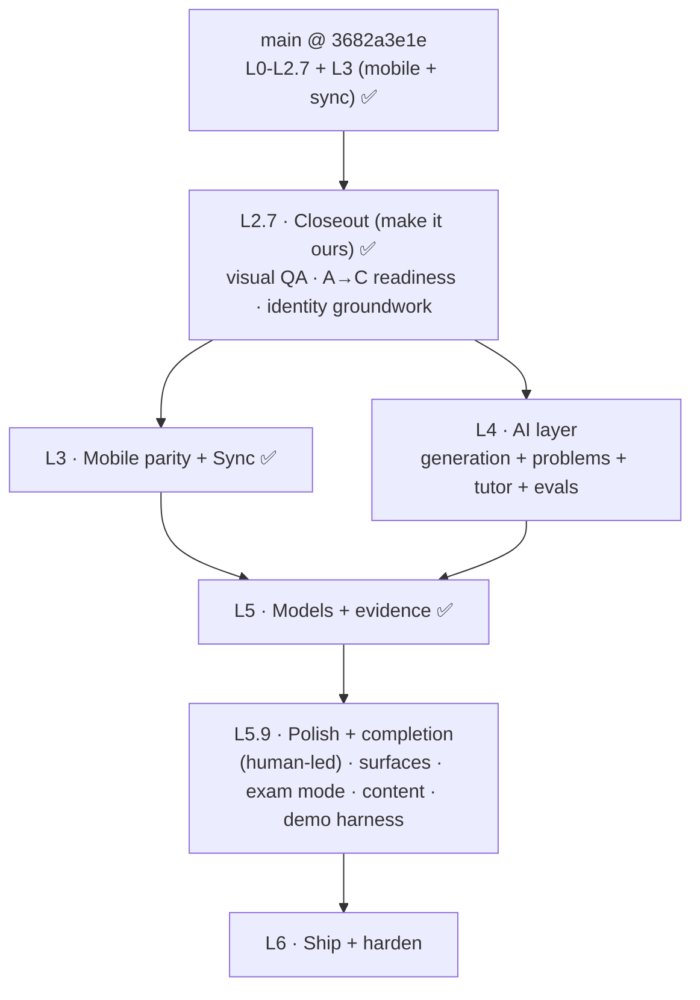

# pgrep Unified Build Plan

**What this is.** The single execution roadmap from where the code is today to a shipped product. It supersedes the old layer sketch. It states the verified starting line, the remaining trajectory, how each layer is split across agents, the exit gate that proves each layer, and a copy-paste controller prompt to run it.

**How to use it.**

1. Pick the lowest layer whose entry gate is green.
2. Open a fresh chat, paste that layer's controller prompt.
3. That chat becomes the layer controller. It reads this plan plus the named design docs, extracts the tasks into a `TodoWrite`, dispatches subagents (parallel where marked), and runs the review gates.
4. When the exit gate is met, mark the layer done here and move on.

**Legend.** 🔒 sequential gate (nothing after it starts until it is green). ∥ parallelizable (independent files or domains). ✅ done and on `main`.

**Governing docs.** Product context and the nine spec constraints live in `[../README.md](../README.md)`. The durable "why" is in `[../research/](../research/)`. The human, content, and dependency track is `[content-and-dependencies.md](../reference/content-and-dependencies.md)`. The dev and test harness is `[dev-harness.md](../reference/dev-harness.md)`. Phase contracts are the appendices in section 7.

**Copy rule (this doc and all pgrep text).** No em-dashes, no colon-heavy phrasing, short labels.

---

## 1. Where we are (the verified starting line)

Everything through the desktop takeover, the visual system, the closeout, and the mobile companion with two-way sync is complete and on `main` (HEAD `3682a3e1e`). `just lint` is green and the L3 sync round-trip proof passes. The remaining work starts from this base.

| Layer                            | Status | What it gave us                                                                                                                                                                                                                                                                                                                                                                                                                                                                                                                                                                                                                                                       |
| -------------------------------- | ------ | --------------------------------------------------------------------------------------------------------------------------------------------------------------------------------------------------------------------------------------------------------------------------------------------------------------------------------------------------------------------------------------------------------------------------------------------------------------------------------------------------------------------------------------------------------------------------------------------------------------------------------------------------------------------- |
| **L0 Build foundation**          | ✅     | The Anki fork builds from source (`just run`), a trivial Rust change shows up end to end, the shared engine cross-compiles and loads a deck on iOS (`just ios-smoke`), and the dev harness runs (`just smoke`).                                                                                                                                                                                                                                                                                                                                                                                                                                                       |
| **L1 Engine seam + data model**  | ✅     | The graded Rust change: `ReviewCardOrder::PointsAtStake` (`rslib/src/scheduler/queue/builder/points_at_stake.rs`), a read-only reorder inside gather-then-limit (never mutates `due`/`interval`/`memory_state`). Two-level topic tags, the Attempt log as immutable notes ("A now, C-ready"), the `pgrep::Problem` and `pgrep::Attempt` notetypes, with Rust and Python tests. Contracts: `[tag-and-attempt-log-schema.md](../reference/tag-and-attempt-log-schema.md)`.                                                                                                                                                                                              |
| **L2 Core surfaces (no AI)**     | ✅     | The four desktop surfaces in `ts/routes/pgrep/` (Study, Home, Progress, Diagnostic) on the real FSRS loop, the honest Memory score, the two-door session with commit-before-reveal and the static ladder, and a real macOS installer. Bridge and API: `[api-contract.md](../reference/api-contract.md)`.                                                                                                                                                                                                                                                                                                                                                              |
| **L2.5 Desktop takeover**        | ✅     | `qt/aqt/pgrep_host.py` makes the pgrep SPA the primary surface (`hosted` default), Anki's screens reachable via `Tools > Open Anki screens`. `tools/ios-run.sh` launches the iOS app visibly. Installer rebuilt from the takeover. Plan: `[api-contract.md §6](../reference/api-contract.md)`.                                                                                                                                                                                                                                                                                                                                                                        |
| **Visual system**                | ✅     | Design tokens (`ts/lib/sass/_pgrep.scss`), the Svelte primitives (`ts/lib/components/`: `ScoreCard`, `ChoiceList`, `CoverageBar`, `GradeBar`, `HintRung`, `StudyFrame`, `NavRail`, `ReliabilityDiagram`, `Manifold`, `Manifold3D`), the 2D and 3D manifold (`ts/lib/pgrep/manifold.ts`, `manifold3d.ts`), the restyled surfaces plus a Settings surface, and the `ts/routes/pgrep-lab/` gallery. Deps: `three`, `@fontsource-variable/inter` + `jetbrains-mono`, `lucide-static`. The top toolbar now hides while pgrep leads. Spec: `[../../design/ux-foundation.md](../../design/ux-foundation.md)`.                                                                |
| **L2.7 Closeout (make it ours)** | ✅     | Surface QA across all five surfaces in both themes (single shared `NavRail`, `Manifold3D` degrades to the 2D fallback, tokenized accents, copy-rule fixes, evidence-linked abstain states). The `ts/routes/pgrep-lab/gallery` covers every primitive's states. The exclusive takeover is proven with pure helpers in `pgrep_host.py` (`hosted` stays default), tested in `qt/tests/test_pgrep_host.py`. The dev app carries the pgrep name and icon (desktop titles + window icon, iOS `CFBundleDisplayName` + `AppIcon`).                                                                                                                                            |
| **L3 Mobile parity + Sync**      | ✅     | The native SwiftUI companion (`mobile/ios/PgrepStudy/`): a Home glance (2D wireframe manifold, native Memory that matches desktop by construction, honest Performance and Readiness abstains), a Study Cards door with full FSRS grading, and Settings sync. Two-way sync reuses Anki's self-hosted server unmodified (`just sync-server`) with the conflict rule in `[sync-conflict-rule.md](../reference/sync-conflict-rule.md)`, proven by `pylib/tests/test_pgrep_sync_roundtrip.py` (revlog and Attempt union, newer-mtime, offline-then-sync) and `just ios-sync-proof` (the iOS FFI upload downloaded by a desktop engine). No changes under `rslib/src/sync`. |

**What is deliberately not done yet.** L4 (AI) is merged to `main` and off by default, with its provisional gate green on beat-baseline but the absolute cutoffs and the human E4 rating still pending (see the L4 status block in section 4). L5 (Models + evidence) is merged to `main` @ `280621c36`: all three scores are calibrated with held-out evidence and the ablation is reported (see the L5 status block in section 4). What remains is the L5.9 polish-and-completion interlude (human-led: surface fine-tuning, exam mode, real content, the demo/sync harness), then L6 (the de-Anki sweep, packaging, hardening, and recording; the exclusive takeover flip and the first identity pass are already done), plus the human E4 deliverables (the results report, model cards, and the Brainlift).

---

## 2. The trajectory ahead

**Sequential spine:** L2.7 ✅, then **L3 ✅ ∥ L4** (run together, different stacks), then L5, then the L5.9 polish-and-completion interlude (human-led), then L6. Parallelism inside each layer is marked ∥.

**What each exit gate proves.**

- **L2.7:** the app looks and behaves like pgrep in both themes, the exclusive takeover is proven, and it carries its own name and icon in development.
- **L3:** review on the phone shows up on the desktop and back, with no lost or doubled reviews, and offline works then syncs (spec constraint 2).
- **L4:** every AI output traces to a named source, clears the gold-set gate, beats a simple baseline, and the app still scores with AI off (spec constraints 6 and 7).
- **L5:** Memory is calibrated, Performance is measured on held-out items, Readiness is mapped with a range, and the ablation is reported including what did not work (spec constraints 3, 4, 5).
- **L6:** both apps install and run clean on a fresh machine, AI off still scores, and the polished demo is recorded (spec constraint 8).

---

## 3. How work is split to agents (orchestration model)

Every layer runs the same way, following the `subagent-driven-development` and `dispatching-parallel-agents` skills.

1. **Isolate.** Create a git worktree for the layer off `main`, under `.worktrees/<layer>` (the worktree workflow rule). Never build on `main` without consent.
2. **Controller is the chat.** It reads this plan plus the layer's design docs, extracts the tasks into a `TodoWrite`, and hands each subagent the full task text and context. It never says "go read the plan."
3. **Per-task loop.** Dispatch a fresh **implementer** subagent. It asks questions first (the controller answers), implements with tests, commits, and self-reviews. Then a **spec-compliance reviewer** subagent (must be green before quality), then a **code-quality reviewer** subagent. Fix and re-review until approved, then mark the task done.
4. **Parallel rule.** Dispatch multiple implementers concurrently **only** for ∥ tasks that touch different files or domains. Never two implementers on the same files. One shared worktree cannot run concurrent `ninja` safely, so when tasks share a build, run their tests sequentially through the controller even if the implementation was parallel.
5. **Between layers.** Run a final reviewer over the whole layer, confirm the exit gate, merge the worktree to `main`, then remove the worktree.
6. **Model selection.** Cheap model for mechanical one or two file tasks, standard for multi-file integration, most capable for design, debugging, and review.

**File-ownership discipline.** Each layer below lists which files or domains each subagent owns, so parallel implementers never collide. When a shared seam needs a change mid-layer, it goes through the controller, not a second implementer.

---

## 4. The layers ahead

### L2.7 · Closeout (make it ours) · entry: `main` (L2.5 + visual) ✅ · done ✅

**Why.** The visual system and the shell takeover are built, but nobody has audited the surfaces end to end, the exclusive takeover is documented but unproven, and the app still carries Anki's name and icon. This layer closes the "make it ours" thread so the base is demo-clean before the heavy layers.

**Design refs.** `[../../design/ux-foundation.md](../../design/ux-foundation.md)` (the visual contract), `[../../design/readme.md](../../design/readme.md)` (the brand rules), `[api-contract.md §6](../reference/api-contract.md)` (the A to C flip, already documented), the `ts/routes/pgrep-lab/` gallery.

**Tasks.**

- **L2.7.1 ∥ Visual QA pass.** Audit every surface (Home, Study with both doors, Diagnostic, Progress, Settings) and every state (default, abstain, AI-off, loading, empty) against `ux-foundation.md`, in **both light and dark**. Fix drift from the tokens, the reserved color language (amber Memory, blue Performance, lilac Readiness, monochrome interaction), the copy rule, and the 100ms speed rule. Confirm the 2D manifold fallback renders when WebGL is unavailable. Owns: `ts/routes/pgrep/` **, `ts/lib/components/`**, `ts/lib/sass/_pgrep.scss`.
- **L2.7.2 ∥ Gallery coverage.** Ensure `ts/routes/pgrep-lab/` renders each primitive in its key states so reviewers can inspect them without running a full session (the durable gallery workflow). Owns: `ts/routes/pgrep-lab/`**.
- **L2.7.3 Exclusive-takeover proof.** Verify the A to C flip works end to end without shipping it as the default: hide `toolbarWeb` (already done) plus drop the "Open Anki screens" action and short-circuit `moveToState("deckBrowser")` back to `pgrep` when the mode is `exclusive`, then confirm `hosted` stays the default. Owns: `qt/aqt/pgrep_host.py`, `qt/aqt/main.py`.
- **L2.7.4 Identity groundwork.** Set the app's display name to the lowercase wordmark `pgrep` (matching the logo and the docs). Desktop: replace the two window titles in `qt/aqt/main.py` (currently `f"{self.pm.name} - Anki"` around line 518 and `"Anki"` around line 1512) so the app reads `pgrep`, and sweep for any other visible "Anki" title strings. iOS: set the shown name to `pgrep` via `CFBundleDisplayName` in `mobile/ios/project.yml` (the `PgrepStudy` target name and bundle id can stay; only the displayed label changes here). Produce the app icon from `design/assets/reference/logo.png` (the `.icns` set for desktop, the icon set for iOS). Final bundle id, menu-bar name, and installer name stay at L6.2. Owns: `qt/aqt/main.py` titles, `mobile/ios/project.yml` display name, icon assets.

**Exit gate.** Every surface matches the design system in both themes with no copy-rule or speed-rule violations. The gallery shows each primitive's states. Exclusive mode is proven and reverts cleanly to `hosted`. The dev app shows the pgrep name and icon. `just lint` and `just test-py` green.

**Agents.** Two parallel implementers (surfaces vs gallery) for the visual work, then one implementer for the takeover proof, then one for identity. Reviews per the model in section 3.

**Controller prompt.**

> You are the controller for **Build Layer L2.7 (Closeout, make it ours)** of pgrep.
> **Read first, in full:**
>
> - this file's L2.7 section
> - design/ux-foundation.md
> - design/readme.md
> - docs_pgrep/reference/api-contract.md §6 (the A to C flip)
> - docs_pgrep/README.md (skim)
>   **Entry check:** confirm `main` builds, `just lint` and `just test-py` are green, and `just run` opens into pgrep with the top toolbar hidden. If not, stop and tell me.
>   **Deliverable:** the surfaces match the design system in both themes, the gallery covers component states, the exclusive takeover is proven (kept off by default), and the dev app carries the pgrep name and icon.
>   **Your job:** run this layer with subagent-driven development in a `.worktrees/l2.7-closeout` worktree. Dispatch L2.7.1 (surface QA) and L2.7.2 (gallery) as parallel implementers, then L2.7.3 (exclusive proof) and L2.7.4 (identity) sequentially. Spec-compliance reviewer then code-quality reviewer per task.
>   **Constraints (hard):** do not restyle away from the ux-foundation.md spec, keep hosted the default surface mode, never mutate scheduling state, no AI. Respect the copy rule and the 100ms speed rule.
>   **Exit gate:** as above, `just lint` and `just test-py` green. Report what changed, screenshots or the gallery route, and any drift you could not resolve.

---

### L3 · Mobile parity + Sync · entry: L2 core ✅ · runs ∥ with L4 · done ✅

**Why.** The spec requires two apps sharing one engine with two-way sync (constraint 2). The shared engine already runs on iOS (L0.3, `just ios-smoke` and `just ios-run`). This layer builds the mobile surfaces and wires sync.

**Design refs.** `[../research/technical-architecture.md](../research/technical-architecture.md)` (Phase 4: reuse Anki's Rust sync server, self-host, iOS-via-FFI, the documented conflict rule), `[attempt-log-storage.md](../research/attempt-log-storage.md)` (the log rides note sync for free), `design/ux-foundation.md` §9 (mobile is the companion subset, a native translation of the same tokens).

**Tasks.**

- **L3.1 ∥ Mobile surfaces.** Home (readiness glance: manifold thumbnail plus the three score rows with ranges) and Study (a session that mirrors desktop) in the existing SwiftUI app (`mobile/ios/`), driving the shared engine through `rslib/ffi`. The manifold uses native 3D (SceneKit or Metal) or the 2D fallback. Owns: `mobile/ios/` **, `rslib/ffi/`** (only if new FFI entry points are needed), Swift protobuf regen via `tools/gen-swift-protos.sh`.
- **L3.2 ∥ Sync.** Two-way incremental sync by reusing Anki's Rust sync server, self-hosted (local Mac for the demo, a small VPS optionally). Document the conflict rule (union-by-id on the Attempt log, per K2 in `tag-and-attempt-log-schema.md`). Prove offline-then-sync. Owns: sync host config, `docs/syncserver/` usage, no changes under `rslib/src/sync/`**.

**Exit gate.** Review on the phone appears on the desktop and back, with no lost or doubled reviews. Offline works, then syncs. `just ios-run` shows the mobile surfaces on the shared engine.

**Human dependencies.** S2 (stand up the self-hosted sync server), P (Apple Developer account only if TestFlight or on-device signing is wanted; simulator and 7-day sideload are free). See section 5.

**Agents.** Two parallel implementers (mobile UI in Swift vs sync integration). Different domains, safe to parallelize.

**Controller prompt.**

> You are the controller for **Build Layer L3 (Mobile parity + Sync)** of pgrep.
> **Read first, in full:**
>
> - this file's L3 section
> - docs_pgrep/research/technical-architecture.md (Phase 4)
> - docs_pgrep/reference/tag-and-attempt-log-schema.md (the Attempt-log conflict rule)
> - design/ux-foundation.md (section 9)
> - docs_pgrep/reference/dev-harness.md (iOS recipes)
>   **Entry check:** confirm `just ios-smoke` and `just ios-run` are green on `main` (the shared engine runs on iOS). If not, stop and tell me.
>   **Deliverable:** the mobile Home and Study surfaces on the shared engine, plus two-way sync with a documented conflict rule and working offline-then-sync.
>   **Your job:** run this layer with subagent-driven development in a `.worktrees/l3-mobile-sync` worktree. Dispatch L3.1 (mobile surfaces, Swift) and L3.2 (sync) as parallel implementers. Spec-compliance then code-quality review per task.
>   **Constraints (hard):** reuse Anki's sync server, never modify anything under rslib/src/sync (the sync layer), the Attempt log rides note sync (union-by-id), never mutate scheduling state, everything works AI off. Mobile is the companion subset, a native translation of the tokens.
>   **Exit gate:** phone-to-desktop-and-back with no lost or doubled reviews, offline then syncs. Report the conflict rule you implemented, the sync host setup, and a review of the round trip.

---

### L4 · AI layer (generation + problems + tutor + evals) · entry: L1 data + L2 study ✅ · runs ∥ with L3

**Why.** The AI features and their evidence (spec constraints 6 and 7). This is the largest layer and where most grading weight sits. It has an internal 🔒 gate: the eval harness lands first, because everything else is graded against it.

**Status (left off here, 2026-07-03). Merged to** `main` **@** `7f98989d0` **by fast-forward, AI off by default so the installer, ship, and AI-off scoring never depend on the gold or the gate.** The next agent picks up from here.

_Built and merged (versioned, under_ `main` _)._

- Shared Collection-free core `anki.pgrep.ai`: `retrieval.py` (local ONNX `bge-small-en-v1.5` via `fastembed`, parity-checked against the index model at cosine 0.99999), `llm.py` (pinned OpenAI client, refuses floating aliases, robust to reasoning-model temperature/seed rejections), `provenance.py` (cite-or-refuse), `verify.py` (dedup, giveaway verifier, SymPy CAS), `generation_core.py` (the confidence route below 0.6 to human review). Every heavy import is lazy, so an AI-off session loads none of it (proven: the core imports with `fastembed`, `openai`, `sympy` all absent).
- `ai_config.py` (AI on/off in collection config, default off), `generation.py` (L4.1 stylize plus gap-fill) with the Library surface `ts/routes/pgrep/library/`, `problem_gen.py` (L4.2 misconception-first into the `pgrep::Problem` notetype), `tutor.py` (L4.3 AI-on rubric grading, giveaway-verified, AI-off reveal-and-self-compare intact) with the study ladder UI, bridge handlers in `qt/aqt/pgrep.py`. Tests: `pylib/tests/test_pgrep_{ai_core,generation,problem_gen,tutor}.py` (20 pass, 1 CAS test skips without SymPy). `just lint` green (clippy, mypy, ruff, eslint, svelte, typescript).

_Offline eval harness (private, git-ignored_ `content/` _, NOT versioned, lives only in Frank's workspace)._ `content/tools/`: `build_index.py` (index built, 4450 chunks, leakage guard wired into the end of every build), `leakage_check.py` (firewall green), `coverage_report.py` (25 finest units covered), `baselines.py` (keyword FTS5 BM25 plus vector ONNX), `eval_metrics.py` / `eval_splits.py` / `eval_manifest.py` / `eval_judge.py` / `score_batch.py` (scorer, bootstrap CIs, per-area, LLM judge, kappa, run manifest, the section-6 safeguards), `make_gold.py`, `run_batch.py`, `check_parity.py`, `check_gencore.py`.

_Provisional L4.0 gate ran (LLM judge only, Frank rating deferred as E4)._ Generator `gpt-5.5-2026-04-23`, judge `gpt-5.4-mini-2026-03-17`, both pinned in `content/run/run_manifest.json`. Batch of 50 cards and 36 problems graded blind against 106 provisional problem gold (GR9677 official keys plus community-70) and 25 finest-unit card anchors; 10 of 86 AI items refused by the safety layer.

- Cards (n=50): fact precision 0.920, useful-yield 0.580. Beats keyword by +0.44 and vector by +0.48, CIs exclude zero.
- Problems (n=36): fact precision 0.750, key correctness 0.722, distractor quality per problem 0.611, useful-yield 0.500. Beats keyword by +0.61 and vector by +0.58, CIs exclude zero.
- Beat-baseline PASSES for both (the spec's core requirement). The absolute cutoffs are NOT cleared under the strict mini-judge. Naive-distractor comparison (reported, not a gate) is flat: ai minus naive is -0.056 [-0.278, 0.167]. Report at `content/run/score_report.json`, candidates at `content/run/candidates.json`, batch gold at `content/run/batch_gold.json`.

_What remains (for the next agent)._

1. **E4 human rating and adjudication.** Frank rates the batch (rater 1), the judge stands as rater 2, Frank adjudicates and kappa is reported. This is the real gate confirmation. Re-score with `score_batch.py --gold content/run/batch_gold.json --candidates content/run/candidates.json --rater1-csv <frank.csv>` (columns `target_id,system,useful,fact_precision,key_correct`).
2. **Clear the absolute cutoffs.** Under the mini-judge, card useful-yield (0.58 vs 0.80), problem distractor quality (0.611 vs 0.70), and problem key correctness (0.722 vs 0.95) fall short. Likely levers: human adjudication (the mini-judge is harsh and noisy on physics keys), the deferred verification layers (self-consistency, a critic pass, CAS on more items), and stronger generation prompts. A stronger judge is also worth trying.
3. **Gold reconciliation.** The provisional problem gold uses GR9677 (per this section's v3) plus community-70. `docs_pgrep/ai/heldout-and-leakage.md` still lists GR9677 as held-out and GR0877 as the gold source; reconcile the eval docs to match, or switch the gold source to GR0877 (edit `make_gold.py` and re-run). Using GR9677 as gold leaves only GR0177 for the L5 held-out performance bank.
4. **Card gold.** No authoritative source exists (CWRU `cards.json` text is failed transcription, "I'm sorry, I can't assist with that"), so card grading currently uses finest-unit anchors plus judge-on-merits. Frank authors about 50 corpus-verified card gold items, or CWRU is re-transcribed, to make the card gate rigorous.
5. **Runtime enablement (AI-on demo).** The app-env AI deps are an optional extra and are NOT installed in `out/pyenv`, and the `[project.optional-dependencies]` block was NOT added to `pylib/pyproject.toml` (deferred to avoid perturbing the build). To run AI live: add that extra (fastembed, openai, sympy, sqlite-vec, numpy), install into `out/pyenv`, set `OPENAI_API_KEY`, and toggle AI on in Settings. The ONNX sidecar fallback (a localhost service in the `pgrep-ai` env) is the alternative if in-process deps prove heavy.
6. **C4 curated seed bank** (annotated GR8677 and GR9277 few-shot examples) is not staged. Optional; it feeds generation as examples and does not gate.
7. **Known non-L4 issue.** `qt/tests/test_installer.py` fails in a fresh worktree (empty `qt/installer/mac-template`); it passes on the primary `main` checkout (template populated). Unrelated to L4.

_Resume commands (repo root, conda_ `pgrep-ai` _)._ `python content/tools/make_gold.py` then `python content/tools/run_batch.py --generator-model <snapshot>` then `python content/tools/score_batch.py --gold content/run/batch_gold.json --candidates content/run/candidates.json --judge openai --judge-model <snapshot> --provisional --workers 6`. The AI-off app path needs none of this.

**Design refs.** `[../ai/ai-layer.md](../ai/ai-layer.md)` (the AI layer: data, decisions, the file map, the leakage firewall, and the safeguards), `[../research/feature-forced-generation.md](../research/feature-forced-generation.md)` (cards: stylize vs gap-fill, the verification stack, the gen→FSRS bridge), `[../research/feature-problem-generation.md](../research/feature-problem-generation.md)` (MCQ with misconception-first distractors, the MCQ gold set), `[../research/feature-productive-failure.md](../research/feature-productive-failure.md)` (the wrong-answer ladder, stored decomposition, AI-off vs AI-on grading), `design/ux-foundation.md` §7.4 (the Library authoring surface). Content and provenance rules in `[content-and-dependencies.md](../reference/content-and-dependencies.md)`. The locked gate values, gold spec, and leakage rule live in `[../ai/](../ai/)`.

**Tasks.**

- **L4.0 🔒 Eval harness.** The ruler everything else is graded on. Build the harness: the corpus index (reads `content/corpus/` only), the leakage guard (`content/tools/leakage_check.py`), the keyword and vector baselines to beat, the scorer (fact precision, useful-yield, distractor quality, with bootstrap CIs and the per-area breakdown), and the SymPy (CAS) path for computational items. The two gold sets are Frank's gate inputs (E1), staged into `content/gold/`: the problem gold is the vision-cleaned GR9677 (real ETS) plus the community 70, and the card gold is about 50 corpus-verified cards. The fed problem examples (all of REA, both exams) are already parsed and do not gate. The held-out splits, the blueprint, the schemas, and the frozen cutoffs are already in place (`docs_pgrep/ai/`, `content/blueprint/`, `content/gold/`). Time-based splits only, never random. Nothing in L4.1 to L4.3 ships until this gate is green. Full detail in `docs_pgrep/ai/ai-layer.md`.
- **L4.1 ∥ Forced generation (cards).** The Library authoring surface ("author a seed", `design/ux-foundation.md` §7.4). AI **stylizes** the bundle's cards into the learner's voice where the bundle already covers a subtopic, and **gap-fills** net-new siblings from the corpus only where the user authors a technique the bundle lacks. Core-minimum verification: RAG grounding plus provenance plus the gold-set gate, routing `confidence < 0.6` to human review. CAS, self-consistency, and critic layers deferred. Owns: `ts/routes/pgrep/library/`**, `pylib/anki/pgrep/generation.py`, its bridge handler and tests.
- **L4.2 ∥ Problem generation.** MCQ with **misconception-first distractors** (name the likely error, derive the trap from it, store the misconception tag and rationale per distractor), plus a stored solution decomposition verified once at creation. Gate against the MCQ gold set: key correct, distractors plausible and grounded, and it beats naive-distractor generation and problem retrieval side by side. Core is misconception-first plus the gate; the student-data distractor ranker is deferred. Owns: `pylib/anki/pgrep/problem_gen.py`, its bridge handler and tests. Reads the `pgrep::Problem` notetype from L1.
- **L4.3 ∥ Scaffold-fade tutor.** The wrong-answer ladder: L1 nudge, L2 sub-goal decomposition and self-explanation over the **stored** decomposition, L3 sibling worked example, L4 reveal plus explain-back. AI-off is reveal-and-self-compare (required by spec). AI-on is rubric grading with a giveaway verifier so the final answer never leaks. Session-end synthesis from the Attempt log. Owns: `ts/routes/pgrep/study/`** (the ladder UI beyond the L2 static fallback), `pylib/anki/pgrep/tutor.py`, its bridge handler and tests.

**Exit gate.** Every AI output traces to a named source. The gold-set gate has a cutoff set before results were seen, and generation clears it and beats the baseline side by side. The wrong-answer ladder never leaks the answer (verified). The app still produces a Memory score and runs the static ladder with AI off.

**Human dependencies.** Inputs are largely staged. Done: C1 (corpus, under `content/corpus/`), C4 (all of REA as the fed problem examples, both exams, already parsed), E2 (held-out splits and the leakage rule), E3 (cutoffs and the baseline bar, now frozen), plus the LLM key, local embeddings, and the local vector store (the `pgrep-ai` toolchain). Runtime, not pre-authored: C3 (seeds are per-user at run time, not a batch). No ETS is fed to generation. Still gating L4.0: E1, the two gold sets, Frank's. Problem gold is the vision-cleaned GR9677 (real ETS, about 40 to 50 verified items) plus the community 70 (57 keyed), card gold is about 50 corpus-verified cards (OpenStax, Fitzpatrick), not from CWRU. The infrastructure track (index, baselines, harness, plumbing) needs none of these. See `docs_pgrep/ai/ai-layer.md` and section 5.

**Agents.** L4.0 first (sequential, it is the gate). Then L4.1, L4.2, L4.3 as parallel implementers (different modules and surfaces).

**Controller prompt.**

> You are the controller for **Build Layer L4 (AI layer)** of pgrep.
> **Read first, in full:**
>
> - docs_pgrep/ai/ai-layer.md (the AI layer: data, decisions, the file map, the leakage firewall, the safeguards, and the infra-vs-gate split)
> - this file's L4 section
> - docs_pgrep/ai/cutoffs-and-baselines.md (the frozen gate), docs_pgrep/ai/gold-set-spec.md, docs_pgrep/ai/heldout-and-leakage.md
> - docs_pgrep/research/feature-forced-generation.md
> - docs_pgrep/research/feature-problem-generation.md
> - docs_pgrep/research/feature-productive-failure.md
> - design/ux-foundation.md (section 7.4)
> - docs_pgrep/reference/content-and-dependencies.md (tiers, gold set, leakage rule)
>
> **Entry check:** confirm the L1 data model (Problem and Attempt notetypes, topic tags) and the L2 Study loop are on `main`. Confirm the staged inputs, all in place today: the corpus under content/corpus/tier1-open/ (OpenStax Vol 1 to 3 and the three Fitzpatrick texts), the held-out quarantine under content/tier3-private/, the locked blueprint (content/blueprint/), the gold schemas (content/gold/), and the frozen pre-registration (docs_pgrep/ai/cutoffs-and-baselines.md). Because these are staged, the infrastructure track can start now. The fed problem examples (all of REA, both exams) are already parsed, so the L4.0 gate closes only when the two gold sets (E1) land; the cutoffs are already locked. Under v3 the problem gold is the vision-cleaned GR9677 plus the community 70, and the card gold is about 50 corpus-verified cards. If a gate input is missing when you reach the gate, stop and tell me exactly what is needed.
> **Deliverable:** card generation (gap-fill graded, stylize shown live), problem generation (misconception-first distractors), and the scaffold-fade tutor, all traced to named sources, gold-set gated, beating the baseline by the locked margin, with AI-off paths intact.
> **Your job:** run this layer with subagent-driven development in a `.worktrees/l4-ai` worktree. Start the infrastructure track now: the corpus index (reads content/corpus/ only), the leakage guard (content/tools/leakage_check.py), the keyword and vector baselines, the eval-harness scaffolding, and the RAG and generation plumbing. Build **L4.0 (the eval harness) and get it green** before any graded generation. Hold the scored batch until the two gold sets are in. Then dispatch L4.1, L4.2, L4.3 as parallel implementers. Spec-compliance then code-quality review per task.
> **Constraints (hard):** every output cites a named source or is refused. Held-out and gold items never enter the corpus, the index, or a prompt (the index reads content/corpus/ only, leakage_check.py enforces it). The ladder never reveals the final answer before the reveal rung (giveaway-verified). Everything must still work AI off. Never mutate scheduling state. Apply the generation safeguards in docs_pgrep/ai/ai-layer.md section 5: name the split first, keep gold off the fed path, reject memorized outputs (dedup against all ETS and all fed examples), corpus provenance, report seen versus held.
> **Exit gate:** as above, with the frozen cutoff, the side-by-side baseline win (>= 0.10 absolute, the advantage CI excludes zero), and the AI-off proof. Report the eval numbers, the cutoff, the baseline comparison, and which forms were seen versus held out.

---

### L5 · Models + evidence · entry: L2 + L4 ✅ · done ✅

**Status. Done, merged to** `main` **@** `280621c36` **by fast-forward.** Memory is calibrated on the held-out anki-revlogs-10k (default FSRS Brier 0.234, log-loss 0.743, ECE 0.159; beats the base-rate baseline on the primary Brier; reconstruction pinned to the engine's fsrs-rs 5.2.0 vectors). Performance is the PFA calibrated logistic with beta calibration, validated held-out on seeded synthetic (Brier 0.175 vs 0.268, accuracy 0.775 vs 0.563; the pre-registered beat-baseline rule passes, honest that synthetic validates the pipeline at n=1). Readiness maps expected performance to a 200 to 990 scaled score with an 80% range, coverage-gated at 70% (abstains and names the uncovered exam). The ablation reports negatives: interleaving-as-spacing beats blocked practice robustly, but the full selector does not robustly beat stock Anki (it loses at the scarcest budget) and the K=3 anti-blocking is memory-neutral by construction. The Progress dashboard shows real Memory and Performance reliability diagrams plus Brier, coverage-gated Readiness, and the abstain rule. The calibration and ablation harnesses live in the private `content/tools/`; the shipped models are `pylib/anki/pgrep/{performance,readiness,calibration_evidence}.py`, with the raw-to-scaled table and calibration evidence embedded as constants (no runtime `content/` read, firewall intact). E4 (human spot-check, results report, model cards, Brainlift) remains for L6.

**Why.** The three scores and their held-out evidence (spec constraints 3, 4, 5). This turns the honest dashboard from "Memory only" into all three calibrated scores.

**Design refs.** `[../research/three-scores.md](../research/three-scores.md)` (the three scores and their ranges), `[../research/statistics-and-evaluation.md](../research/statistics-and-evaluation.md)` (the metrics and the held-out pipelines), `[../research/performance-model.md](../research/performance-model.md)` (PFA calibrated logistic), `[../research/feature-calibration.md](../research/feature-calibration.md)` (the honest dashboard, model calibration not user confidence).

**Tasks.**

- **L5.1 ∥ Memory calibration.** Brier and log-loss on held-out revlog, plus the reliability diagram (reuse `ts/lib/components/ReliabilityDiagram.svelte`). Time-based splits.
- **L5.2 ∥ Performance model.** The PFA calibrated logistic, with beta calibration for small data, measured on held-out exam-style questions against the batting-average baseline.
- **L5.3 Readiness mapping.** Map expected performance to a 200 to 990 scaled score with a range, using the private Tier-3 raw-to-scaled conversion table as constants only. Depends on L5.2.
- **L5.4 ∥ Ablation harness.** Full versus interleaving-off versus plain Anki, equal study time, the pre-stated metric, using the L1 selector switch. Report what did not work.
- **L5.5 Calibration dashboard (Feature 4).** Wire real calibration into the Progress surface: reliability diagrams plus Brier for Memory and Performance, coverage gating Readiness, the abstain rule. Depends on the Attempt log, the revlog, and L5.1 and L5.2.

**Exit gate.** Memory is calibrated with a reliability diagram and Brier. Performance is measured on held-out items and beats the baseline. Readiness is mapped with an explicit range and is coverage-gated. The ablation is reported including negatives.

**Human dependencies.** E2 (held-out splits), E4 (spot-check as grader, the results report, model cards, the Brainlift), and the readiness mapping constants (Tier-3 conversion table). See section 5.

**Agents.** L5.1, L5.2, L5.4 in parallel (independent analyses). L5.3 after L5.2. L5.5 after L5.1 and L5.2.

**Controller prompt.**

> You are the controller for **Build Layer L5 (Models + evidence)** of pgrep.
> **Read first, in full:**
>
> - this file's L5 section
> - docs_pgrep/research/three-scores.md
> - docs_pgrep/research/statistics-and-evaluation.md
> - docs_pgrep/research/performance-model.md
> - docs_pgrep/research/feature-calibration.md
>   **Entry check:** confirm the Attempt log and revlog are populated and the L4 held-out splits exist with the leakage rule enforced. If not, stop and tell me.
>   **Deliverable:** Memory calibrated, Performance measured on held-out items, Readiness mapped with a range and coverage-gated, the ablation reported, and the Progress dashboard wired to real calibration.
>   **Your job:** run this layer with subagent-driven development in a `.worktrees/l5-models` worktree. Dispatch L5.1, L5.2, L5.4 in parallel, then L5.3 after L5.2, then L5.5. Spec-compliance then code-quality review per task.
>   **Constraints (hard):** time-based splits only, never random. No score without its range and evidence. Abstain when data is thin. Readiness stays coverage-gated. Do not capture user confidence (model calibration only).
>   **Exit gate:** as above. Report the Brier and log-loss, the Performance accuracy versus baseline, the Readiness mapping and range, and the ablation including what did not work.

---

### L5.9 · Polish and completion (human-led) · entry: L5 ✅ · before L6

**Why.** The layers built the engine, the models, the evidence, and the surface wiring, each to a machine-checkable gate. Before shipping (L6), the app needs a human pass that the gates cannot express: look at every page, tune the feel, fill the features that were designed but not yet built, replace placeholder content with the real thing, and make the whole thing hands-on testable end to end. This is Frank-led, with agents assisting on the buildable parts. It has a "done when it feels complete" bar, not a hard automated gate, so it sits between L5 and L6 as an explicit interlude rather than a numbered layer with a proof.

**What already exists (do not rebuild).** Six desktop surfaces render on the real loop: Home, Study (two doors, Cards shows flashcards on the FSRS loop, Problems runs the commit-gate ladder), Progress (coverage, the three scores, calibration), Diagnostic, Library (L4 authoring), Settings. The three scores are live and abstain honestly on thin data. Desktop and mobile share one engine with working two-way sync (L3). The L4 AI generation (cards, problems, tutor) is built and off by default. The `ts/routes/pgrep-lab/gallery` is a component-state gallery. The sample data is a fixed seed (`seed.py` ~28 cards, `problem.py` 6 problems).

**Tasks (checklist).**

- **P1 ∥ Visual and UX fine-tuning.** Walk every surface in both themes and tune the design, copy, and states (default, abstain, AI-off, loading, empty) against `ux-foundation.md`. This is the hands-on version of the L2.7 audit, now over the full L5 surface (calibration, Readiness, the score cards). Owns: `ts/routes/pgrep/`, `ts/lib/components/`, `ts/lib/sass/_pgrep.scss`.
- **P2 Wire-up gaps.** Close the stubs the L5 review flagged: render a live Performance score card on Progress (the `pgrepPerformanceScore` endpoint exists and is tested but no surface calls it), and sweep for any other wired-but-unshown or placeholder-only elements. Owns: `ts/routes/pgrep/`, `qt/aqt/pgrep.py` if a handler is missing.
- **P3 Exam mode (designed, not yet built).** Build the timed Exam mode: a full-length or sectioned timed run of Problems under exam conditions, scored on the raw-to-scaled Readiness map, with pace from the logged `response_ms` (the M5 signal in `performance-model.md`). This is where latency and blind-review live, distinct from untimed practice. Owns: `ts/routes/pgrep/` (a new exam surface or a Study mode), `pylib/anki/pgrep/` (an exam-session read model over the attempt log), its bridge handler and tests. Note: wiring `response_ms` into the attempt payload (the deferred M5 half of the L5.2 seam) belongs here.
- **P4 Real content, using what we generated.** Replace the placeholder sample cards and problems with real, corpus-grounded content, authored through the L4 generation path as originally intended (stylize plus gap-fill for cards, misconception-first for problems), Frank-reviewed before it lands. The goal is a genuine PGRE study set across the nine blueprint areas, not the 34 seed items. Owns: content authoring via the Library surface and `problem_gen`, the seed data, provenance per `content-and-dependencies.md`.
- **P5 Demo and test harness (hypothetical data to sync demo).** A dev tool to inject hypothetical user data (a review history, a batch of clean attempts, a coverage profile) into a collection so the three scores, calibration, and Readiness light up on demand, then push that account through the self-hosted sync server to show the same data landing on the desktop and the mobile app. This makes the whole system hands-on testable and is the backbone of the sync demo. Prefer extending the durable `pgrep-lab` workflow and the existing seed path over throwaway scripts; keep it out of the shipped user path (dev/demo only). Owns: `ts/routes/pgrep-lab/`, a dev-only seeding/profile module beside `seed.py`, the sync recipes in `dev-harness.md`.
- **P6 (optional) Repo hygiene.** Clear the pre-existing, non-L5 `just check` debt so the tree is green before L6: the `pgrep/ai/llm.py` mypy nit, the missing copyright header in `prod/video/record.mjs`, and the prettier drift across the pgrep UI. Independent of the above; do it whenever convenient.

**Done when.** Frank has walked every surface and is happy with the feel in both themes; the Performance card and any other wired-but-unshown elements render; exam mode runs end to end and produces a Readiness projection; the placeholder content is replaced with real reviewed content; and a hypothetical profile can be injected, made to score, and shown syncing desktop to mobile. `just lint` and `just test-py` stay green (P6 gets the full `just check` green if taken).

**Agents.** Human-led. P1/P2 as an implementer pass with review; P3 and P5 as their own subagent-built features (spec then quality review each); P4 is content authoring with Frank in the loop; P6 is a small cleanup pass. Reuse the L5 orchestration model where a task is agent-buildable.

**Controller prompt.**

> You are the controller for **Build Layer L5.9 (Polish and completion, human-led)** of pgrep.
> **Read first, in full:**
>
> - this file's L5.9 section
> - design/ux-foundation.md (the visual contract, and §7 for the surfaces)
> - docs_pgrep/research/performance-model.md (M5: the timed Exam-mode pace signal)
> - docs_pgrep/research/technical-architecture.md (Phase 4: the self-hosted sync path)
> - docs_pgrep/reference/api-contract.md (the bridge and per-surface endpoints)
> - docs_pgrep/reference/dev-harness.md (run, iOS, and sync recipes) and docs_pgrep/reference/content-and-dependencies.md (content and provenance)
>
> **Entry check:** confirm `main` builds, `just lint` and `just test-py` are green, and the L5 scores render on Progress (Memory and Performance reliability plus Brier, coverage-gated Readiness abstaining honestly on thin data). If not, stop and tell me.
> **Deliverable:** every surface fine-tuned and hands-on approved in both themes, the wired-but-unshown elements rendered (the live Performance card first), the timed Exam mode built and producing a Readiness projection, the placeholder content replaced with real corpus-grounded generated content, and a dev-only harness that injects hypothetical user data and demonstrates the same account syncing desktop to mobile.
> **Your job:** run this layer with subagent-driven development in a `.worktrees/l5.9-polish` worktree. This one is Frank-led, so surface tasks (P1, P2, P4) go through Frank in the loop, while P3 (exam mode) and P5 (demo harness) are agent-built features, each with a spec-compliance reviewer then a code-quality reviewer. Dispatch P1 and P2 as an implementer pass first, then P3 and P5 as parallel feature builds (different surfaces and modules), with P4 content authoring alongside and P6 whenever convenient. Never two implementers on the same files.
> **Constraints (hard):** keep the scores honest (abstain on thin data, never hardcode a number), never mutate scheduling state, everything still works AI off, hold the copy rule and the 100ms speed rule, and keep the demo harness dev-only and out of the shipped user path so real accounts still abstain by construction. Held-out and gold data never leak into the app. Prefer the durable `pgrep-lab` workflow over throwaway harnesses.
> **Exit gate:** as above, `just lint` and `just test-py` green (full `just check` green if P6 is taken). This is a "done when it feels complete" bar set by Frank, not a machine gate. Report what changed per surface, the exam-mode flow, the demo-to-sync walkthrough, and any drift you could not resolve.

---

### L6 · Ship + harden · entry: L5.9 polish complete · partly done

**Status. Partly done on `main`.** The exclusive takeover flip and a first identity pass landed during the L5.9 run, so this section has been corrected to match the repo. Done: L6.1 (the flip) plus the window title "pgrep", the pgrep window icon, and the macOS "About pgrep" label. The genuine remainder is (a) the de-Anki sweep, remove every user-facing "Anki" and "AnkiWeb" from the shipped surface while keeping the Anki credit in one About and licenses surface, and (b) the follow-ons: packaging, hardening, and the submission recording. Full spec for the sweep and the re-planned follow-ons: `[production-de-anki-design.md](production-de-anki-design.md)`.

**Why.** Turn the working system into shippable artifacts and make the takeover final (spec constraint 8), presenting as pgrep everywhere a learner looks with Anki only underneath.

**Design refs.** `[production-de-anki-design.md](production-de-anki-design.md)` (the de-Anki sweep and the re-planned follow-ons), `[content-and-dependencies.md](../reference/content-and-dependencies.md)` (signing, packaging), `[api-contract.md §6](../reference/api-contract.md)` (the A to C flip), `[../../prod/video/submission-video-kit.md](../../prod/video/submission-video-kit.md)` (the recordings).

**Tasks.**

_Done and on `main` (landed during the L5.9 run)._

- **L6.1 Exclusive takeover ✅.** `_DEFAULT_MODE = "exclusive"` in `pgrep_host.py:39`, the deck browser redirects back to pgrep (`redirect_state`), and the collection-admin menus are hidden (`apply_menu_chrome`). This is the one-place change proven in L2.7.3, now the default.
- **L6.2 Identity, first pass ✅.** The window title reads "pgrep" (`main.py:517`), the window carries the pgrep icon (`main.py:981`), and the macOS app menu shows "About pgrep" (`main.py:1475`).

_The genuine remainder._

- **L6.2a de-Anki sweep.** Remove every user-facing "Anki" and "AnkiWeb" from the shipped exclusive surface, keeping the Anki credit in one place. Rebuild the About dialog as pgrep with an Open-Source Licenses and Credits block, add a Settings "About and licenses" row, and rebrand the reachable sync (`ftl/core/sync.ftl`) and error (`ftl/qt/errors.ftl`) strings to pgrep and neutral server wording. Full spec: `[production-de-anki-design.md](production-de-anki-design.md)`.
- **L6.2a-structural (in progress, parked in `feat/l6-structural-de-anki`).** Remove Anki's interface, not just its branding. Build pgrep's own exclusive menu bar (app, Edit, Go only, Anki's admin menus never created), make Anki's profile chooser unreachable (one implicit account), and add the macOS unified transparent title bar. Spec: `[structural-de-anki-design.md](structural-de-anki-design.md)`. Defers pgrep's own note type; the first-run login gate's page artifacts were since built for the beta (`[login-gate-beta-handoff.md](login-gate-beta-handoff.md)`), with the startup-routing hookup landing alongside the office beta.
- **L6.2b Packaging (follow-on).** Bundle display name and id, the `.dmg` name, the macOS app-menu name (`CFBundleName`), the deferred data-folder and support-link cleanup carried over from the de-Anki sweep, and the phone build (signed APK or TestFlight, or a documented sideload). Needs human signing and an Apple Developer decision.
- **L6.3 Hardening (follow-on).** Crash test the review loop twenty times with zero collection corruption. A one-command benchmark on a 50k-card collection reporting p50, p95, and worst. Confirm the coverage map and the abstain rule under load.
- **L6.4 Submission (follow-on).** The clean-machine install recordings and the polished Sunday demo from the real build, per `prod/video/submission-video-kit.md`. Human-run.

**Exit gate.** Launched in exclusive mode, no "Anki" or "AnkiWeb" is visible on any reachable surface except the Anki credit in the About and licenses surface. Both apps install and run clean on a fresh machine, AI off still scores, the review loop is corruption-free across the crash test, the benchmark meets the speed rule, and the demo is recorded.

**Human dependencies.** P1 (signing, packaging, phone build, clean-machine test), E4 (results report, model cards, Brainlift), and recording the videos. See section 5.

**Agents.** The de-Anki sweep runs as parallel implementers on separate files (About and licenses, sync strings, error strings) with a reachability audit alongside, per `production-de-anki-design.md`. Packaging and hardening follow (one implementer each, then review). L6.4 is human-run recording.

**Controller prompt.**

> You are the controller for **Build Layer L6 (Ship + harden)** of pgrep.
> **Read first, in full:**
>
> - this file's L6 section
> - docs_pgrep/plan/production-de-anki-design.md (the de-Anki sweep and the re-planned follow-ons)
> - docs_pgrep/reference/content-and-dependencies.md (signing and packaging)
> - docs_pgrep/reference/api-contract.md §6 (the A to C flip)
> - prod/video/submission-video-kit.md
>   **Entry check:** confirm L3, L4, and L5 exit gates are green on `main`, and that the exclusive flip and the first identity pass (title, icon, "About pgrep") are already in. If not, stop and tell me.
>   **Deliverable:** the de-Anki sweep (a pgrep About and licenses surface plus rebranded sync and error strings), then the follow-ons: final packaging, hardening (crash test, benchmark), and the recorded submission.
>   **Your job:** run this layer with subagent-driven development in a `.worktrees/l6-de-anki` worktree. Dispatch the de-Anki sweep first (About and licenses, sync strings, error strings, and the reachability audit, on separate files), then packaging and hardening where independent. L6.4 is human-run; prepare the exact steps. Spec-compliance then code-quality review per task.
>   **Constraints (hard):** AI off must still score. Zero collection corruption. Keep the AGPL headers and the Anki credit in the About and licenses surface (spec constraint 9). No made-up measurements in the recordings. Copy rule: no em-dashes, short labels, calm voice.
>   **Exit gate:** as above. Report the rebranded surfaces, the installer artifacts, the benchmark numbers, the crash-test result, and the recording checklist.

---

## 5. Human dependencies (division of labor)

The engine, UI, sync, and AI plumbing are agent-buildable. A few inputs need a human, recorded here so the division of labor is documented. Sourcing, provenance, and dependency detail is in `[content-and-dependencies.md](../reference/content-and-dependencies.md)`; the AI-layer data and decisions are in `[../ai/ai-layer.md](../ai/ai-layer.md)`.

| Input                   | What                                                                             | Needed by | Status                     |
| ----------------------- | -------------------------------------------------------------------------------- | --------- | -------------------------- |
| Sync server             | Self-hosted sync endpoint (local Mac or a small VPS)                             | L3        | done                       |
| Corpus (C1)             | The Tier-1 named-source corpus, licensed and bundled                             | L4        | done                       |
| Problem examples (C4)   | All of REA as the fed problem examples (no ETS fed to generation)                | L4        | done                       |
| Gold sets (E1)          | Problem gold (GR9677 cleaned + community 70) and card gold (~50 corpus-verified) | L4.0      | built, Frank audit pending |
| Held-out + leakage (E2) | The held-out splits and the leakage rule                                         | L4.0, L5  | done                       |
| Cutoffs (E3)            | The gold-set cutoff and the baseline bar, frozen before results                  | L4, L5    | frozen                     |
| Grading + report (E4)   | Spot-check AI items, write the results report and model cards                    | L5, L6    | pending                    |
| Readiness constants     | The Tier-3 raw-to-scaled conversion table (constants only)                       | L5.3      | extracted                  |
| Packaging (P1)          | Sign the desktop installer, produce the phone build, clean-machine test          | L6        | pending                    |

Content and judgment are the scarce inputs. Compute is not the bottleneck.

---

## 6. Constraints and readiness

**The nine spec constraints, and where each is satisfied.**

| # | Constraint                                                                   | Satisfied by                                                            |
| - | ---------------------------------------------------------------------------- | ----------------------------------------------------------------------- |
| 1 | A real change inside Anki's Rust engine                                      | L1 selector ✅ (`points_at_stake.rs`)                                   |
| 2 | Two apps sharing one engine, two-way sync                                    | L3 ✅                                                                   |
| 3 | Three separate scores, each with a range and a give-up rule                  | Memory L2 ✅; Performance and Readiness L5 ✅                           |
| 4 | Held-out evaluation for every model, reproducibly                            | L4.0 harness ✅; L5 evidence ✅                                         |
| 5 | One study feature built on learning science, ablation-tested                 | L1 interleaving ✅; ablation L5.4 ✅                                    |
| 6 | Every AI output traces to a named source, gold-set checked, beats a baseline | L4                                                                      |
| 7 | Both apps run with AI off and still score                                    | L2 ✅ (desktop), L3 ✅ (mobile), guarded in L4                          |
| 8 | Ship a desktop installer plus a phone build                                  | Installer L2 and L2.5 ✅; final L6                                      |
| 9 | License AGPL-3.0-or-later, crediting Anki                                    | AGPL headers kept; Anki credited in the About and licenses surface (L6) |

**Hard invariants (every layer inherits).**

- Never mutate `due`, `interval`, or `memory_state`. Ordering is the L1 selector, never a schedule rewrite.
- The app scores with AI off. AI is an upgrade, never a dependency.
- No score without its range and evidence. Abstain when data is thin.
- Every AI output cites a named source or is refused. Held-out and gold items never leak into the corpus, index, or prompts.
- No interaction blocks the UI over 100ms.
- Keep the AGPL headers and the Anki credit.

**Design readiness.** All layers are design-ready. L2.7 draws on the existing `ux-foundation.md`. L3 on `technical-architecture.md` Phase 4. L4 on the two generation docs plus productive-failure. L5 on the three scoring docs plus calibration. L6 on setup-and-dependencies plus the video kit.

---

## 7. Appendix: phase contracts and references

- `[tag-and-attempt-log-schema.md](../reference/tag-and-attempt-log-schema.md)` · topic tags, blueprint weights, the Attempt-log schema and invariants (K1 to K5).
- `[api-contract.md](../reference/api-contract.md)` · the frontend-to-backend channels, the `anki.pgrep.*` bridge, per-surface endpoints, file ownership.
- `[api-contract.md §6](../reference/api-contract.md)` · the desktop takeover and the documented A to C flip.
- `[content-and-dependencies.md](../reference/content-and-dependencies.md)` · the human, content, sourcing, and external-tooling track.
- `[dev-harness.md](../reference/dev-harness.md)` · the build, run, and test recipes for desktop and iOS.
- `[../research/](../research/)` · the durable "why" behind every feature and model.

_This plan is the single roadmap. When a layer completes, update its row in section 1 and mark its gate here._
