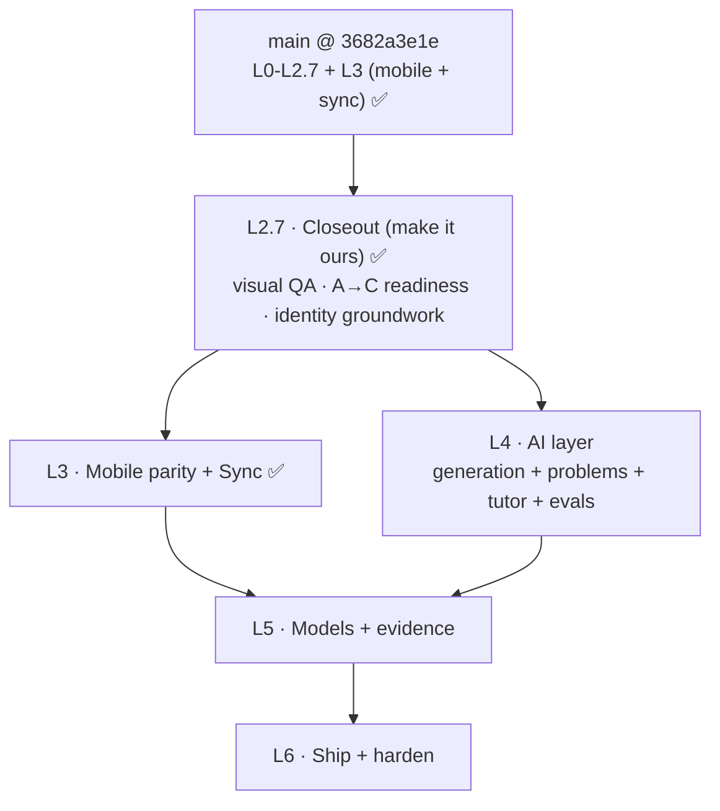

# pgrep Unified Build Plan

**What this is.** The single execution roadmap from where the code is today to a shipped product. It supersedes the old layer sketch. It states the verified starting line, the remaining trajectory, how each layer is split across agents, the exit gate that proves each layer, and a copy-paste controller prompt to run it.

**How to use it.**
1. Pick the lowest layer whose entry gate is green.
2. Open a fresh chat, paste that layer's controller prompt.
3. That chat becomes the layer controller. It reads this plan plus the named design docs, extracts the tasks into a `TodoWrite`, dispatches subagents (parallel where marked), and runs the review gates.
4. When the exit gate is met, mark the layer done here and move on.

**Legend.** 🔒 sequential gate (nothing after it starts until it is green). ∥ parallelizable (independent files or domains). ✅ done and on `main`.

**Governing docs.** Product context and the nine spec constraints live in [`../README.md`](../README.md). The durable "why" is in [`../research/`](../research/). The human, content, and dependency track is [`setup-content-deps.md`](setup-content-deps.md). The dev and test harness is [`dev-harness.md`](dev-harness.md). Phase contracts are the appendices in section 7.

**Copy rule (this doc and all pgrep text).** No em-dashes, no colon-heavy phrasing, short labels.

---

## 1. Where we are (the verified starting line)

Everything through the desktop takeover, the visual system, the closeout, and the mobile companion with two-way sync is complete and on `main` (HEAD `3682a3e1e`). `just lint` is green and the L3 sync round-trip proof passes. The remaining work starts from this base.

| Layer | Status | What it gave us |
|---|---|---|
| **L0 Build foundation** | ✅ | The Anki fork builds from source (`just run`), a trivial Rust change shows up end to end, the shared engine cross-compiles and loads a deck on iOS (`just ios-smoke`), and the dev harness runs (`just smoke`). |
| **L1 Engine seam + data model** | ✅ | The graded Rust change: `ReviewCardOrder::PointsAtStake` (`rslib/src/scheduler/queue/builder/points_at_stake.rs`), a read-only reorder inside gather-then-limit (never mutates `due`/`interval`/`memory_state`). Two-level topic tags, the Attempt log as immutable notes ("A now, C-ready"), the `pgrep::Problem` and `pgrep::Attempt` notetypes, with Rust and Python tests. Contracts: [`l1-coordination-schema.md`](l1-coordination-schema.md). |
| **L2 Core surfaces (no AI)** | ✅ | The four desktop surfaces in `ts/routes/pgrep/` (Study, Home, Progress, Diagnostic) on the real FSRS loop, the honest Memory score, the two-door session with commit-before-reveal and the static ladder, and a real macOS installer. Bridge and API: [`l2-api-contract.md`](l2-api-contract.md). |
| **L2.5 Desktop takeover** | ✅ | `qt/aqt/pgrep_host.py` makes the pgrep SPA the primary surface (`hosted` default), Anki's screens reachable via `Tools > Open Anki screens`. `tools/ios-run.sh` launches the iOS app visibly. Installer rebuilt from the takeover. Plan: [`l2.5-onscreen-proof.md`](l2.5-onscreen-proof.md). |
| **Visual system** | ✅ | Design tokens (`ts/lib/sass/_pgrep.scss`), the Svelte primitives (`ts/lib/components/`: `ScoreCard`, `ChoiceList`, `CoverageBar`, `GradeBar`, `HintRung`, `StudyFrame`, `NavRail`, `ReliabilityDiagram`, `Manifold`, `Manifold3D`), the 2D and 3D manifold (`ts/lib/pgrep/manifold.ts`, `manifold3d.ts`), the restyled surfaces plus a Settings surface, and the `ts/routes/pgrep-lab/` gallery. Deps: `three`, `@fontsource-variable/inter` + `jetbrains-mono`, `lucide-static`. The top toolbar now hides while pgrep leads. Spec: [`../../design/ux-foundation.md`](../../design/ux-foundation.md). |
| **L2.7 Closeout (make it ours)** | ✅ | Surface QA across all five surfaces in both themes (single shared `NavRail`, `Manifold3D` degrades to the 2D fallback, tokenized accents, copy-rule fixes, evidence-linked abstain states). The `ts/routes/pgrep-lab/gallery` covers every primitive's states. The exclusive takeover is proven with pure helpers in `pgrep_host.py` (`hosted` stays default), tested in `qt/tests/test_pgrep_host.py`. The dev app carries the pgrep name and icon (desktop titles + window icon, iOS `CFBundleDisplayName` + `AppIcon`). |
| **L3 Mobile parity + Sync** | ✅ | The native SwiftUI companion (`mobile/ios/PgrepStudy/`): a Home glance (2D wireframe manifold, native Memory that matches desktop by construction, honest Performance and Readiness abstains), a Study Cards door with full FSRS grading, and Settings sync. Two-way sync reuses Anki's self-hosted server unmodified (`just sync-server`) with the conflict rule in [`l3-sync-conflict-rule.md`](l3-sync-conflict-rule.md), proven by `pylib/tests/test_pgrep_sync_roundtrip.py` (revlog and Attempt union, newer-mtime, offline-then-sync) and `just ios-sync-proof` (the iOS FFI upload downloaded by a desktop engine). No changes under `rslib/src/sync`. |

**What is deliberately not done yet.** No AI (L4), no Performance or Readiness scores or model evidence (L5), and no final packaging or the exclusive takeover flip (L6).

---

## 2. The trajectory ahead

**Sequential spine:** L2.7 ✅, then **L3 ✅ ∥ L4** (run together, different stacks), then L5, then L6. Parallelism inside each layer is marked ∥.

**What each exit gate proves.**
- **L2.7:** the app looks and behaves like pgrep in both themes, the exclusive takeover is proven, and it carries its own name and icon in development.
- **L3:** review on the phone shows up on the desktop and back, with no lost or doubled reviews, and offline works then syncs (spec constraint 2).
- **L4:** every AI output traces to a named source, clears the gold-set gate, beats a simple baseline, and the app still scores with AI off (spec constraints 6 and 7).
- **L5:** Memory is calibrated, Performance is measured on held-out items, Readiness is mapped with a range, and the ablation is reported including what did not work (spec constraints 3, 4, 5).
- **L6:** both apps install and run clean on a fresh machine, AI off still scores, and the polished demo is recorded (spec constraint 8).

---

## 3. How work is split to agents (orchestration model)

Every layer runs the same way, following the `subagent-driven-development` and `dispatching-parallel-agents` skills.

1. **Isolate.** Create a git worktree for the layer off `main`, under `.worktrees/<layer>` (the worktree workflow rule). Never build on `main` without consent.
2. **Controller is the chat.** It reads this plan plus the layer's design docs, extracts the tasks into a `TodoWrite`, and hands each subagent the full task text and context. It never says "go read the plan."
3. **Per-task loop.** Dispatch a fresh **implementer** subagent. It asks questions first (the controller answers), implements with tests, commits, and self-reviews. Then a **spec-compliance reviewer** subagent (must be green before quality), then a **code-quality reviewer** subagent. Fix and re-review until approved, then mark the task done.
4. **Parallel rule.** Dispatch multiple implementers concurrently **only** for ∥ tasks that touch different files or domains. Never two implementers on the same files. One shared worktree cannot run concurrent `ninja` safely, so when tasks share a build, run their tests sequentially through the controller even if the implementation was parallel.
5. **Between layers.** Run a final reviewer over the whole layer, confirm the exit gate, merge the worktree to `main`, then remove the worktree.
6. **Model selection.** Cheap model for mechanical one or two file tasks, standard for multi-file integration, most capable for design, debugging, and review.

**File-ownership discipline.** Each layer below lists which files or domains each subagent owns, so parallel implementers never collide. When a shared seam needs a change mid-layer, it goes through the controller, not a second implementer.

---

## 4. The layers ahead

### L2.7 · Closeout (make it ours) · entry: `main` (L2.5 + visual) ✅ · done ✅

**Why.** The visual system and the shell takeover are built, but nobody has audited the surfaces end to end, the exclusive takeover is documented but unproven, and the app still carries Anki's name and icon. This layer closes the "make it ours" thread so the base is demo-clean before the heavy layers.

**Design refs.** [`../../design/ux-foundation.md`](../../design/ux-foundation.md) (the visual contract), [`../../design/readme.md`](../../design/readme.md) (the brand rules), [`l2.5-onscreen-proof.md`](l2.5-onscreen-proof.md) (the A to C flip, already documented), the `ts/routes/pgrep-lab/` gallery.

**Tasks.**
- **L2.7.1 ∥ Visual QA pass.** Audit every surface (Home, Study with both doors, Diagnostic, Progress, Settings) and every state (default, abstain, AI-off, loading, empty) against `ux-foundation.md`, in **both light and dark**. Fix drift from the tokens, the reserved color language (amber Memory, blue Performance, lilac Readiness, monochrome interaction), the copy rule, and the 100ms speed rule. Confirm the 2D manifold fallback renders when WebGL is unavailable. Owns: `ts/routes/pgrep/**`, `ts/lib/components/**`, `ts/lib/sass/_pgrep.scss`.
- **L2.7.2 ∥ Gallery coverage.** Ensure `ts/routes/pgrep-lab/` renders each primitive in its key states so reviewers can inspect them without running a full session (the durable gallery workflow). Owns: `ts/routes/pgrep-lab/**`.
- **L2.7.3 Exclusive-takeover proof.** Verify the A to C flip works end to end without shipping it as the default: hide `toolbarWeb` (already done) plus drop the "Open Anki screens" action and short-circuit `moveToState("deckBrowser")` back to `pgrep` when the mode is `exclusive`, then confirm `hosted` stays the default. Owns: `qt/aqt/pgrep_host.py`, `qt/aqt/main.py`.
- **L2.7.4 Identity groundwork.** Set the app's display name to the lowercase wordmark `pgrep` (matching the logo and the docs). Desktop: replace the two window titles in `qt/aqt/main.py` (currently `f"{self.pm.name} - Anki"` around line 518 and `"Anki"` around line 1512) so the app reads `pgrep`, and sweep for any other visible "Anki" title strings. iOS: set the shown name to `pgrep` via `CFBundleDisplayName` in `mobile/ios/project.yml` (the `PgrepStudy` target name and bundle id can stay; only the displayed label changes here). Produce the app icon from `design/assets/reference/logo.png` (the `.icns` set for desktop, the icon set for iOS). Final bundle id, menu-bar name, and installer name stay at L6.2. Owns: `qt/aqt/main.py` titles, `mobile/ios/project.yml` display name, icon assets.

**Exit gate.** Every surface matches the design system in both themes with no copy-rule or speed-rule violations. The gallery shows each primitive's states. Exclusive mode is proven and reverts cleanly to `hosted`. The dev app shows the pgrep name and icon. `just lint` and `just test-py` green.

**Agents.** Two parallel implementers (surfaces vs gallery) for the visual work, then one implementer for the takeover proof, then one for identity. Reviews per the model in section 3.

**Controller prompt.**
> You are the controller for **Build Layer L2.7 (Closeout, make it ours)** of pgrep.
> **Read first, in full:**
> - this file's L2.7 section
> - design/ux-foundation.md
> - design/readme.md
> - docs_pgrep/plan/l2.5-onscreen-proof.md (the A to C flip)
> - docs_pgrep/README.md (skim)
> **Entry check:** confirm `main` builds, `just lint` and `just test-py` are green, and `just run` opens into pgrep with the top toolbar hidden. If not, stop and tell me.
> **Deliverable:** the surfaces match the design system in both themes, the gallery covers component states, the exclusive takeover is proven (kept off by default), and the dev app carries the pgrep name and icon.
> **Your job:** run this layer with subagent-driven development in a `.worktrees/l2.7-closeout` worktree. Dispatch L2.7.1 (surface QA) and L2.7.2 (gallery) as parallel implementers, then L2.7.3 (exclusive proof) and L2.7.4 (identity) sequentially. Spec-compliance reviewer then code-quality reviewer per task.
> **Constraints (hard):** do not restyle away from the ux-foundation.md spec, keep hosted the default surface mode, never mutate scheduling state, no AI. Respect the copy rule and the 100ms speed rule.
> **Exit gate:** as above, `just lint` and `just test-py` green. Report what changed, screenshots or the gallery route, and any drift you could not resolve.

---

### L3 · Mobile parity + Sync · entry: L2 core ✅ · runs ∥ with L4 · done ✅

**Why.** The spec requires two apps sharing one engine with two-way sync (constraint 2). The shared engine already runs on iOS (L0.3, `just ios-smoke` and `just ios-run`). This layer builds the mobile surfaces and wires sync.

**Design refs.** [`../research/technical-architecture.md`](../research/technical-architecture.md) (Phase 4: reuse Anki's Rust sync server, self-host, iOS-via-FFI, the documented conflict rule), [`attempt-log-storage.md`](../research/attempt-log-storage.md) (the log rides note sync for free), `design/ux-foundation.md` §9 (mobile is the companion subset, a native translation of the same tokens).

**Tasks.**
- **L3.1 ∥ Mobile surfaces.** Home (readiness glance: manifold thumbnail plus the three score rows with ranges) and Study (a session that mirrors desktop) in the existing SwiftUI app (`mobile/ios/`), driving the shared engine through `rslib/ffi`. The manifold uses native 3D (SceneKit or Metal) or the 2D fallback. Owns: `mobile/ios/**`, `rslib/ffi/**` (only if new FFI entry points are needed), Swift protobuf regen via `tools/gen-swift-protos.sh`.
- **L3.2 ∥ Sync.** Two-way incremental sync by reusing Anki's Rust sync server, self-hosted (local Mac for the demo, a small VPS optionally). Document the conflict rule (union-by-id on the Attempt log, per K2 in `l1-coordination-schema.md`). Prove offline-then-sync. Owns: sync host config, `docs/syncserver/` usage, no changes under `rslib/src/sync/**`.

**Exit gate.** Review on the phone appears on the desktop and back, with no lost or doubled reviews. Offline works, then syncs. `just ios-run` shows the mobile surfaces on the shared engine.

**Human dependencies.** S2 (stand up the self-hosted sync server), P (Apple Developer account only if TestFlight or on-device signing is wanted; simulator and 7-day sideload are free). See section 5.

**Agents.** Two parallel implementers (mobile UI in Swift vs sync integration). Different domains, safe to parallelize.

**Controller prompt.**
> You are the controller for **Build Layer L3 (Mobile parity + Sync)** of pgrep.
> **Read first, in full:**
> - this file's L3 section
> - docs_pgrep/research/technical-architecture.md (Phase 4)
> - docs_pgrep/plan/l1-coordination-schema.md (the Attempt-log conflict rule)
> - design/ux-foundation.md (section 9)
> - docs_pgrep/plan/dev-harness.md (iOS recipes)
> **Entry check:** confirm `just ios-smoke` and `just ios-run` are green on `main` (the shared engine runs on iOS). If not, stop and tell me.
> **Deliverable:** the mobile Home and Study surfaces on the shared engine, plus two-way sync with a documented conflict rule and working offline-then-sync.
> **Your job:** run this layer with subagent-driven development in a `.worktrees/l3-mobile-sync` worktree. Dispatch L3.1 (mobile surfaces, Swift) and L3.2 (sync) as parallel implementers. Spec-compliance then code-quality review per task.
> **Constraints (hard):** reuse Anki's sync server, never modify anything under rslib/src/sync (the sync layer), the Attempt log rides note sync (union-by-id), never mutate scheduling state, everything works AI off. Mobile is the companion subset, a native translation of the tokens.
> **Exit gate:** phone-to-desktop-and-back with no lost or doubled reviews, offline then syncs. Report the conflict rule you implemented, the sync host setup, and a review of the round trip.

---

### L4 · AI layer (generation + problems + tutor + evals) · entry: L1 data + L2 study ✅ · runs ∥ with L3

**Why.** The AI features and their evidence (spec constraints 6 and 7). This is the largest layer and where most grading weight sits. It has an internal 🔒 gate: the eval harness lands first, because everything else is graded against it.

**Design refs.** [`../research/feature-forced-generation.md`](../research/feature-forced-generation.md) (cards: stylize vs gap-fill, the verification stack, the gen→FSRS bridge), [`../research/feature-problem-generation.md`](../research/feature-problem-generation.md) (MCQ with misconception-first distractors, the MCQ gold set), [`../research/feature-productive-failure.md`](../research/feature-productive-failure.md) (the wrong-answer ladder, stored decomposition, AI-off vs AI-on grading), `design/ux-foundation.md` §7.4 (the Library authoring surface). Content and provenance rules in [`setup-content-deps.md`](setup-content-deps.md).

**Tasks.**
- **L4.0 🔒 Eval harness.** The ruler everything else is graded on. Build the 50-item card gold set and the MCQ-shaped problem gold set, the held-out splits with the leakage rule (held-out items never enter the corpus, the RAG index, or any prompt), the keyword and vector baselines to beat, and the SymPy (CAS) path for computational items. Time-based splits only, never random. Nothing in L4.1 to L4.3 ships until this is green.
- **L4.1 ∥ Forced generation (cards).** The Library authoring surface ("author a seed", `design/ux-foundation.md` §7.4). AI **stylizes** the bundle's cards into the learner's voice where the bundle already covers a subtopic, and **gap-fills** net-new siblings from the corpus only where the user authors a technique the bundle lacks. Core-minimum verification: RAG grounding plus provenance plus the gold-set gate, routing `confidence < 0.6` to human review. CAS, self-consistency, and critic layers deferred. Owns: `ts/routes/pgrep/library/**`, `pylib/anki/pgrep/generation.py`, its bridge handler and tests.
- **L4.2 ∥ Problem generation.** MCQ with **misconception-first distractors** (name the likely error, derive the trap from it, store the misconception tag and rationale per distractor), plus a stored solution decomposition verified once at creation. Gate against the MCQ gold set: key correct, distractors plausible and grounded, and it beats naive-distractor generation and problem retrieval side by side. Core is misconception-first plus the gate; the student-data distractor ranker is deferred. Owns: `pylib/anki/pgrep/problem_gen.py`, its bridge handler and tests. Reads the `pgrep::Problem` notetype from L1.
- **L4.3 ∥ Scaffold-fade tutor.** The wrong-answer ladder: L1 nudge, L2 sub-goal decomposition and self-explanation over the **stored** decomposition, L3 sibling worked example, L4 reveal plus explain-back. AI-off is reveal-and-self-compare (required by spec). AI-on is rubric grading with a giveaway verifier so the final answer never leaks. Session-end synthesis from the Attempt log. Owns: `ts/routes/pgrep/study/**` (the ladder UI beyond the L2 static fallback), `pylib/anki/pgrep/tutor.py`, its bridge handler and tests.

**Exit gate.** Every AI output traces to a named source. The gold-set gate has a cutoff set before results were seen, and generation clears it and beats the baseline side by side. The wrong-answer ladder never leaks the answer (verified). The app still produces a Memory score and runs the static ladder with AI off.

**Human dependencies.** C1 (named-source corpus), C3 (seed cards), C4 (curated problems and their decompositions), E1 (gold sets), E2 (held-out splits), E3 (cutoffs and the baseline bar), plus the LLM key, local embeddings, and a local vector store. These gate L4.0. See section 5.

**Agents.** L4.0 first (sequential, it is the gate). Then L4.1, L4.2, L4.3 as parallel implementers (different modules and surfaces).

**Controller prompt.**
> You are the controller for **Build Layer L4 (AI layer)** of pgrep.
> **Read first, in full:**
> - this file's L4 section
> - docs_pgrep/research/feature-forced-generation.md
> - docs_pgrep/research/feature-problem-generation.md
> - docs_pgrep/research/feature-productive-failure.md
> - design/ux-foundation.md (section 7.4)
> - docs_pgrep/plan/setup-content-deps.md (tiers, gold set, leakage rule)
> **Entry check:** confirm the L1 data model (Problem and Attempt notetypes, topic tags) and the L2 Study loop are on `main`, and that Frank has provided the corpus, seeds, curated problems, and gold sets (L4.0 inputs). If the human inputs are missing, stop and tell me exactly what is needed.
> **Deliverable:** card generation (stylize plus gap-fill), problem generation (misconception-first distractors), and the scaffold-fade tutor, all traced to named sources, gold-set gated, beating a baseline, with AI-off paths intact.
> **Your job:** run this layer with subagent-driven development in a `.worktrees/l4-ai` worktree. Build **L4.0 (eval harness) first and get it green** before anything else. Then dispatch L4.1, L4.2, L4.3 as parallel implementers. Spec-compliance then code-quality review per task.
> **Constraints (hard):** every output cites a named source or is refused. Held-out and gold items never enter the corpus, index, or prompts. The ladder never reveals the final answer before the reveal rung (giveaway-verified). Everything must still work AI off. Never mutate scheduling state.
> **Exit gate:** as above, with the pre-set cutoff, the side-by-side baseline win, and the AI-off proof. Report the eval numbers, the cutoff, and the baseline comparison.

---

### L5 · Models + evidence · entry: data flowing (L2 plus L4) 🔒 depends on L4 evals

**Why.** The three scores and their held-out evidence (spec constraints 3, 4, 5). This turns the honest dashboard from "Memory only" into all three calibrated scores.

**Design refs.** [`../research/three-scores.md`](../research/three-scores.md) (the three scores and their ranges), [`../research/statistics-and-evaluation.md`](../research/statistics-and-evaluation.md) (the metrics and the held-out pipelines), [`../research/performance-model.md`](../research/performance-model.md) (PFA calibrated logistic), [`../research/feature-calibration.md`](../research/feature-calibration.md) (the honest dashboard, model calibration not user confidence).

**Tasks.**
- **L5.1 ∥ Memory calibration.** Brier and log-loss on held-out revlog, plus the reliability diagram (reuse `ts/lib/components/ReliabilityDiagram.svelte`). Time-based splits.
- **L5.2 ∥ Performance model.** The PFA calibrated logistic, with beta calibration for small data, measured on held-out exam-style questions against the batting-average baseline.
- **L5.3 Readiness mapping.** Map expected performance to a 200 to 990 scaled score with a range, using the private Tier-3 raw-to-scaled conversion table as constants only. Depends on L5.2.
- **L5.4 ∥ Ablation harness.** Full versus interleaving-off versus plain Anki, equal study time, the pre-stated metric, using the L1 selector switch. Report what did not work.
- **L5.5 Calibration dashboard (Feature 4).** Wire real calibration into the Progress surface: reliability diagrams plus Brier for Memory and Performance, coverage gating Readiness, the abstain rule. Depends on the Attempt log, the revlog, and L5.1 and L5.2.

**Exit gate.** Memory is calibrated with a reliability diagram and Brier. Performance is measured on held-out items and beats the baseline. Readiness is mapped with an explicit range and is coverage-gated. The ablation is reported including negatives.

**Human dependencies.** E2 (held-out splits), E4 (spot-check as grader, the results report, model cards, the Brainlift), and the readiness mapping constants (Tier-3 conversion table). See section 5.

**Agents.** L5.1, L5.2, L5.4 in parallel (independent analyses). L5.3 after L5.2. L5.5 after L5.1 and L5.2.

**Controller prompt.**
> You are the controller for **Build Layer L5 (Models + evidence)** of pgrep.
> **Read first, in full:**
> - this file's L5 section
> - docs_pgrep/research/three-scores.md
> - docs_pgrep/research/statistics-and-evaluation.md
> - docs_pgrep/research/performance-model.md
> - docs_pgrep/research/feature-calibration.md
> **Entry check:** confirm the Attempt log and revlog are populated and the L4 held-out splits exist with the leakage rule enforced. If not, stop and tell me.
> **Deliverable:** Memory calibrated, Performance measured on held-out items, Readiness mapped with a range and coverage-gated, the ablation reported, and the Progress dashboard wired to real calibration.
> **Your job:** run this layer with subagent-driven development in a `.worktrees/l5-models` worktree. Dispatch L5.1, L5.2, L5.4 in parallel, then L5.3 after L5.2, then L5.5. Spec-compliance then code-quality review per task.
> **Constraints (hard):** time-based splits only, never random. No score without its range and evidence. Abstain when data is thin. Readiness stays coverage-gated. Do not capture user confidence (model calibration only).
> **Exit gate:** as above. Report the Brier and log-loss, the Performance accuracy versus baseline, the Readiness mapping and range, and the ablation including what did not work.

---

### L6 · Ship + harden · entry: all above ✅

**Why.** Turn the working system into shippable artifacts and make the takeover final (spec constraint 8).

**Design refs.** [`setup-content-deps.md`](setup-content-deps.md) (signing, packaging), [`l2.5-onscreen-proof.md`](l2.5-onscreen-proof.md) (the A to C flip), [`../../prod/video/submission-video-kit.md`](../../prod/video/submission-video-kit.md) (the recordings).

**Tasks.**
- **L6.1 Exclusive takeover.** Flip `_DEFAULT_MODE = "exclusive"` in `pgrep_host.py`, drop the "Open Anki screens" action, and short-circuit `deckBrowser` back to `pgrep`. This is the one-place change proven in L2.7.3.
- **L6.2 Final identity and packaging.** App name, bundle id, icon, window and menu title, and the installer name. Rebuild the desktop `.dmg` and produce the phone build (signed APK or TestFlight, or a documented sideload).
- **L6.3 Hardening.** Crash test the review loop twenty times with zero collection corruption. A one-command benchmark on a 50k-card collection reporting p50, p95, and worst. Confirm the coverage map and the abstain rule under load.
- **L6.4 Submission.** The clean-machine install recordings and the polished Sunday demo from the real build, per `prod/video/submission-video-kit.md`.

**Exit gate.** Both apps install and run clean on a fresh machine, AI off still scores, the review loop is corruption-free across the crash test, the benchmark meets the speed rule, and the demo is recorded.

**Human dependencies.** P1 (signing, packaging, phone build, clean-machine test), E4 (results report, model cards, Brainlift), and recording the videos. See section 5.

**Agents.** L6.1 and L6.2 (one implementer each, then review). L6.3 (one implementer, benchmark and crash harness). L6.4 is human-run recording.

**Controller prompt.**
> You are the controller for **Build Layer L6 (Ship + harden)** of pgrep.
> **Read first, in full:**
> - this file's L6 section
> - docs_pgrep/plan/setup-content-deps.md (signing and packaging)
> - docs_pgrep/plan/l2.5-onscreen-proof.md (the A to C flip)
> - prod/video/submission-video-kit.md
> **Entry check:** confirm L3, L4, and L5 exit gates are green on `main`. If not, stop and tell me.
> **Deliverable:** the exclusive takeover, final identity and packaging, hardening (crash test, benchmark), and the recorded submission.
> **Your job:** run this layer with subagent-driven development in a `.worktrees/l6-ship` worktree. L6.1 then L6.2, L6.3 in parallel where independent. L6.4 is human-run; prepare the exact steps. Spec-compliance then code-quality review per task.
> **Constraints (hard):** AI off must still score. Zero collection corruption. Keep the AGPL headers and the Anki credit (spec constraint 9). No made-up measurements in the recordings.
> **Exit gate:** as above. Report the installer artifacts, the benchmark numbers, the crash-test result, and the recording checklist.

---

## 5. The human track (Frank)

The engine, UI, sync, and AI plumbing are agent-buildable. These are the tasks only Frank can do, mapped to the layer that needs them. Full detail in [`setup-content-deps.md`](setup-content-deps.md).

| Task | What | Needed by |
|---|---|---|
| **S2** | Stand up the self-hosted sync server (local Mac or a small VPS) | L3 |
| **C1** | Assemble the named-source corpus (Tier-1 open plus Tier-2 own), decide what is legal to bundle | L4 |
| **C3** | Author the seed cards, one conceptual seed per subtopic (the generation-effect requirement) | L4 |
| **C4** | Curate the core Problem set with distractor rationales and solution decompositions | L4 |
| **E1** | Build the card gold set and the MCQ gold set that gate generation | L4.0 |
| **E2** | Define the held-out splits and the leakage rule (memory reviews, performance questions, a private mock) | L4.0, L5 |
| **E3** | Set the metrics, the gold-set cutoff, and the baseline bar; make ship or no-ship calls | L4, L5 |
| **E4** | Spot-check AI items as grader; write the results report, model cards, and Brainlift | L5, L6 |
| **Readiness constants** | Obtain the Tier-3 raw-to-scaled conversion table (constants only, not shipped as items) | L5.3 |
| **P1** | Sign and package the desktop installer, produce the phone build, test on a clean machine | L6 |

**The one thing to internalize.** With unlimited AI tokens, compute is not the bottleneck. The scarce inputs are content (C tasks) and judgment (E tasks). Budget the majority of non-agent hours there.

---

## 6. Constraints and readiness

**The nine spec constraints, and where each is satisfied.**

| # | Constraint | Satisfied by |
|---|---|---|
| 1 | A real change inside Anki's Rust engine | L1 selector ✅ (`points_at_stake.rs`) |
| 2 | Two apps sharing one engine, two-way sync | L3 ✅ |
| 3 | Three separate scores, each with a range and a give-up rule | Memory L2 ✅; Performance and Readiness L5 |
| 4 | Held-out evaluation for every model, reproducibly | L4.0 harness, L5 evidence |
| 5 | One study feature built on learning science, ablation-tested | L1 interleaving ✅; ablation L5.4 |
| 6 | Every AI output traces to a named source, gold-set checked, beats a baseline | L4 |
| 7 | Both apps run with AI off and still score | L2 ✅ (desktop), L3 ✅ (mobile), guarded in L4 |
| 8 | Ship a desktop installer plus a phone build | Installer L2 and L2.5 ✅; final L6 |
| 9 | License AGPL-3.0-or-later, crediting Anki | Headers kept throughout; verified at L6 |

**Hard invariants (every layer inherits).**
- Never mutate `due`, `interval`, or `memory_state`. Ordering is the L1 selector, never a schedule rewrite.
- The app scores with AI off. AI is an upgrade, never a dependency.
- No score without its range and evidence. Abstain when data is thin.
- Every AI output cites a named source or is refused. Held-out and gold items never leak into the corpus, index, or prompts.
- No interaction blocks the UI over 100ms.
- Keep the AGPL headers and the Anki credit.

**Design readiness.** All layers are design-ready. L2.7 draws on the existing `ux-foundation.md`. L3 on `technical-architecture.md` Phase 4. L4 on the two generation docs plus productive-failure. L5 on the three scoring docs plus calibration. L6 on setup-and-dependencies plus the video kit.

---

## 7. Appendix: phase contracts and references

- [`l1-coordination-schema.md`](l1-coordination-schema.md) · topic tags, blueprint weights, the Attempt-log schema and invariants (K1 to K5).
- [`l2-api-contract.md`](l2-api-contract.md) · the frontend-to-backend channels, the `anki.pgrep.*` bridge, per-surface endpoints, file ownership.
- [`l2.5-onscreen-proof.md`](l2.5-onscreen-proof.md) · the desktop takeover and the documented A to C flip.
- [`setup-content-deps.md`](setup-content-deps.md) · the human, content, sourcing, and external-tooling track.
- [`dev-harness.md`](dev-harness.md) · the build, run, and test recipes for desktop and iOS.
- [`../research/`](../research/) · the durable "why" behind every feature and model.

_This plan is the single roadmap. When a layer completes, update its row in section 1 and mark its gate here._
