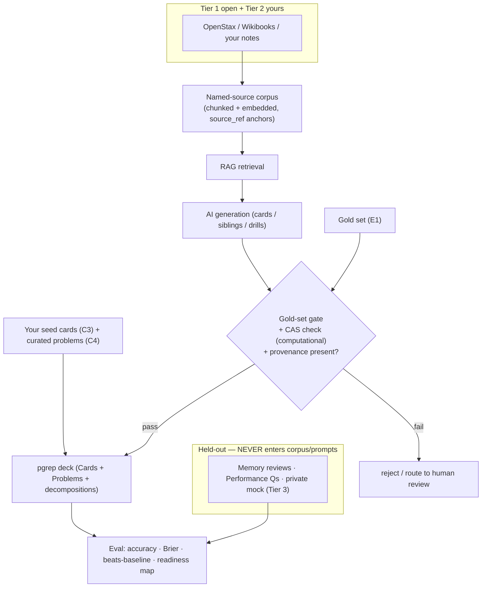

# Setup, Content Sourcing & Dependencies — the "outside the code" plan

**Status: designed (core).** Shared context in `README.md`. This is the doc for everything the project needs from *outside the codebase*: **(1) what you (Frank) must do**, **(2) where the content/data comes from**, and **(3) what external programs, services, and accounts are required.** Feeds `build-plan.md` (every layer) and satisfies the spec's provenance/eval/ship requirements (constraints 4, 6, 8, 9).

> **The one thing to internalize:** with unlimited AI tokens and a MacBook, **compute is not the bottleneck — your expert time is.** The scarce, irreplaceable inputs are *content* (tagged cards/problems, seeds, decompositions) and *judgment* (gold sets, eval cutoffs, ship calls). Plan your hours around those.

---

## 1. What you (Frank) must do — human-in-the-loop

The engine, UI, sync, and AI plumbing are buildable by agents. These are the tasks **only you** can do, mapped to when they're needed.

| # | Your task | When (build layer) | Why only you |
|---|---|---|---|
| **S1** | Get the fork **building + running** on your Mac (`just run`), phone build on a device/sim | L0 | one-time environment + accounts (below) |
| **S2** | Stand up a **self-hosted sync server** (local or a small VPS) | L0→L3 | it's your endpoint + credentials |
| **C1** | Assemble the **named-source corpus** (openly-licensed physics text) and decide what's legal to bundle | L1→L4 | licensing judgment (§2) |
| **C2** | Define the **two-level topic taxonomy** + **tag** every card/problem to the PGRE blueprint | L1 | domain expertise |
| **C3** | Author the **seed cards** — one conceptual seed per subtopic (the generation-effect requirement) | L2→L4 | it's *your* generation that the science requires |
| **C4** | Curate the **core Problem set** — stems, 5 choices, correct answer, **distractor rationales**, **solution decomposition** (sub-goals + rubric) | L2→L4 | curated (not generated) for core; feeds the ladder |
| **E1** | Build the **gold set** (~50 hand-verified items) that gates AI generation | L4.0 | the ground truth to grade AI against |
| **E2** | Define the **held-out sets** + leakage rules (memory reviews, performance questions, a private mock) | L4.0→L5 | you decide what "held out" means |
| **E3** | Set **metrics + cutoffs** (gold-set pass threshold; the baseline to beat) and make **ship/no-ship** calls | L4→L5 | human judgment on quality |
| **E4** | Spot-check AI items as the **human grader**; write the **results report + model cards + Brainlift** | L5 | graded deliverables in your voice |
| **P1** | **Sign/package** the desktop installer; produce the **phone build** (TestFlight/sideload); test on a clean machine + real device | L6 | your signing identity + hardware |

**Reading it:** the top-left (S/setup) is a few hours, one time. The middle (C/content) is the **real recurring cost** — budget the majority of your non-agent hours here. The bottom (E/eval, P/pack) is judgment + mechanics near the deadlines.

---

## 2. Where the data comes from — sourcing & provenance

The spec requires **every AI output to trace to a named source** and be checked against a **gold set** (constraint 6), and **every model to be evaluated on held-out data** (constraint 4). That makes *content sourcing a graded, first-class concern*, not an afterthought. It also has a **legal edge** we must respect.

### 2.1 Sourcing tiers (ordered by legal safety)

| Tier | Source | Use in pgrep | License note |
|---|---|---|---|
| **1 · Open** | **OpenStax University Physics** Vol 1–3; Wikibooks/Wikiversity; Wikipedia; public-domain texts; open lecture notes | **The bundled named-source corpus** (RAG + provenance) | OpenStax **CC-BY 4.0** (attribute, bundle freely). Wikipedia/Wikibooks **CC-BY-SA** (share-alike — fine, and pgrep is AGPL). Check each set. |
| **2 · Yours** | Cards/problems **you author**, your own notes | Seeds (C3), curated problems (C4), gold set (E1) | original work, safe. This is exactly what the generation-effect science wants. |
| **3 · ETS official** | Official PGRE practice tests (GR86/92/96/0177, current practice book) | **Private held-out validation only** — sanity-check the readiness mapping against real items. **Do NOT bundle, ship, or feed to generation.** | **Copyright ETS.** Personal/academic use is defensible; redistribution is not. Keep out of the shipped app + out of the corpus. |
| **4 · AI-generated** | Cards/problems produced by the pipeline | Deck content, **only if** it cites a Tier-1 source + passes the gold-set gate | provenance + gate are the spec requirement (`feature-forced-generation.md`). |

**The rule that keeps us safe and compliant:** the **corpus** (what AI cites and generates from) is **Tier 1 + Tier 2 only**. **Tier 3** never enters the corpus or a prompt — it lives in a private, unshipped folder used solely to validate scores. This simultaneously satisfies "named source" and avoids shipping ETS's copyrighted items.

### 2.2 The four data assets you build

1. **Named-source corpus** — a bundled, openly-licensed reference set (OpenStax chapters, etc.), **chunked + embedded** for retrieval. Each chunk carries a stable `source_ref` (title + section + a quote anchor) so every generated item can point back at a real line.
2. **Gold set (~50 items)** — hand-verified Q + correct answer + distractor rationales + solution decomposition. Gates AI generation (accuracy + wrong-answer rate) and anchors the "beats a baseline" test.
3. **Held-out sets** (leakage-controlled) —
   - **Memory:** a slice of `revlog` reviews held out → Brier / log-loss for FSRS calibration.
   - **Performance:** exam-style questions never shown during tuning → accuracy of the Performance model.
   - **Readiness:** ideally one **private** real mock (Tier 3) → sanity-check the score mapping + range.
   - **Leakage rule:** held-out items must never appear in the corpus, the RAG index, or any generation/tutor prompt.
4. **Readiness mapping constants (Tier 3, private) — the one hard external dependency.** The **official raw→scaled conversion table** (and percentile table) from a real PGRE practice test, used *only as constants* to turn an expected raw score into a 200–990 scaled number (`three-scores.md` §3). **Not shipped as items — just the mapping.** Without it, Readiness renders as raw/percent only. Pairs naturally with the Tier-3 mock in (3): the same practice test gives you both the conversion table and a validation mock. **Status (2026-07-01): de-risked — Frank can obtain ETS materials, plus has additional content on hand (to be tiered/licensed).**

### 2.3 Content pipeline (sources → deck, and → eval)

---

## 3. External programs, services & accounts

Everything not living in the repo. Grouped by **when you first need it**. "Cost" assumes your unlimited-AI-token situation.

### 3.1 Build toolchain (need at L0, local, mostly wired by `just`)

| Tool | For | Cost |
|---|---|---|
| **Rust** (rustup) + `aarch64-apple-ios` target | the engine + the graded change + iOS cross-compile | free |
| **Python 3** | pylib, scripts, CAS, eval harness | free |
| **Node + Yarn** (vendored — `out/extracted/node/bin/yarn`) | the `ts/` frontend | free |
| **`just`** | every build/run/test/lint recipe | free |
| **Xcode + Command Line Tools** | iOS build, native manifold (SceneKit/Metal), signing | free (account extra) |
| Protobuf toolchain | cross-language API (handled by the build) | free |

### 3.2 AI + content tooling (need at L4)

| Tool / service | For | Cost / note |
|---|---|---|
| **LLM API** (Anthropic Claude and/or OpenAI) | generation, tutor grading, session synthesis | key + account; **your tokens are covered**. Store the key in Settings / OS secure storage — never synced, never committed. |
| **Embeddings** | RAG over the corpus | **prefer local** (`sentence-transformers` / `bge`) → free, offline, keeps corpus private. API embeddings (OpenAI/Voyage/Cohere) are the alternative. |
| **Vector store** | retrieval index | **no service needed** — `sqlite-vec` / FAISS / `hnswlib` locally over the bundled corpus. |
| **CAS: SymPy** (Python) | verify **computational** cards/problems (symbolic/numeric) without an LLM | free, deterministic, offline. Central to the gold-set gate + "beats baseline." |
| **PDF/equation extraction** | turn source PDFs into corpus text/equations | `PyMuPDF`/`pdfplumber` (text, free); **`nougat`** (local science-OCR, free) or **Mathpix** (paid API, higher quality) for equations. |

### 3.3 Mobile + ship (need at L3 / L6)

| Thing | For | Cost / note |
|---|---|---|
| **Apple Developer Program** | TestFlight + clean device signing (the phone "build" deliverable) | **$99/yr**. Free path: simulator + 7-day sideload for the demo. |
| **Self-hosted sync server** | the two-device sync requirement | `anki-sync-server` (in-repo). **Local Mac = free** for the demo; a small **VPS** (~$5/mo) if you want always-on. Docker in `docs/syncserver/`. |
| **(Optional) Apple Developer ID + notarization** | signed/notarized mac installer | polish, "beyond Sunday." Unsigned installs fine for grading. |
| **(Optional) Android Studio + SDK/NDK + `cargo-ndk`** | Android via the same FFI + Compose | only if you choose Android over iOS. |

### 3.4 Frontend libraries (from `ux-foundation.md` §10 — no new accounts)

**Three.js** (manifold, MIT), **Inter + JetBrains Mono** (fonts, OFL, self-hosted), **Lucide** (icons, ISC). Already in the stack: **D3 7**, **MathJax 3**, Svelte 5 motion. All AGPL-compatible.

### 3.5 Cost summary

**Realistic out-of-pocket:** essentially **$0** to build and demo everything (local sync server, local embeddings, simulator/sideload, SymPy, nougat). The only likely spend is **Apple Developer ($99/yr)** if you want TestFlight, and optionally a **~$5/mo VPS** and **Mathpix** if you want nicer equation OCR. Your LLM usage is covered.

---

## 4. Readiness checklist

**Before L0 (build foundation):**
- [ ] Xcode + Command Line Tools installed; `just run` builds Anki on your Mac.
- [ ] Rust + `aarch64-apple-ios` target; phone build runs on a sim/device.
- [ ] LLM API key obtained (used later, but grab it now).
- [ ] Decide sync host: local Mac now, VPS later?

**Before L4 (AI layer):**
- [ ] Tier-1 corpus chosen + downloaded (OpenStax, etc.); licenses noted.
- [ ] Corpus chunked + embedded (local embeddings running).
- [ ] Gold set (~50 items) authored + verified.
- [ ] Held-out splits defined; leakage rule written down.
- [ ] SymPy verification path working on computational items.

**Before L6 (ship):**
- [ ] Apple Developer account (if TestFlight) or sideload plan confirmed.
- [ ] Clean-machine test plan for the desktop installer.
- [ ] Private Tier-3 mock ready to validate the readiness mapping.

---

_Sources: the project spec (constraints 4, 6, 8, 9); `README.md`; `ux-foundation.md` §10 (deps/licenses); `technical-architecture.md` (sync/mobile/FFI, self-host); `feature-forced-generation.md` (provenance + gold-set gate + CAS); the PGRE BrainLift (resource stack). Licensing notes are practical guidance, not legal advice — verify each source's license before bundling._
