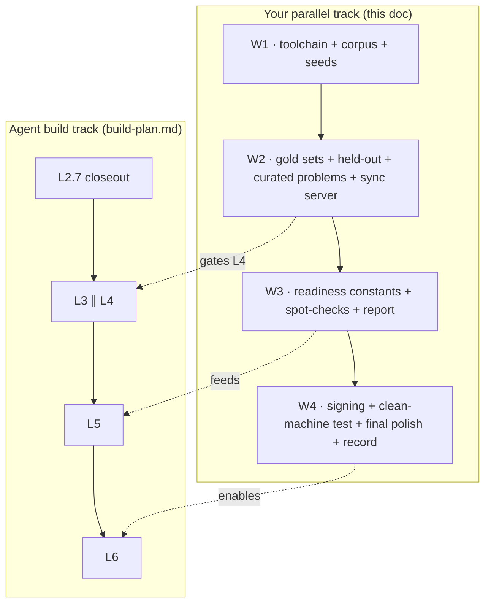

# Your Parallel Track (what to do while the agents build)

**What this is.** The **when** of your non-code work, sequenced against the build so you are never the thing blocking a layer. The **what and how** already live in [`setup-content-and-dependencies.md`](setup-content-and-dependencies.md) (sourcing tiers, RAG assets, tools, accounts, cost). The **build order** lives in [`build-plan.md`](build-plan.md). This doc ties your work to that order. It does not repeat the detail, it points at it.

**Copy rule.** No em-dashes, no colon-heavy phrasing, short labels.

---

## The one rule that governs your timing

Your content and eval prep **gate L4** (the AI layer), and L4 runs in parallel with L3. Nothing you do gates L2.7 or L3. So the whole game is: **have the corpus, the seeds, and the gold sets ready by the time the L4 controller opens.** The L4 controller prompt is written to stop and ask you for exactly these, so if they are ready, L4 starts immediately, and if not, it waits on you.

**Content is the long pole.** With unlimited AI tokens, compute is not the bottleneck, your expert time is. Corpus assembly, seed authoring, curated problems, and the gold sets are the scarce inputs. Start them now, in parallel with everything, because they take the longest.

---

## Window 1 · now, while L2.7 (closeout) builds

L2.7 is short and needs nothing from you, so use it to start the long-pole work.

- **Stand up the AI toolchain.** LLM API key, local embeddings running (`sentence-transformers` or `bge`), a local vector store (`sqlite-vec` or FAISS), and SymPy for computational checks. Detail: `setup-content-and-dependencies.md` §3.2.
- **Start the corpus (C1).** Pick the Tier-1 open sources (OpenStax University Physics Vol 1 to 3, Wikibooks, your notes), download them, and note each license. Detail: §2.1 and §2.2.
- **Start authoring seeds (C3).** One conceptual seed per finest topic unit, roughly 20 to 30 total. This is the generation-effect surface and the AI style signal, and it is the single most time-consuming input. Detail: §1 (C3).
- **Optional, your UI polish window.** The desktop surfaces are on `main`, so this is the natural time to fine-tune Home, Study, Progress, Diagnostic, and Settings. Do it on a branch or worktree so you do not collide with the L2.7 controller editing the same `ts/` files.

**Checklist to leave Window 1 with:** toolchain working, Tier-1 sources downloaded and licensed, seed authoring underway.

---

## Window 2 · while L3 and L4 build

This is the critical hand-off. L4 opens here, so its inputs must be ready at the start, not the end.

- **Finish the corpus and index it.** Chunk and embed the Tier-1 sources, each chunk carrying a `source_ref`. Detail: §2.2 (the named-source corpus).
- **Build the gold sets (E1).** The 50-item card gold set and the MCQ-shaped problem gold set, including a rationale per distractor. This is the ruler L4 is graded against. Detail: §1 (E1), §2.2.
- **Define the held-out splits and the leakage rule (E2).** Memory reviews, performance questions, and a private mock, none of which may ever enter the corpus, the index, or a prompt. Detail: §1 (E2), §2.3.
- **Curate the core problems (C4).** Stems, five choices, the key, distractor rationales, and a solution decomposition each. The trusted seed bank the generator scales. Detail: §1 (C4).
- **Set the cutoffs (E3).** The gold-set pass bar and the baseline to beat, decided before you see results.
- **Stand up the sync server (S2)** for L3. Local Mac is fine for the demo. Detail: §3.3.

**Checklist to unblock L4:** corpus indexed, gold sets built, held-out splits defined with the leakage rule written down, curated problems ready, cutoffs set.

---

## Window 3 · before and into L5 (models and evidence)

- **Obtain the readiness mapping constants.** The Tier-3 raw-to-scaled conversion table from a real practice test, used as constants only, never shipped as items. This is the one hard external dependency for Readiness. Detail: §2.2 (asset 4).
- **Spot-check AI items as the grader (E4).** Sample generated cards and problems, confirm fact precision and distractor quality.
- **Start the results report and model cards (E4).** In your voice, these are graded deliverables. Begin them as the L5 numbers land.

**Checklist:** conversion table in hand, grading pass done, report and model cards drafted.

---

## Window 4 · before and into L6 (ship)

- **Signing and packaging (P1).** Apple Developer account if you want TestFlight or on-device signing, otherwise the free simulator and 7-day sideload path. Test the desktop installer on a fresh account or VM. Detail: §3.3.
- **Final UI polish pass.** By now the Library surface (L4), the calibration dashboard (L5), and the mobile surfaces (L3) exist, so this is where you tune the surfaces that did not exist at Window 1. This finishes the UI, it is not left for after ship.
- **Record the submission.** The clean-machine install clips and the polished demo from the real build, per [`../../prod/video/submission-video-kit.md`](../../prod/video/submission-video-kit.md).

**Checklist:** installer verified on a clean machine, phone build produced, every surface polished, videos recorded.

---

## UI fine-tuning, the direct answer

Not after L6. You get two windows. **Window 1 (during L2.7)** is the dedicated polish pass for the five desktop surfaces that already exist. **Window 4 (into L6)** is the final pass, once Library, the dashboard, and mobile have been built. Between those you can tweak anytime, always on a branch or worktree so you do not collide with a running layer controller. The visual system itself is already on `main`, so nothing about styling is blocked.

---

## What gates what (quick reference)

| Your input | Unblocks | Window |
|---|---|---|
| Toolchain (LLM key, embeddings, vector store, SymPy) | L4 | W1 |
| Corpus (C1) indexed | L4 generation | W1 to W2 |
| Seeds (C3) | L4 generation and the generation effect | W1 to W2 |
| Gold sets (E1) + cutoffs (E3) | L4 gate | W2 |
| Held-out splits (E2) | L4 and L5 evidence | W2 |
| Curated problems (C4) | L4 problem generation and the ladder | W2 |
| Sync server (S2) | L3 | W2 |
| Readiness constants (Tier-3 table) | L5.3 | W3 |
| Signing and hardware (P1) | L6 | W4 |

Nothing you do gates L2.7 or L3, so the closeout and the mobile work can proceed while you build content.

---

## References

- [`setup-content-and-dependencies.md`](setup-content-and-dependencies.md) · the full detail on sourcing, RAG assets, tools, accounts, and cost.
- [`build-plan.md`](build-plan.md) · the build order, the per-layer gates, and the human dependencies each layer names.
- [`../../prod/video/submission-video-kit.md`](../../prod/video/submission-video-kit.md) · the recording shot lists.
