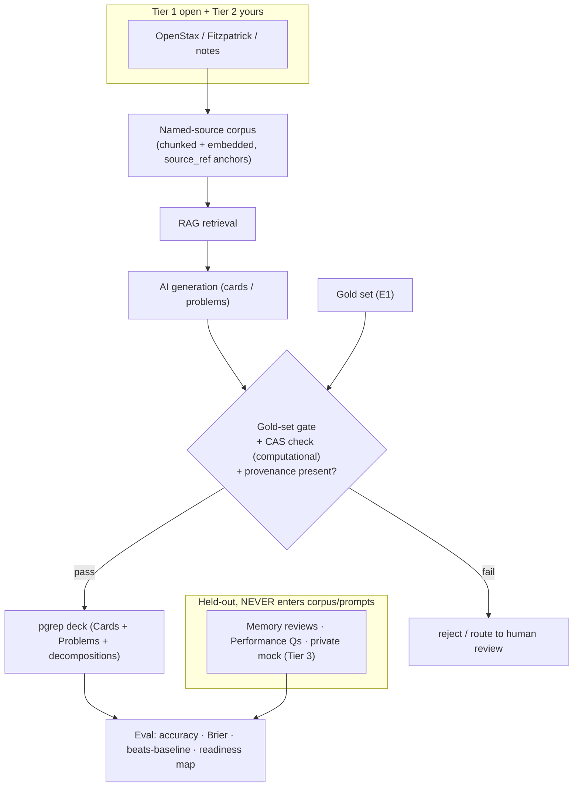

# Content, Provenance & Dependencies

The durable reference for how the AI layer's content is sourced and kept honest,
and what the project depends on from outside the codebase. It defines the
sourcing tiers, the provenance and leakage rules, the data assets the AI layer is
built on, and the external tools and services the build requires. Shared product
context is in [`../README.md`](../README.md). Live dataset status is in
[`dataset-pipeline.md`](dataset-pipeline.md).

---

## 1. Sourcing tiers and provenance

The spec requires every AI output to trace to a named source and be checked
against a gold set (constraint 6), and every model to be evaluated on held-out
data (constraint 4). That makes content sourcing a first-class, graded concern
with a legal edge the project respects.

### 1.1 The tiers (ordered by legal safety)

| Tier                 | Source                                                                                                         | Use in pgrep                                                                                               | License note                                                                                                         |
| -------------------- | -------------------------------------------------------------------------------------------------------------- | ---------------------------------------------------------------------------------------------------------- | -------------------------------------------------------------------------------------------------------------------- |
| **1 · Open**         | OpenStax University Physics Vol 1-3; the Fitzpatrick texts; Wikibooks; public-domain texts; open lecture notes | The bundled named-source corpus (RAG + provenance)                                                         | OpenStax CC-BY 4.0 (attribute, bundle freely). Wikibooks CC-BY-SA (share-alike, fine under AGPL). Check each set.    |
| **2 · Yours**        | Cards and problems Frank authors, own notes                                                                    | Curated content, gold set (E1)                                                                             | original work, safe                                                                                                  |
| **3 · ETS official** | Official PGRE forms (GR8677, GR9277, GR9677, GR0177, GR0877, GR1777)                                           | Private held-out validation and the problem gold ruler only. Never bundled, shipped, or fed to generation. | Copyright ETS. Academic use is defensible, redistribution is not. Kept out of the shipped app and out of the corpus. |
| **4 · AI-generated** | Cards and problems the pipeline produces                                                                       | Deck content, only if it cites a Tier-1 source and passes the gold-set gate                                | provenance + gate are the spec requirement                                                                           |

**The rule that keeps the project safe and compliant.** The corpus (what the AI
cites and generates from) is Tier 1 plus Tier 2 only. Tier 3 never enters the
corpus, the index, or a prompt. It lives in a private, unshipped folder used
solely to grade and validate. This satisfies "named source" and avoids shipping
ETS's copyrighted items.

### 1.2 The leakage firewall

Held-out and gold items never enter the corpus, the RAG index, or any generation
or tutor prompt. The index is built from `content/corpus/` only. From
`content/tier3-private/`, only the numeric raw-to-scaled constants are ever read
(by the readiness mapping), never the items. This is structural first (the index
has one input) and guarded second (a leakage check asserts no held-out or gold
path appears in the index). Full detail in
[`../ai/heldout-and-leakage.md`](../ai/heldout-and-leakage.md).

---

## 2. The data assets

Four assets the AI layer is built on.

1. **Named-source corpus.** A bundled, openly-licensed reference set (OpenStax,
   Fitzpatrick), chunked and embedded for retrieval. Each chunk carries a stable
   `source_ref` (title, section, quote anchor) so every generated item points
   back at a real line.
2. **Gold sets (E1).** Hand-verified items with correct answers, distractor
   rationales, and solution decompositions. They gate AI generation (fact
   precision, useful-yield, distractor quality) and anchor the beats-a-baseline
   test. The card gold is corpus-verified; the problem gold is the vision-cleaned
   GR9677 plus the community 70. Never fed to generation.
3. **Held-out sets (E2), leakage-controlled.**
   - Memory: a slice of revlog reviews held out, for FSRS calibration.
   - Performance: exam-style questions never shown during tuning.
   - Readiness: a private real mock (Tier 3) to sanity-check the score mapping.
   - Leakage rule: held-out items never appear in the corpus, the index, or a prompt.
4. **Readiness mapping constants (Tier 3, private).** The official raw-to-scaled
   conversion and percentile tables from a real form, used only as constants to
   turn an expected raw score into a 200-990 scaled number
   ([`../research/three-scores.md`](../research/three-scores.md) §3). Not shipped
   as items, just the mapping. Without it, Readiness renders as raw or percent only.

### Content pipeline

---

## 3. External programs, services and accounts

Everything not living in the repo, grouped by when it is first needed.

### 3.1 Build toolchain (L0, local, mostly wired by `just`)

| Tool                                       | For                                              | Cost                 |
| ------------------------------------------ | ------------------------------------------------ | -------------------- |
| Rust (rustup) + `aarch64-apple-ios` target | the engine, the graded change, iOS cross-compile | free                 |
| Python 3                                   | pylib, scripts, CAS, eval harness                | free                 |
| Node + Yarn (vendored)                     | the `ts/` frontend                               | free                 |
| `just`                                     | every build, run, test, lint recipe              | free                 |
| Xcode + Command Line Tools                 | iOS build, native manifold, signing              | free (account extra) |
| Protobuf toolchain                         | cross-language API (handled by the build)        | free                 |

### 3.2 AI and content tooling (L4)

| Tool / service   | For                                                      | Cost / note                                                                      |
| ---------------- | -------------------------------------------------------- | -------------------------------------------------------------------------------- |
| LLM API (OpenAI) | generation, tutor grading, session synthesis, eval judge | key + account. Stored in `content/.env`, never synced, never committed.          |
| Embeddings       | RAG over the corpus                                      | local (`sentence-transformers` / `bge`), free, offline, keeps the corpus private |
| Vector store     | retrieval index                                          | local `sqlite-vec`, no service needed                                            |
| CAS: SymPy       | verify computational cards and problems without an LLM   | free, deterministic, offline. Central to the gate.                               |
| PDF extraction   | source PDFs into corpus text                             | `PyMuPDF` (text). Vision models for scanned equations where needed.              |

### 3.3 Mobile and ship (L3 / L6)

| Thing                                        | For                                 | Cost / note                                                                      |
| -------------------------------------------- | ----------------------------------- | -------------------------------------------------------------------------------- |
| Apple Developer Program                      | TestFlight and clean device signing | $99/yr. Free path: simulator + 7-day sideload for the demo.                      |
| Self-hosted sync server                      | the two-device sync requirement     | `anki-sync-server` (in-repo). Local Mac free for the demo; a small VPS optional. |
| (Optional) Apple Developer ID + notarization | signed and notarized mac installer  | polish. Unsigned installs are fine for grading.                                  |

### 3.4 Frontend libraries (no new accounts)

Three.js (manifold, MIT), Inter + JetBrains Mono (fonts, OFL, self-hosted),
Lucide (icons, ISC), D3 7, MathJax 3, Svelte 5 motion. All AGPL-compatible.

### 3.5 Cost summary

Realistic out-of-pocket is essentially $0 to build and demo everything (local
sync server, local embeddings, simulator or sideload, SymPy). The only likely
spend is Apple Developer ($99/yr) for TestFlight, and optionally a small VPS.
LLM usage is covered.

---

_Sources: the project spec (constraints 4, 6, 8, 9); [`../README.md`](../README.md);
[`../../design/ux-foundation.md`](../../design/ux-foundation.md) §10 (deps and
licenses); [`../research/technical-architecture.md`](../research/technical-architecture.md)
(sync, mobile, FFI, self-host); [`../research/feature-forced-generation.md`](../research/feature-forced-generation.md)
(provenance, gold-set gate, CAS). Licensing notes are practical guidance, not
legal advice; verify each source's license before bundling._
