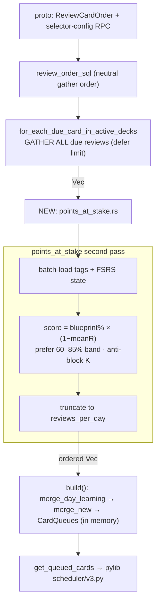

# Anki Rooting & the Rust Engine Change

**Status: approach approved.** Shared context in `README.md`; the selector's design is in `feature-interleaving.md`; this doc is the concrete implementation plan for the graded Rust change (spec rubric: 20%). Maps the L1 build layer in `build-plan.md`.

_Grounding: knowledge graph (`.understand-anything/knowledge-graph.json`) + direct code reads + a thorough exploration ([Rust change map](503078db-0a75-41c7-b33a-cde168c798c5)). Verify line numbers before editing — the code moves._

## The key finding (changes the shape of the change)

**Anki orders review cards via SQL `ORDER BY` at _gather_ time — not a Rust post-sort.** `review_order_sql` (`rslib/src/storage/card/mod.rs:859`) maps each `ReviewCardOrder` variant to an SQL clause, and **the daily review limit is applied _during_ SQL iteration** (`gathering.rs:35–61`). `sorting.rs` only sorts _new_ cards — there is **no `sort_review`**.

Consequence for points-at-stake: a naive post-sort is **insufficient** — the wrong cards may never be gathered before the limit cuts in. So our change is a genuine engine change with two parts:

1. A new `ReviewCardOrder::PointsAtStake` variant.
2. A **Rust second pass** that **gathers all due reviews, scores them, then truncates to the limit** ("gather-then-limit"), inserted at the gather seam.

This is _more_ than a cosmetic sort — exactly the kind of real Rust change the rubric wants, and it never touches `due`/`interval`/`memory_state`.

## What "weakness" is (consistent with the locked selector design)

`weakness(topic) = 1 − mean FSRS retrievability R over that topic's due cards`. **FSRS-native — no attempt-log dependency for the selector.** `Worth(card) = blueprint%(topic) × weakness(topic)`, where blueprint% is a static PGRE table. So everything the scorer needs is computable at queue-build from **FSRS state + note tags + a static table**. (The attempt log feeds Performance + calibration, not the selector.)

## Concrete insertion plan (file + function level)

| #  | Action                                                                                                                                                                                        | File                                                                                                                  | Anchor                     |
| -- | --------------------------------------------------------------------------------------------------------------------------------------------------------------------------------------------- | --------------------------------------------------------------------------------------------------------------------- | -------------------------- |
| 1  | Add `REVIEW_CARD_ORDER_POINTS_AT_STAKE = 13`                                                                                                                                                  | `proto/anki/deck_config.proto`                                                                                        | 97–111                     |
| 2  | Neutral SQL gather order for the new variant (Day + random tiebreak)                                                                                                                          | `rslib/src/storage/card/mod.rs`                                                                                       | `review_order_sql` 859–896 |
| 3  | For the new variant, **gather all due, defer the limit**                                                                                                                                      | `rslib/src/scheduler/queue/builder/gathering.rs`                                                                      | `gather_due_cards` 35–61   |
| 4  | **New scorer module** `sort_reviews_points_at_stake(&mut QueueBuilder, &Collection)`: score = blueprint% × (1−meanR), prefer 60–85% band, anti-blocking (max K same-topic), truncate to limit | new `builder/points_at_stake.rs`                                                                                      | —                          |
| 5  | Load note tags (filter `topic::…`)                                                                                                                                                            | `rslib/src/storage/note/mod.rs` `get_note_tags_by_id_list` (250) + `tags::split_tags` (42)                            | —                          |
| 6  | Load FSRS state in gather order (stability/difficulty/decay)                                                                                                                                  | `storage/card/mod.rs` `set_search_table_to_card_ids` (726) + `all_searched_cards_in_search_order` (604)               | —                          |
| 7  | Compute retrievability                                                                                                                                                                        | mirror `rslib/src/stats/card.rs:51` (`current_retrievability_seconds`) or reuse SQL UDF `extract_fsrs_retrievability` | —                          |
| 8  | Wire scorer in after review gather                                                                                                                                                            | `gathering.rs:14–21` / end of `gather_due_cards(Review)`                                                              | —                          |
| 9  | Proto message + RPC to set selector config (K, band, blueprint weights)                                                                                                                       | `proto/anki/scheduler.proto` (or `deck_config.proto`)                                                                 | —                          |
| 10 | Rust RPC impl                                                                                                                                                                                 | `rslib/src/scheduler/service/mod.rs` `impl SchedulerService for Collection`                                           | 34–385                     |
| 11 | Python wrapper (optional)                                                                                                                                                                     | `pylib/anki/collection.py`                                                                                            | mirror 1186–1199           |

## Proto → Python (auto-generated, no manual bridge edits)

`proto/*.proto` → `rslib/proto/build.rs` → generated `pylib/anki/_backend_generated.py` + Rust service traits (`services.rs`) + `pylib/rsbridge`. Implement the method on `Collection` in `impl SchedulerService`; it's then callable as a snake_case method from Python. Reference RPCs end-to-end: `compute_memory_state` (`scheduler/service/mod.rs:376` → `collection.py:1186`) and `get_queued_cards` (`scheduler/queue/mod.rs:88` → `pylib/anki/scheduler/v3.py:48`). `just check` regenerates everything.

## Undo & safety (verified)

Queues live in memory (`Collection.state.card_queues`); building/reordering them **writes nothing** and creates **no undo record** — undo tracks _card answers_, not queue order (`scheduler/queue/undo.rs`). So reordering the due `Vec`/`VecDeque` is **undo-safe and non-corrupting**, and FSRS interval validity is preserved because scheduling fields are untouched. **Hard rule:** the scorer must **not** call `compute_memory_state`/`update_card` during queue build (that would write cards).

## Tests (3 Rust + 1 Python, per spec 7a)

- **Rust 1** — end-to-end order: extend `review_queue_building` test (`builder/mod.rs:431`) with a PointsAtStake deck; assert order.
- **Rust 2** — pure scoring: blueprint% × weakness ranking (new module `#[cfg(test)]`).
- **Rust 3** — anti-blocking + band: no >K consecutive same-topic; 60–85% tie-break; **limit-interaction** (with `reviews_per_day=N`, top-N by score, not first-N by SQL).
- **Python** — backend integration: `pylib/tests/test_schedv3.py`, set the deck order, `get_queued_cards`, assert order.
- Run: `just test-rust`, `just test-py`.

## Architecture diagram

## Decisions (approved)

1. **Scope (locked):** the graded Rust change = the **points-at-stake selector** — new `ReviewCardOrder::PointsAtStake` variant + a Rust **gather-then-limit** second pass. (Not topic-aware scheduling or the mastery-query — those stay optional/later.) The readiness- and time-aware value-vs-band weighting (`feature-interleaving.md`) is a later extension of the scorer: core ships a **fixed** weighting, and the annealing is not part of the graded minimum.
2. **Weakness + perf (locked):** weakness = `1 − mean topic R` (FSRS-native, no attempt-log needed). Compute the per-topic **weakness map once per session** (cached), not per build — keeps queue build sub-second, under the spec's targets.
3. **Config plumbing (locked = proto RPC):** K / band edges / blueprint weights pass via a new proto RPC (the simulation-tuned knobs). Exact field layout settled at build time.

_Sources: the exploration map (agent 503078db); `.understand-anything/knowledge-graph.json`; direct reads of `rslib/src/scheduler/**`, `rslib/src/storage/card/**`, `proto/anki/*.proto`; spec challenge 7a._
