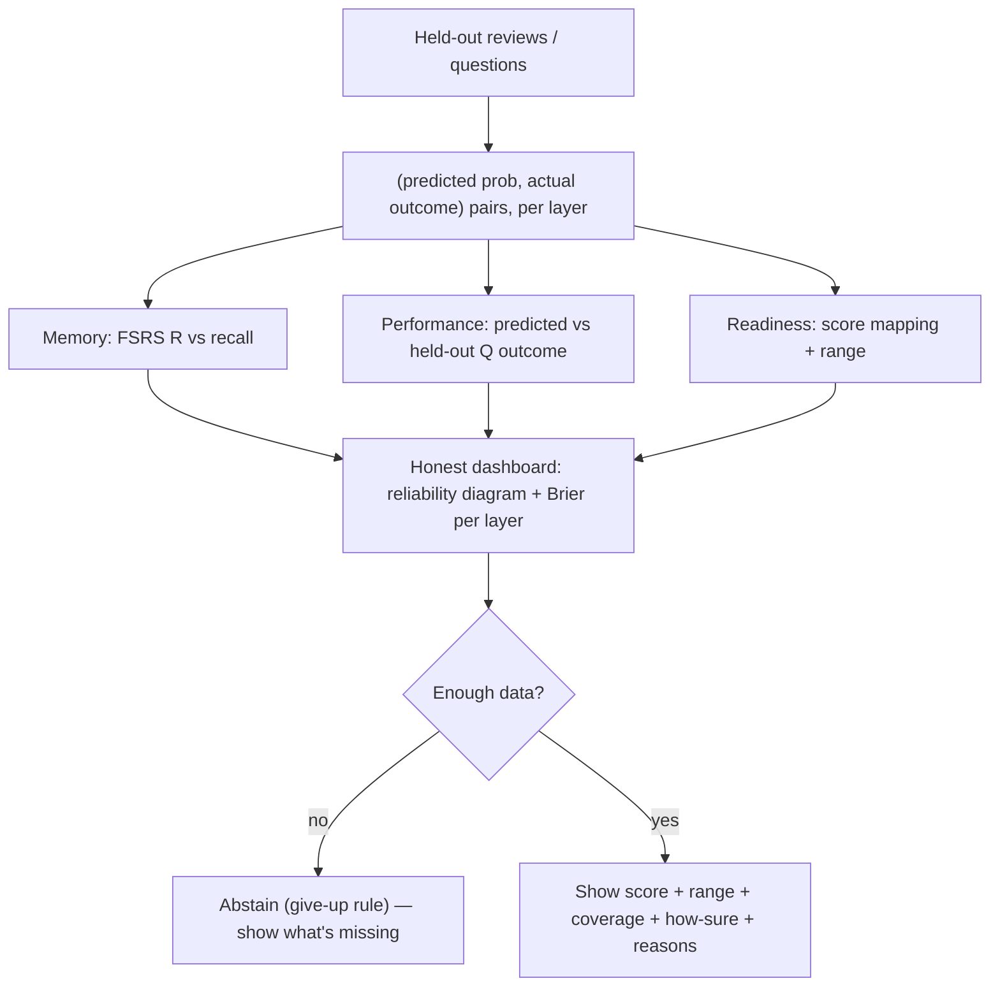

# Feature — Calibration (POV4: "optimize calibration, not confidence")

**Status: designed (core).** Shared context in `README.md`.

## The sharpened reading of POV4

POV4 = "optimize **calibration**, not **confidence**." Faithful reading: **the *system* reports honestly-calibrated numbers** (what you can actually do, with ranges + evidence), rather than inflating the learner's *feeling* of readiness. It is satisfied by an honest, calibrated dashboard — **not** by harvesting the learner's subjective confidence.

**Decision (locked): we do NOT capture user confidence / "will you get this right?" predictions.** That is the *confidence* side POV4 de-emphasizes, and the evidence for confidence/calibration-*training* gains is modest relative to interleaving, generation, and productive failure. So calibration = **model calibration, made honest and visible** — zero added session friction.

**Consequence:** the session has **no predict-before-answer step**. "Commit your answer before help" stays — but that belongs to **POV3** (productive struggle), not POV4.

## What it is: the honest 3-score dashboard

The three scores are three calibrations, each reported honestly (this *is* the spec's honesty rule):

| Layer | The prediction | Calibrated against | Shown as |
|---|---|---|---|
| **Memory** | FSRS retrievability R | actual recall on held-out reviews | reliability diagram + Brier |
| **Performance** | P(correct on a new exam-style Q) | held-out exam-style question outcomes | reliability diagram + Brier |
| **Readiness** | projected score | (bonus) real practice-test scores | point + range + coverage + "how sure" |

Every score shows: point estimate, **range**, % of exam covered, a "how sure" indicator, last-updated, the main reasons, and the **give-up rule** (abstain when data is thin). No number without its evidence.

## Metrics (math) — reuse the cohort's eval code where possible

- **Brier** = mean((pred − outcome)²); primary (binning-free).
- **Log-loss** — punishes confident-and-wrong hardest.
- **ECE** = Σ (|bin|/N)·|acc − conf|; use equal-mass bins + per-bin CIs.
- **Reliability diagram** — predicted (x) vs observed (y); diagonal = calibrated.
- **Split by time** (TimeSeriesSplit), never random — no leakage across a card's trajectory.
- Reuse: a sibling app's `eval/metrics.py` already implements `brier / ece / log_loss / reliability_bins / auc / bootstrap_ci` _[cohort — verify]_.

## Diagram

## Dropped / deferred (with rationale)

- **User-confidence capture, predict-before-answer, a learner-facing reliability diagram** — **dropped**: the "confidence" side; modest gains vs. core features.
- Hypercorrection targeting, latency low-effort detection, Blind Review (timed vs untimed), skip/guess trainer — **deferred**: they only mattered if we captured student prediction.

## Evidence

- Calibration metrics + recipe: felipe's FSRS/benchmark report (Brier/ECE/reliability, TimeSeriesSplit, equal-mass bins).
- Three-layer separation (memory ≠ performance ≠ readiness): felipe + PGRE BrainLift.
- Honesty rule: the project spec.
- Noted but de-prioritized: calibration *training* raises performance (ram's sources) — real, but modest next to the core learning-science features.

_Sources: spec honesty rule + challenge 9; felipe FSRS report; PGRE BrainLift POV4; cohort metacognition research (de-prioritized per Frank's "calibration not confidence")._
