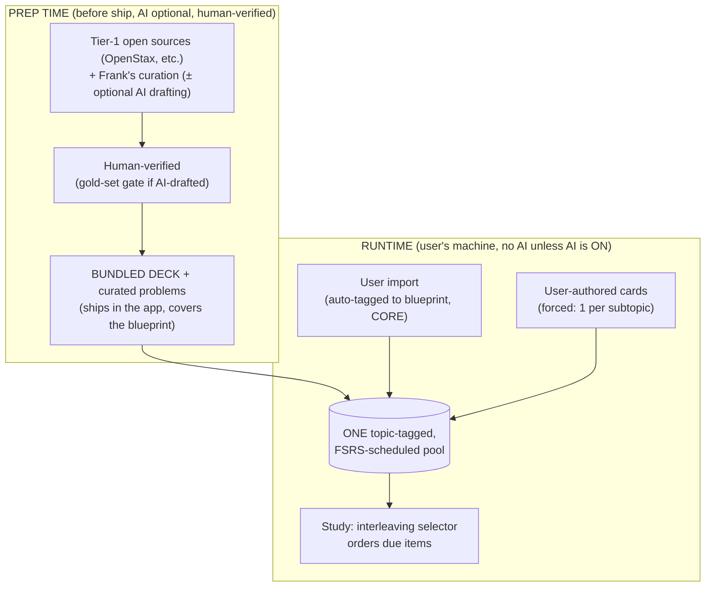
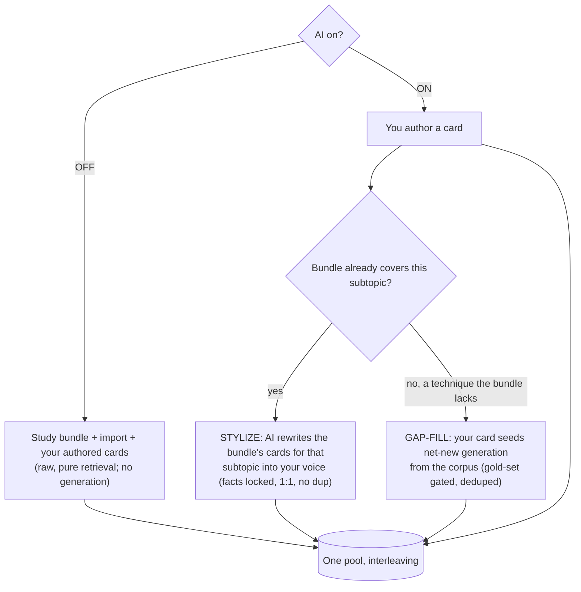
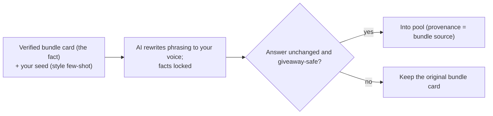
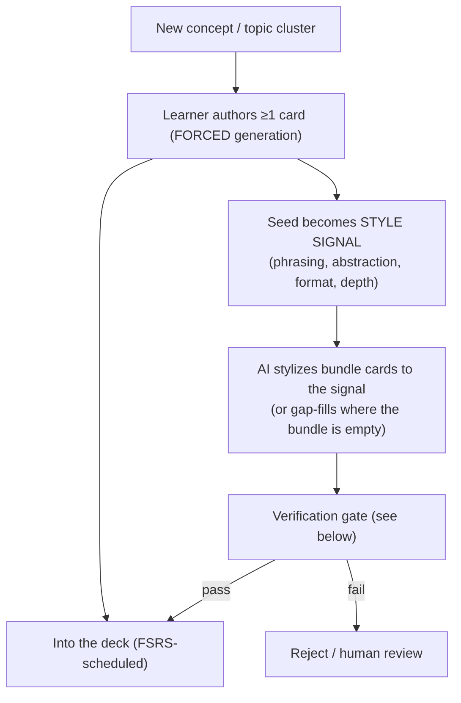
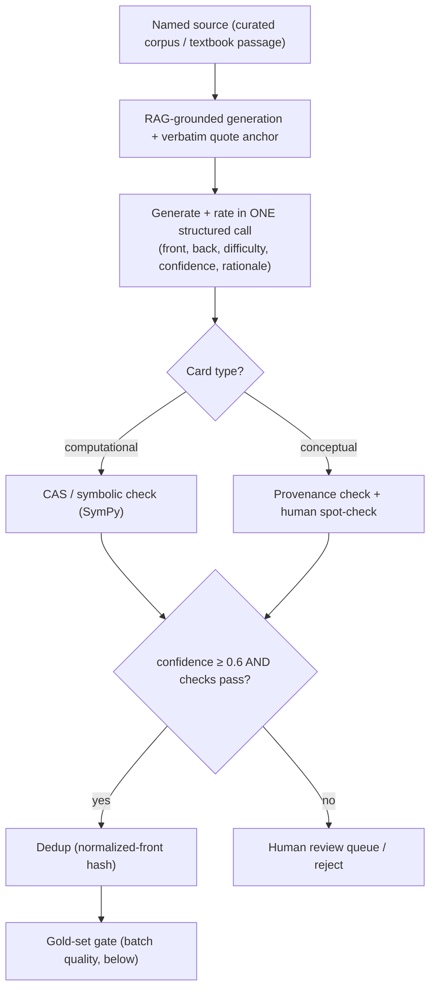
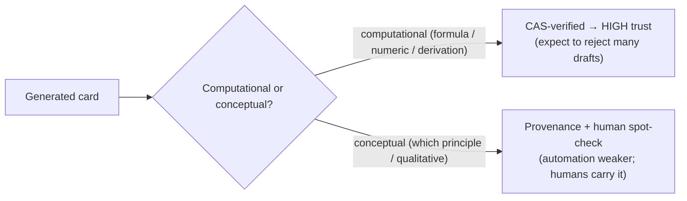
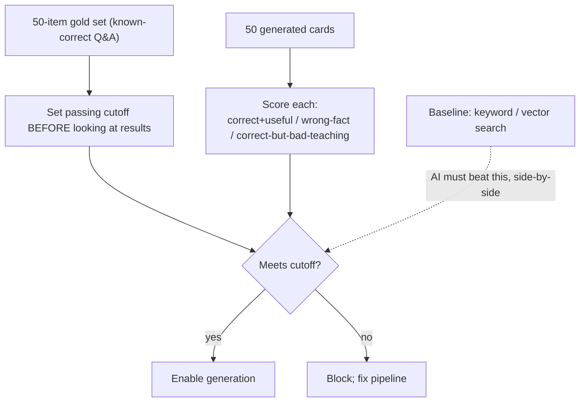
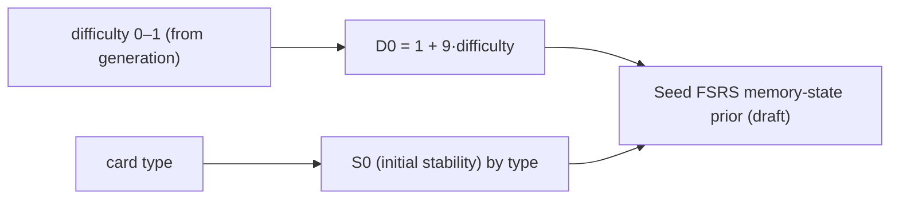

# Feature — Forced Generation + AI Conforming (POV2)

**Status: in progress** — literature laid out; architecture to be composed with Frank.
Shared context in `README.md`. The scheduler it feeds is in `feature-interleaving.md`.

**Epistemic note (Frank's caution):** cohort research — felipe.caicedo (GRE-math generation + verification), adarsh.rajesh (CFA card-gen), ram.sarma (distractors) — is a strong starting point but **not taken on faith**. Claims are tagged: _[primary]_ (peer-reviewed / established technique), _[cohort — verify]_ (cohort synthesis to confirm independently), _[our bet]_ (reasoned, no direct evidence). Physics ≠ GRE-math: more conceptual + multi-step content, so verification transfers only partly.

## The thesis (POV2)

Not "user-made" vs "AI-made." **Forced user generation first** (pay the cognitive cost at novel-concept formation) → **AI-conformed scaling** (amortize the learner's style across the deck) → **verification gate** (no bad card enters).

## Deck assembly vs. studying (the "where do cards come from" model, locked)

The studyable pool is **assembled in a setup phase**, never generated live mid-session, so interleaving is never starved. Everything lands in **one topic-tagged, FSRS-scheduled pool**, and the selector does not care where a card came from.

**The key distinction is prep-time vs runtime.** If AI touches the shipped deck at all, it runs once during content prep and is human-verified before ship. At runtime no AI runs unless the user turns AI on. So "works with AI off" is a runtime promise, and it holds no matter how the bundled deck was drafted.

Three contributors to the runtime pool:

- **Bundled deck.** Verified, openly-licensed content that ships with the app, plus curated problems, covering the full blueprint. It gives interleaving day-one breadth and it is the **AI-off** experience. How it is drafted (hand-curation and/or AI drafting at prep) is a content-prep task, not an architectural choice. Either way a human verifies it before ship, and no AI runs at runtime.
- **Import.** The user imports their own deck (Anki's importer). Import is a **breadth/coverage contribution only**, and **never a substitute for authoring** (importing someone else's cards yields **zero generation effect**). **Auto-tagging is CORE for the user-import path.** Imported cards are auto-tagged to the blueprint taxonomy (human-auditable) so the selector can use them. Tagging our own bundled/curated content is Frank's manual taxonomy work (plan task C2), as already planned.
- **Authoring.** The user's own conceptual seeds (one per finest topic unit). The only path to the generation effect, and the style signal AI conforms to.

**AI-on splits by whether the bundle already covers what you authored:**

**User-authored cards, two cases (the only place net-new generation is allowed):**

- **Bundle covers it.** Your card is the style signal; AI **stylizes** the existing bundle cards into your voice. Your card also stays. No net-new generation, no duplication.
- **Bundle does not cover it.** Your card enters the pool as your own and **triggers gap-fill generation**: AI produces siblings for that technique, grounded in the corpus and gold-set gated. User-initiated, so it is wanted, and it cannot duplicate the bundle (which had no coverage there).

Everywhere the bundle already covers, AI only stylizes (1:1). Net-new generation happens only where you venture past the bundle. Duplication is impossible by construction, and the gap-fill path still gives the spec's "generation beats a baseline" claim.

**Stylize sub-pipeline (facts stay verified):**

The **gap-fill sub-pipeline** is the full generation + verification pipeline below; it runs **only** for the user-introduced-technique case.

**Consequence (intended):** AI-on is "pay to play." To unlock either stylization or gap-fill you author first. The generation effect requires your own authoring, so import (breadth) and authoring (the personal generative act) coexist and never compete.

## Why force generation — the effect

- **Slamecka & Graf 1978 — generation effect:** self-generated material is remembered better than read, even when semantically identical; holds across item types/methods/ages. Meta **d ≈ 0.40** (Bertsch et al.). _[primary]_
- **Pan / Wendt et al. 2022 (APA), six experiments:** user-generated vs premade flashcards — memory **d = 0.45**, application **d = 0.29**. _[primary — confirm exact numbers against the paper]_

### Diagram — the two-phase flow

## The AI generation + verification pipeline

_(This is the **gap-fill** path from the assembly model above. It runs only when the user authors a technique the bundle does not cover. Where the bundle already covers a subtopic, the AI **stylizes** instead of generating.)_

### The verification stack (ordered by trustworthiness)

1. **RAG grounding + source binding + verbatim anchors + enforced abstention** → provenance; mechanically satisfies the spec's "named source / no untraceable claims" rule. _[primary technique]_
2. **CAS / symbolic check (SymPy, PAL)** — decisive for **computational** cards. _[primary technique]_ **Physics caveat _[verify]_:** units, dimensional analysis, and _multiple valid symbolic forms_ make physics derivations harder to auto-check than GRE-math arithmetic — confirm feasibility per card type.
3. **Self-consistency / multi-sample agreement** — generate N, keep agreement. _[primary]_
4. **Retrieval-grounded verification** — claim vs source passage. _[primary]_
5. **Independent LLM "critic" — WEAK.** Corpus + known LLM-eval finding: self-critics rubber-stamp and can introduce errors. Supplementary only. _[cohort + known finding]_

### Diagram — computational vs conceptual split

_felipe's headline conclusion [cohort — verify]:_ layered verification can pass a strict gold-set gate for **computational** cards but rejects a large fraction of drafts; **conceptual** cards lean on provenance + human adjudication. For PGRE this means a **split pipeline**, and the conceptual half is where the risk concentrates.

## The gold-set gate (spec challenge 7f)

Metrics: **fact precision**, **useful-yield rate**; inter-rater process on the scoring. _[spec + cohort]_

## Problems (MCQ) generation

Problem generation is now its own core feature: see **`feature-problem-generation.md`** (misconception-first distractors, MCQ-shaped gold set, and its own eval). This card doc covers card generation only.

## Style conformance (the novel bit)

- Mechanism: **few-shot conditioning** on the learner's seed card (phrasing / abstraction / format).
- **No direct effect-size evidence — this is our bet.** _[our bet]_ We validate it ourselves (does conforming reduce reschedules / lift engagement?), we don't cite it.

## Generation → FSRS bridge

Lets generation feed the scheduler directly, no separate rating pass. _[cohort — adarsh; verify the mapping constants in simulation]_

## What I'd independently verify (not take on faith)

- felipe's "passes strict gate but rejects many drafts" — the actual **reject rate**, and whether it holds for **physics** (more conceptual + multi-step than GRE-math).
- Slamecka & Graf and Pan/Wendt **effect sizes** vs the primary papers (ours came via BrainLift summaries).
- **CAS feasibility for physics** derivations (units, symbolic equivalence, multiple valid forms).
- The **distractor "2025 frontier"** claim (ram.sarma).
- Whether **cheap 2026 models** hit acceptable fact-precision on PGRE content, and cost/latency at deck scale.

## Locked (core) decisions

1. **Authoring quota — one conceptual seed per finest topic unit** (subtopic where subtopics exist — the big three; category otherwise). The human authors **conceptual** cards only. Rough load ~20–30 seeds total. This _is_ the generation-effect surface **and** the style signal.
2. **Human/AI allocation by mechanism** (the principle behind the split):
   - **Conceptual → human-authored** — gain is the **generation effect** (organizing the big idea); AI least trustworthy here.
   - **Computational → AI-generated, user-rehearsed** — gain is the **testing/retrieval effect** (reps), not authoring; AI most trustworthy here (CAS-checkable).
   - Rule: `human effort ∝ (generation benefit × AI untrustworthiness)`.
3. **Style conformance scoped to conceptual** — few-shot the AI on the conceptual seed so conceptual siblings read like the learner's; computational cards use a clean **standard format** (formulaic; style matters little). _[our bet — validate ourselves, don't cite]_
4. **Verification (core-minimum):** provenance/RAG grounding + the 50-item **gold-set gate** + route `confidence < 0.6` to human review. CAS / self-consistency / critic layers **deferred** (only if core works). _[rooting in core, per Frank]_
5. **Problems: curated seed bank + AI generation.** Curated problems (plan C4) are the trusted seed bank and the first verified decompositions. AI problem generation (MCQ + misconception-first distractors) is now its own core feature, see `feature-problem-generation.md`. Only the student-data-trained distractor ranker is deferred.
6. **gen→FSRS:** keep the AI difficulty rating (feeds our selector's 60–85% band + computational/conceptual routing); do **not** seed FSRS `D0` for core (marginal; FSRS cold-starts fine).

## Still open (deferred)

- Exact verification-layer composition + thresholds (when we build it).
- How the style signal is extracted (few-shot template vs. richer).
- Whether a rare "author one computational exemplar" option is offered for power users.

_Sources: Slamecka & Graf 1978; Pan/Wendt 2022; Frank's PGRE + Hint-Generation BrainLifts; cohort chats (felipe GRE-math generation/verification, adarsh CFA card-gen, ram distractors); spec challenge 7f. Tags: [primary] / [cohort — verify] / [our bet]._
