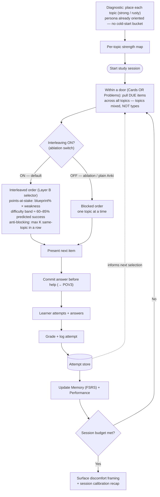
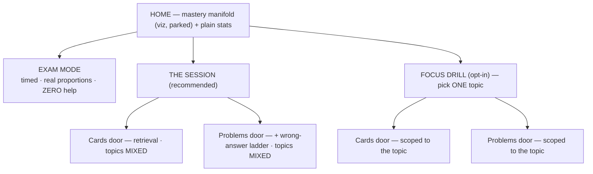
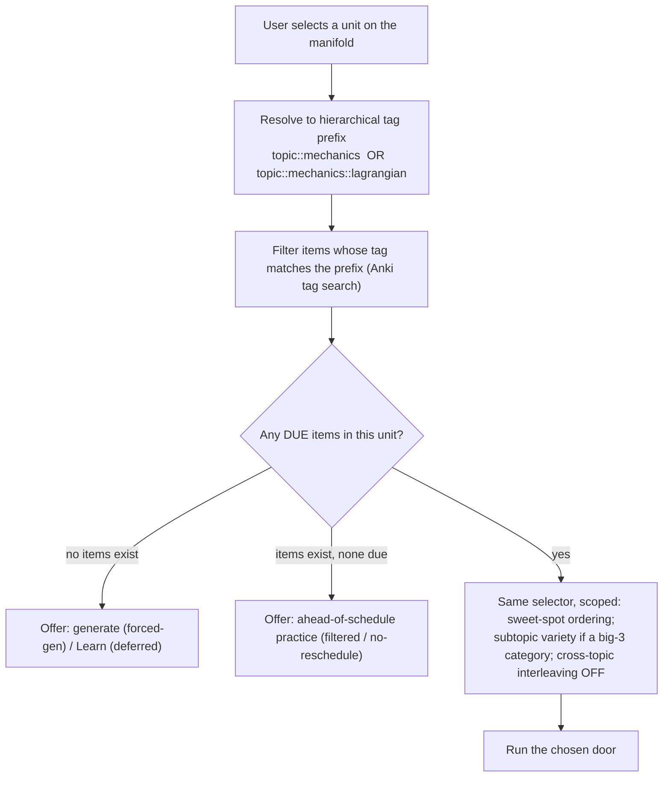

# Feature — Interleaving (+ shared scheduler & engine reference)

**Status: interleaving designed.** Shared mission/constraints/exam facts live in `README.md`.
**Workflow:** for each design decision, the literature's models (math + results) are laid out first; Frank composes the architecture from them.
**Cleanup-later note:** this doc also holds shared scheduler/engine/feasibility reference that will be extracted into its own doc in a later dedupe pass.

> **Persona refinement (locked, applies to all features):** users are **post-undergraduate** students who have already been taught this material and want to ace the test. **No true novices / no cold-starts** in core scope. Lead with the three pillars in order — **retrieval (cards) → practice questions → practice tests** — and defer *teaching fallbacks* (curated content/Learn surface, learn-by-explaining / self-explanation) to after the core works.

---

## Glossary (shared terms)

- **Session budget** — the target size of one study session: a number of items or minutes, after which the session ends. The session loop keeps pulling items "until the budget is met."
- **Weakness (per topic)** — a number in [0,1] for how poorly the learner is doing on a topic. **Working definition (chosen): `1 − mean topic retrievability`, FSRS-native.** (Alternatives considered: `1 − mastery` from knowledge tracing, error rate, `1 − IRT ability` — deferred; see Layer B design.)
- **Anti-blocking rule** — a constraint that stops the scheduler from showing too many consecutive items of one topic (which would silently collapse interleaving back into blocking). E.g. "no more than K in a row from the same topic."
- **Ablation switch** — the feature's on/off toggle, used for the Sunday three-build test (full / feature-off / plain Anki).
- **Orientation** — minimal prior exposure to a topic. (Moot for our persona — everyone is already oriented.)
- **Blueprint weight** — the PGRE's official topic percentages (Mechanics 20%, E&M 18%, Quantum 13%, …).

---

## Feature 1 — Interleaving (POV1: "interleave before comfort")

### Diagram

### Design decisions
- **Locked:** interleaving = **topic mixing within each activity** (NOT card↔problem mixing — that whiplash has no literature); no cold-start gating; ablation built in from day one (topics mixed ↔ blocked-by-topic); discomfort made legible.
- **Locked — topic taxonomy (two-level):** the 9 official PGRE categories, PLUS subtopics under the big three (Mechanics, E&M, Quantum — ≈51% of the exam). Tags stored hierarchically (`topic::mechanics::lagrangian`). Proposed level-mapping (simulation-tunable): **Worth** uses category-level blueprint % (subtopics share their category's weight); **weakness** aggregates at the finest tagged level; **variety rule** counts at category level (with a soft preference to vary subtopics within the big three).
- **Open (remaining):** estimating "predicted success" for brand-new problems with no history (for the 60–85% band); the tiebreak when Worth and the difficulty-band disagree; starting knob values (K, session size, Cards/Problems balance) — defaulted, then simulation-tuned.

### Session structure (locked)

The session is **two separate doors**, never one shuffled queue (card↔problem whiplash has no literature). The Layer-B selector orders items **within** a door; interleaving = **topic** mixing within each door.

- **Exam mode:** zero help — the *measuring* instrument (readiness + pacing).
- **The session:** the *training* instrument; recommended path keeps topics mixed inside each door.
- **Focus drill:** opt-in, single-topic (blocked by nature) — acceptable for the non-novice persona who follows suggestions; not the default.
- **Problems door** carries the **wrong-answer ladder** (designed under Feature 3, pulled forward by this discussion).
- **Home manifold** = parked viz decision (stats always shown plainly regardless).

**Unit selection (focus drill) = tag-prefix filter + guards** (verified: filtering, plus checks):

- **Session consolidation (locked):** every Problems session ends with a short **session-end synthesis** — the pattern across the problems + a performance recap (which also updates the calibrated dashboard). This is the "instruction after struggle" the productive-failure literature requires, at session grain. Detail in `feature-productive-failure.md`.

### The interleaving evidence (why this feature at all)
| Domain | Study | Result |
|---|---|---|
| Physics | Samani & Pan 2021 (npj Sci Learn) | mixed vs blocked HW → **+50–125%** on surprise novel-problem tests |
| Math | Rohrer & Taylor 2007 | mixed ≫ blocked at 1-week test |
| Math | Taylor & Rohrer 2010 | spacing held fixed → interleaving **doubled** next-day scores |
| Math | Rohrer, Dedrick & Burgess 2014 | grade 7, n=140, 9 wks → **72% vs 38% (d=1.05)**, even for dissimilar problems |
| Science | Sana & Yan 2022 | interleaved quizzing, **d≈0.35** at delay |
| Meta | Firth, Rivers & Boyle 2021 | **g≈0.5–0.65**, largest when concepts are confusable |
| Concept induction | Kornell & Bjork 2008 | spacing/interleaving beats massing; learners *misjudge* it (metacognitive illusion) |

**Mechanism (Rohrer 2014):** interleaving forces you to *choose the strategy from the problem itself* → trains discrimination + problem→strategy pairing = exactly the PGRE skill.
**Cost (Taylor & Rohrer 2010; Soderstrom & Bjork 2015):** interleaving *depresses in-session performance* but *raises learning/transfer* — so we must not optimize session accuracy.

---

## Literature menu for the scheduler (math + results)

The mixing policy sits in **two layers**: *when* an item is due (scheduling) and *which* due item comes next (selection). FSRS already handles Layer A in the Anki engine we're forking; Layer B is what we add.

### Layer A — Scheduling: when a card becomes due

| Model | Core math | Params / data | Results | Note |
|---|---|---|---|---|
| **Leitner / fixed** | fixed intervals (1,3,7,14d…) | none | transparent; not individualized | demo only |
| **SM-2** (Anki classic) | `interval = prev × EF`; EF updated by 0–5 quality; EF≥1.3 | EF per card | heuristic; not probability-calibrated; "ease hell" | dated fallback |
| **FSRS (DSR / 3-component)** ← **already in Anki** | state = (R,S,D). `R(t,S)= (1+factor·t/S)^decay`, factor=19/81, decay≈−0.5 (R=90% at t=S). S = days for R:1→0.9. D∈[1,10], mean-reverting. Post-lapse `S' = w11·D^(−w12)·((S+1)^w13−1)·e^(w14·(1−R))` | 17/19/21 weights (v4.5/5/6); MLE+SGD on user history; ~1000 reviews for personal fit (else defaults) | srs-benchmark (~10k users, 727M reviews, time-split): **FSRS-6 LogLoss 0.346 / RMSE 0.065 / AUC 0.70**; beats HLR (0.469/0.128/0.64) & AVG baseline; neural ceiling RWKV-P 0.277 | our default engine |
| **HLR** (Settles & Meeder 2016, Duolingo/ACL) | half-life `h_Θ = 2^(Θ·x)`; recall `p = 2^(−Δ/h)` | 3 params (log-linear features) | **45%+ error reduction** vs baselines; **+12%** engagement; generalizes Leitner/Pimsleur | underperforms FSRS on srs-benchmark |
| **MEMORIZE** (Tabibian 2019, PNAS) | spaced repetition as stochastic optimal control; optimal review intensity `u*(t) ∝ (1 − recall)` (closed form) | memory model + reward | outperforms heuristics on retention vs effort | elegant, heavier |
| **SSP-MMC / DHP** (Ye, Su & Cao 2022, KDD) | stochastic shortest path minimizing expected reviews to hit a memory target | transition model | strong; **FSRS's direct ancestor** | research→productionized |
| **DRL-SRS / RL** | agent maximizes long-term recall; state=(delay, history) | simulator needed | promising, experimental | not standard |

### Layer B — Selection / sequencing: which due item comes next (= the mixing policy)

| Approach | Core math | Outputs | Results / notes |
|---|---|---|---|
| **Random / fixed shuffle** | just interleave the due set, no adaptivity | order | **this is what the interleaving STUDIES actually used** (Rohrer/Taylor) → the evidence-backed baseline; doubles delayed test |
| **BKT** (Corbett & Anderson 1994) | HMM per skill; 4 params: p-init, p-learn, p-slip, p-guess; Bayesian update of P(known) | per-topic **mastery** | classic ITS mastery; identifiability issues; contextual slip/guess (Baker 2008) improves it |
| **DKT / AKT** (Piech 2015; Ghosh 2020) | RNN / attention over interaction sequence | mastery / next-correct prob | DKT beats BKT, but *extended BKT matches DKT*; AKT adds interpretability; heavier/data-hungry |
| **PFA / AFM** | logistic in practice counts per skill | success prob | lightweight KT alternative |
| **IRT + Elo** | 1PL/Rasch, 2PL, 3PL: P(correct)=f(ability − difficulty); Elo online update | item difficulty + learner ability | adaptive difficulty as used by Duolingo/Khan |
| **Difficulty targeting ("desirable difficulty" sweet spot)** | pick next item so expected success ≈ **60–85%** (harder transfer after mastery, easier repair after misses) | next item | grounded in Bjork desirable difficulties + the ~85% optimal-difficulty result; computable from FSRS R or KT mastery |
| **Value / points-at-stake** (ITS utility heuristic) | weight each due item by **blueprint% × weakness** (≈ expected score impact) | ranked queue | coverage-aware; **this is the spec's suggested Rust change**; not from one paper |

### Framing results that constrain selection
- **Learning ≠ performance (Soderstrom & Bjork 2015):** don't optimize in-session accuracy; optimize delayed transfer.
- **The loop (cohort synthesis):** attempt → feedback → self-explain → retry later → transfer to a *related but different* problem. Practice tests stay separate (timed, no hints) and convert missed/lucky-correct items into spaced follow-ups.

---

## Verified engine facts (read from our fork)

- **FSRS version:** the fork ships the `fsrs` crate **v5.2.0** (root `Cargo.toml`) = **FSRS-rs, the Rust FSRS-6** (21 params) — the top non-neural performer on the srs-benchmark. "Most recent deployed FSRS" confirmed.
- **FSRS is deterministic in policy, probabilistic in prediction, stochastic in ancestry.** State updates (S, D) are deterministic; `R(t,S)` is a probabilistic *prediction*; the next interval is set deterministically where R crosses `desired_retention`. Anki adds small random interval **fuzz** to prevent same-day clumping. (The stochastic-optimal-control formulation belongs to its ancestors MEMORIZE/SSP-MMC.)
- **Anki's existing "Layer B" is static sort orders, not adaptive selection** — `ReviewCardOrder` in `proto/anki/deck_config.proto` (lines 97–111): due day (default, random tiebreak), deck order, intervals asc/desc, ease asc/desc, **retrievability asc/desc**, relative overdueness, random, added. Plus `ReviewMix` (new cards with/before/after reviews). Single-signal snapshot sorts; nothing topic-, blueprint-, or weakness-aware, no anti-blocking. **This is exactly the seam our Rust change fills** (a new review order variant + selection logic, surfaced via protobuf — the spec's "points-at-stake queue").
- **Safe-seam invariant** (cohort code-mapping concurs): do **not** mutate `due` / `interval` / `memory_state` at queue-build time. Layer B reorders **within** the FSRS-due set — sequence changes, schedule doesn't. Preserves FSRS validity + undo.
- **FSRS artifacts pgrep must consume, not ignore:** per-card **S** (stability), **D** (1–10 difficulty — free per-item difficulty estimate), **R** at any moment (→ weakness + Memory score), `desired_retention`/decay (user intensity knob), the **revlog** (held-out calibration set for Brier/log-loss), the **optimizer** (population defaults → personal fit at ~1k reviews), and the built-in **simulator** (basis for synthetic-student tuning).
- **Verified — anti-blocking does NOT fight FSRS fuzz.** Fuzz is *interval-level only*: `with_review_fuzz(interval, …) → scheduled_days` (`rslib/src/scheduler/states/fuzz.rs`), applied at every interval site (`review.rs`, `learning.rs`, `relearning.rs`, `memory_state.rs`). It sets *due dates* (± days) = *which* cards are in today's pile; our anti-blocking orders *within* that pile. Different layers → additive, no conflict; Anki has no within-session topic ordering today, so nothing to combat. Edge: fuzz + load-balancer can skew a day's pile toward some topics (less to interleave on skewed days).
- **Verified — ahead-of-schedule practice won't corrupt FSRS, and performance still counts.** Memory (FSRS) and Performance (ours) are separate. (1) FSRS already models elapsed time — `timing.next_day_at.elapsed_days_since(*last_review)` (`rslib/src/scheduler/fsrs/memory_state.rs`) — so an early review is just a low-elapsed review, not corruption. (2) The engine already has practice-without-rescheduling — filtered decks (`rslib/src/scheduler/filtered/`, `states/rescheduling_filter.rs`, test `set_due_date_is_filtered`). **Design:** the "nothing due, practice anyway" path routes through filtered/no-reschedule → the attempt logs to Performance + calibration (it *does* count) but does not drive FSRS rescheduling (keeps low-information early reviews out of stability).

## Working design — Layer B: expected-score-impact selector (direction approved)

Among **due** items (FSRS Layer A untouched):
1. **Points-at-stake value:** score = `blueprint% × topic weakness`, weakness = `1 − mean topic R`. *(Spec's own construct; ITS utility tradition.)*
2. **Desirable-difficulty band:** prefer items with predicted success ≈ **60–85%** (from R and D; no new model). *(Bjork desirable difficulties; Wilson et al. 2019 "Eighty-Five Percent Rule" — derived for binary-classifier training, apply with stated assumptions; Metcalfe region of proximal learning.)*
3. **Anti-blocking:** max K consecutive same-topic items. *(Rohrer/Taylor interleaving.)*
4. **Constants** (band edges, K, value-vs-band weighting) tuned against **FSRS-simulated synthetic students** *(MEMORIZE/SSP-MMC methodology)*, then **ablation-tested on real use** (full / interleaving-off / plain Anki).

Novel as a *composition*; every ingredient literature-backed. Doubles as the graded Rust change (Phase 3 locks implementation).

## Synthetic data & multi-user avenues (project allows synthetic data)

- **(a) Policy tuning in simulation** — generate synthetic students (sampled FSRS parameter vectors + weakness profiles), simulate weeks of study under candidate selectors, compare simulated delayed outcomes. This is the MEMORIZE→SSP-MMC→DRL-SRS methodology, and Anki's engine already contains an FSRS simulator.
- **(b) Population priors** — copy FSRS's two-stage template: ship population defaults, personalize per user as revlog grows (~1k reviews). Extends to hierarchical pooling with real users later.
- **(c) IRT/Elo item calibration** — fundamentally needs many users per item; bootstrap pipelines with synthetic responses now, run Elo online when real users exist. Roadmap, not sprint.
- **(d) Pipeline validation** — synthetic revlogs with known ground truth to prove the Brier/calibration harness end-to-end; public real data available: **`open-spaced-repetition/anki-revlogs-10k`** (Hugging Face, 10k users / ~727M reviews, 15.7 GB, free gated access) for validating calibration code on real review histories.
- **Honest boundary:** simulation tunes policies and validates engineering; it **cannot prove real learning gains** (circular: policy judged by our own student model). Real-use ablation remains the evidence of record; report simulation as simulation. Leakage check applies to synthetic pipelines too (keep generation away from held-out gold questions).
- **DKT/AKT verdict unchanged:** training neural KT on synthetic sequences just relearns our simulator's assumptions. "Later, with real users."

## Feasibility on a single MacBook (+ unlimited AI tokens) — requirements

**Design principle: nothing in the working design needs a GPU, cluster, or data center.** FSRS is 21 parameters; the selector is a sort; simulation is float arithmetic.

| Component | What it actually needs | MacBook verdict |
|---|---|---|
| Anki fork build (desktop) | Rust + Python + Node toolchains (repo's `just`/ninja handles); ~10–20 GB disk; first build ~30+ min, incremental fast | Fine |
| Layer B selector | O(n log n) sort over due queue + cached per-topic aggregates | Trivial |
| FSRS optimizer (personal fit) | CPU, seconds–minutes per collection | Fine |
| Synthetic-student simulation | CPU-only; millions of simulated reviews = float ops; parallelizes across cores | Fine (even large sweeps) |
| Calibration pipeline (Brier/ECE/reliability) | pandas/DuckDB-scale analytics; optional `anki-revlogs-10k` subset (≤15.7 GB full; a slice suffices) | Fine |
| AI generation / tutor / style-conform | **API calls — the "unlimited tokens" superpower**; no local GPU; needs network + caching; AI-off path mandatory (spec) | Fine |
| Gold set + held-out questions | **Human expert time** (Frank): ~50 verified Q&A pairs + held-out ETS-style items; AI drafts, human verifies | The real bottleneck is hours, not hardware |
| Topic-tagged item bank | Content work: PGRE blueprint taxonomy + tags on every card/problem (AI-assisted tagging, human-audited) | Hours, not hardware |
| iOS build | **Xcode (macOS-only — the MacBook is the right machine)**; free Apple ID for device/simulator; **$99/yr Apple Developer only if TestFlight** (sideload/simulator otherwise) | Fine (disk!) |
| Android build | Android Studio + SDK + emulator; ~10–15 GB disk; emulator is the RAM hog | Fine; close emulator during big builds if 16 GB |
| Spec perf targets (50k cards, p95 latencies) | The MacBook *is* the reference machine | Fine |

**Aggregate local footprint:** plan for **~60–80 GB free disk** (Anki build + Xcode + Android SDK + dataset slice) and **16 GB RAM** comfortable (8 GB workable if builds and emulator don't run simultaneously).

**Explicitly NOT needed:** GPU/CUDA, any cluster or distributed training, DKT/AKT/RWKV training, RL training farms, big-data infra, paid datasets, real user traffic before the ablation.

_Sources: PGRE BrainLift + Spiky POV doc + Alpha cohort research chats (FSRS mechanics, half-life/ML papers, BKT/DKT papers, spacing papers) + direct reads of the fork (`Cargo.toml`, `proto/anki/deck_config.proto`) + Hugging Face/srs-benchmark pages._
