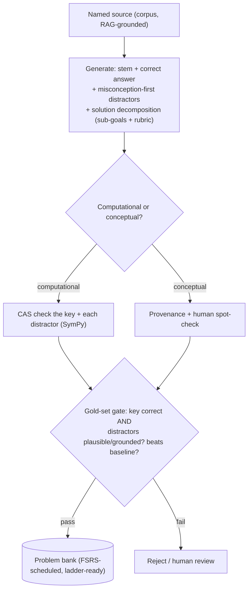
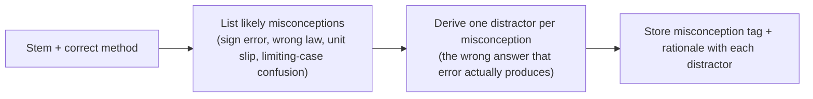

# Feature — Problem Generation (MCQ + misconception-first distractors)

**Status: designed (core), implementing.** Shared context in `README.md`. Reuses the corpus and provenance of card generation (`feature-forced-generation.md`) and feeds the wrong-answer ladder (`feature-productive-failure.md`).

## What this is, and why it is its own feature

Card generation makes retrieval items, and in core it mostly stylizes a verified bundle. Problem generation makes exam-style multiple-choice questions, which is a different and harder job. The value and the risk both sit in the **distractors** (the four wrong choices), not just the key. So problem generation has its own pipeline, its own gold set, and its own eval.

| Dimension        | Card generation           | Problem generation                                               |
| ---------------- | ------------------------- | ---------------------------------------------------------------- |
| Core content     | stylize bundle + gap-fill | generate MCQ (stem, key, 4 distractors, decomposition)           |
| Hardest part     | correct facts             | plausible, misconception-grounded distractors                    |
| Gold set         | fact-focused              | MCQ-shaped, a rationale per distractor                           |
| Beats a baseline | beats keyword/vector      | misconception-first beats naive distractors; gen beats retrieval |
| Feeds            | Memory (retrieval)        | Performance (the ladder)                                         |

## The pipeline

## Distractors: misconception-first (the core of the feature)

Naive "ask the model for wrong answers" produces weak distractors that no one falls for. Misconception-first flips it: **name the specific error or rule a student is likely to misapply, then derive the trap from it.** Each distractor stores its misconception tag and rationale. That rationale is what the wrong-answer ladder teaches from, and what the gold set grades against.

## Solution decomposition (ties to the ladder)

Every generated problem also gets its stored **decomposition** (ordered sub-goals plus a rubric each), verified once at creation, so it is ladder-ready (`feature-productive-failure.md`, L2). A generated problem without a verified decomposition does not ship.

## The gold set and eval

A **gold set** is a small set of hand-verified, known-good items used as the ruler. You grade generation against it, set the passing bar before looking, and generation must beat a simple baseline. For problems it is MCQ-shaped: stem, five choices, correct answer, and a rationale or misconception for each distractor.

Sourcing (the "from questions available online" plan, with the guardrails that keep it valid):

- **Correctness is easy to source.** Real practice questions give stem, choices, and key.
- **Licensing.** Official ETS PGRE items are copyright (Tier 3). Use them as a private, held-out gold/eval set only. Do not bundle, ship, or feed them to generation. Openly-licensed questions can be used more freely, check each.
- **Leakage.** Anything in the gold or held-out set must never enter the corpus, the RAG index, or any generation prompt.
- **Distractor rationales.** Online questions rarely say why each wrong answer is wrong. You annotate those, so the gold set can grade distractor quality, not just the key.

Metrics: answer correctness (fact precision), distractor quality (plausible, misconception-grounded, non-overlapping), useful-yield. Baselines to beat: naive distractor generation, and keyword/vector retrieval of problems, side by side.

## Core now vs frontier later

- **Core (implementing):** misconception-first generation plus the gold-set gate. Needs no student data.
- **Frontier (deferred):** a pairwise distractor **ranker** trained on real student selection data (which wrong answers students actually pick). It sharpens realism, but it needs users, so it is an enhancement, not a blocker.

## Relationship to curated problems

Curated problems (plan task C4) stay as the trusted seed bank and the first verified decompositions. Problem generation **scales** that bank. Both live in one pool, both feed the wrong-answer ladder and the Performance score.

## Open

- Distractor overlap and near-duplicate detection across generated problems.
- CAS feasibility for physics problems (units, multiple valid forms), the same caveat as cards.
- How many gold problems make the distractor-quality gate stable.

_Sources: `feature-forced-generation.md` (shared generation + verification stack); `feature-productive-failure.md` (decomposition + ladder); `../reference/content-and-dependencies.md` (tier system, gold set, leakage rule); cohort distractor research (misconception-first, student-selection-data frontier)._
