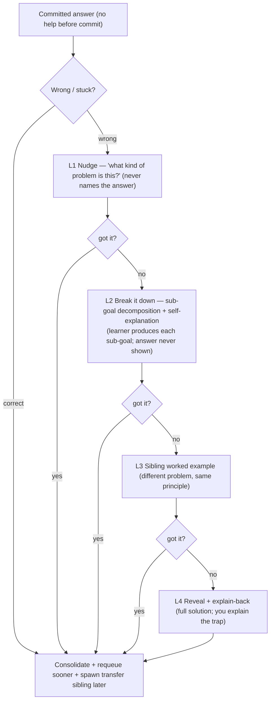
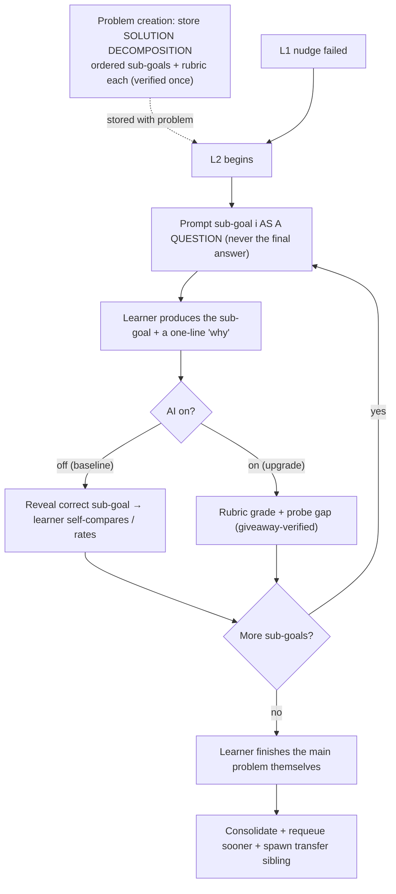
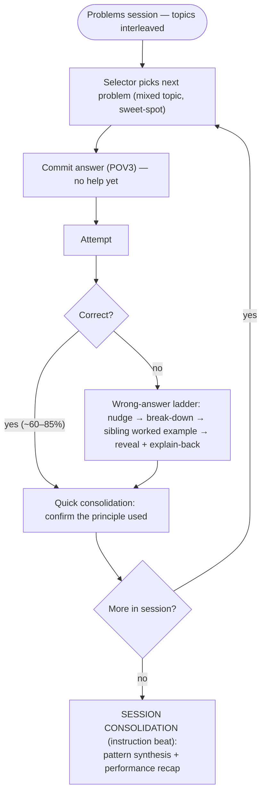

# Feature — Productive Failure (scaffolded struggle + consolidation)

**Status: designed (core).** Shared context in `README.md`; the session it lives inside is in `feature-interleaving.md`.

## What this feature is — and an honest naming note

POV3 in the BrainLift is "optimize for productive failure, not answer delivery." For our **post-undergraduate, content-intermediate / application-novice** persona, the precise mechanism is **scaffolded productive *struggle* + consolidation**, not classic Kapur productive *failure*:

- **Classic Productive Failure (Kapur 2008/2016)** is a *concept-acquisition* method: struggle with a **novel** concept **before** instruction, **then** get full instruction — consolidation is mandatory (without it → *unproductive* failure).
- Our users have **already met** the concepts (undergrad). **Expertise-reversal (Kalyuga):** heavy guidance / invent-first *loses value* as prior knowledge grows. So we do **not** run pre-instruction concept-acquisition PF. We run **attempt-before-help on already-known concepts**, where the "instruction" is the feedback/consolidation after each attempt.
- Strict Kapur PF would only apply on the **deferred** Learn / cold-topic path.

POV3's *spirit* holds throughout: make the learner **produce reasoning before** receiving answers; **refusing to answer immediately is a pedagogical act** (Bastani 2025: unguarded GPT access *reduced* learning).

**Scope (locked):** the ladder and all scaffolded help live on the **Problems door only**. **Cards stay pure retrieval** (show, recall, reveal, FSRS grade). Transferring the ladder or AI grading onto cards was considered and declined, because cards are the lightweight layer that primes problems (Gjerde 2022).

## Where "instruction" lives (so struggle always resolves into learning)

1. **Cards door** — retrieving principles primes problem-solving (Gjerde 2022, physics, d≈0.4). The lightweight instruction/refresh layer.
2. **Per-item consolidation** — the ladder ends in **reveal + explain-back** (worked solution + self-explanation).
3. **Session consolidation (locked)** — session-end synthesis of patterns + discriminating principles + calibration recap (Kapur consolidation at session grain).
4. **Learn / remediation** — full teaching for genuinely cold topics. *Deferred* (persona doesn't need it now).

The difficulty band (60–85% target success) means **most items are effortful wins**, not failures — the ladder handles the minority of misses.

## The wrong-answer ladder

- **"got it?"** = whether the re-attempt after a rung was correct.
- **Guardrails (evidence-backed, mostly reused from Poly/Willow):** answer committed *before* any help (no confidence capture); per-item AI hint budget with static fallback; giveaway verifier on every AI hint (refuse — `{hint: null}` — rather than leak); expertise-adaptive fading (strong recent performance → offer the reveal earlier).
- **L2 (locked):** sub-goal decomposition + self-explanation — see the next section.
- **Deferred:** hint budget K (tune later); **adaptive fading** (strong recent performance → lighter ladder) — nice-to-have; core runs a fixed ladder.

## L2 — sub-goal decomposition + self-explanation (locked)

**Key implementation insight:** the solution **decomposition is pre-computed and stored *with* the problem** (ordered sub-goals + a small rubric per sub-goal), verified once at creation (same gold-set/CAS gate as the item). Nothing about *what the steps are* is generated live while the learner is stuck — hint-time just walks the stored sub-goals. This makes it reliable, fast, and **AI-off-capable** (the sub-goal prompts are stored data).

**Two evaluation modes via the AI toggle (locked = both):**
- **AI-off baseline (required by spec):** reveal-and-self-compare — learner produces their sub-goal + a one-line "why," then the stored correct sub-goal is shown and they self-rate/explain the difference. Retrieval + self-explanation with zero AI.
- **AI-on upgrade:** rubric grading (the Willow checkpoint loop) — score the learner's sub-goal against the stored rubric (covered/partial/missing), probe the weakest gap, `findGiveaway()`-verified so the final answer never leaks.

Both share the stored decomposition; the toggle only changes how the learner's production is evaluated.

Why this shape: **generation effect** (learner produces each step) + **self-explanation** (far-transfer booster — decomposition alone only reliably helps *near* transfer) + **CLT** (offloads means-ends working-memory load) — all on stored, verified structure. _[Sweller completion problems; Chi self-explanation; Renkl/Atkinson fading caveat; your Willow checkpoint engine.]_

## Consolidation — two grains

- **Quick (per-item):** we already know the item's topic (from its tag). On a **correct** answer, quick consolidation just **names the principle used** (~2s, reinforces problem→principle mapping). On a **wrong** answer, it's the ladder's reveal + explain-back.
- **Session (locked = session-end synthesis):** the pattern across the session's problems (recurring confusions), the restated discriminating principles, and a performance recap (feeds the calibrated dashboard). AI-authored from the attempt log (with sources) when AI is on; template when off.

## Integrated session view (interleaving + struggle + consolidation)

## Evidence

| Source | Finding relevant to us |
|---|---|
| Kapur 2008/2016 | struggle-before-instruction wins on delayed transfer; consolidation afterward is mandatory |
| Bastani et al. 2025 (*PNAS*, ~1,000-student RCT) | **unguarded** GPT access *reduced* learning; guardrailed matched human tutors |
| Qian et al. 2026 | 40%+ of AI hints solved the task for the student (leakage) |
| Chi (self-explanation) | learner must *produce* the explanation; explaining > reading |
| Roediger & Karpicke | even failed retrieval attempts help; feedback after is key |
| LLM Hint Factory | 4 levels: orientation → instrumental → worked example → bottom-out (progressive specificity) |
| StAP-tutor (ACE 2024) | one next-step at a time; **don't put the solution in the prompt** |
| Phung et al. (LAK 2024) | generate → simulated-student validate → retry/reject: precision **60–66% → 94–98%** |
| Sweller (CLT) | **completion problems** (partly-solved) reduce cognitive load — the "break it down" instinct |
| Renkl & Atkinson | worked example → completion → full problem; fade **adaptive to competence**, not fixed |
| Kalyuga (expertise reversal) | heavy guidance backfires as prior knowledge grows → fast fading for our persona |
| Gjerde 2022 (*PRPER*) | retrieval of principles *before* problems improves problem solving (d≈0.4) — cards prime problems |
| Soderstrom & Bjork 2015 | learning ≠ performance — don't optimize in-session accuracy |

_Sources: Frank's "Hint Generation & AI Tutoring" BrainLift (Poly/Willow); cohort research (productive failure, worked examples/fading, expertise reversal, self-explanation); Spiky POV doc; the MCAT "content-intermediate / application-novice" synthesis._
