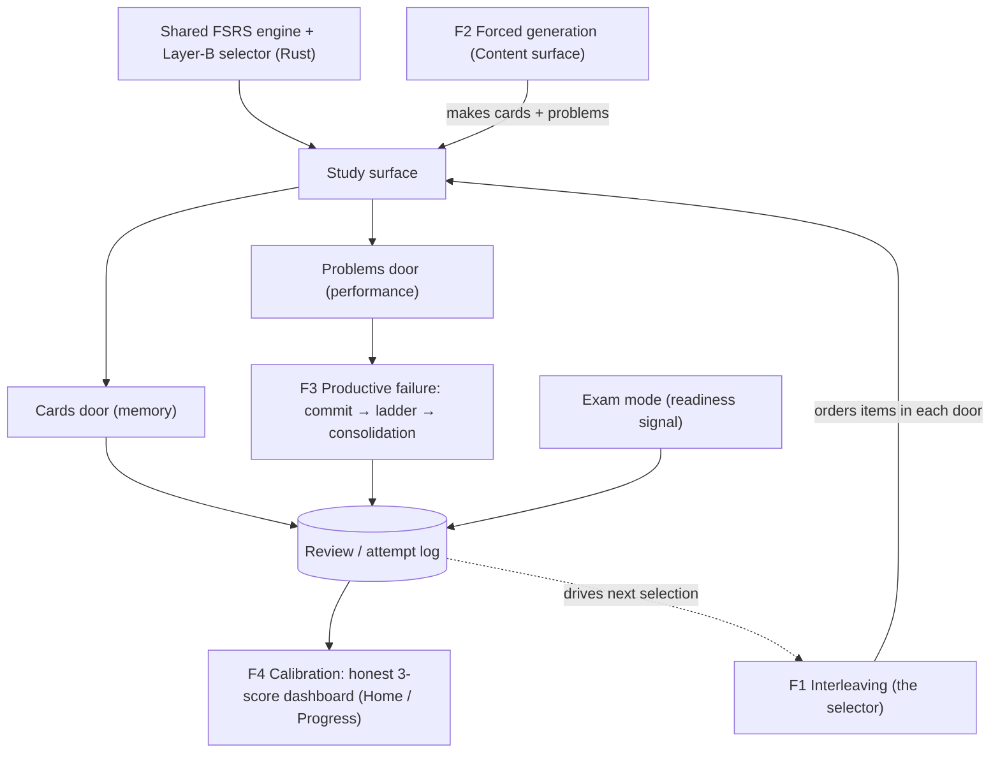

# PGREP Features

**Status: all four designed (core).** Per-feature detail in the `feature-*.md` docs; shared context in `README.md`; build sequencing in `build-plan.md`.

## One-paragraph synthesis

pgrep stands on the shared **FSRS engine + our Layer-B selector**. Four learning-science features compose on top, each owning a different question:

- **Interleaving (POV1)** — the *order* you practice (which item next, across topics).
- **Forced generation (POV2)** — *what* you practice (how cards/problems get made).
- **Productive failure (POV3)** — *how* you work a problem (struggle → scaffolded help → consolidation).
- **Calibration (POV4)** — *whether you're ready* (honest scores).

Said fastest: **F2 makes it · F1 orders it · F3 is how you work it · F4 tells you honestly where you stand.**

## Features × the three scores

|                             | Cards → Memory                                                        | Problems → Performance            | Exams → Readiness                         |
| --------------------------- | --------------------------------------------------------------------- | --------------------------------- | ----------------------------------------- |
| **Interleaving (F1)**       | orders due cards (topic-mixed)                                        | orders due problems (topic-mixed) | exams are inherently mixed                |
| **Forced generation (F2)**  | author conceptual seed → AI conforms/scales; CAS-checks computational | core: curated; generation later   | —                                         |
| **Productive failure (F3)** | —                                                                     | commit → ladder → consolidation   | exam = no help; ladder → post-exam review |
| **Calibration (F4)**        | FSRS R vs recall                                                      | predicted vs held-out Q           | score mapping + range                     |

## How they compose

## Reading the flow

- The **review/attempt log is the spine**: every card review, problem attempt, and exam feeds it; it drives the selector (F1), the scores (F4), and the consolidation (F3).
- **Ablation (Sunday test):** F1 (interleaving) is the single study feature tested full / off / plain-Anki.
- **AI-off (all four degrade gracefully):** F2 → authored/curated + reveal-and-self-compare; F3 → stored decompositions + self-compare; F4 → model calibration (no AI); F1 is pure engine logic.

## Which POV / which doc

- F1 Interleaving (POV1) → `feature-interleaving.md`
- F2 Forced generation (POV2) → `feature-forced-generation.md`
- F3 Productive failure (POV3) → `feature-productive-failure.md`
- F4 Calibration (POV4) → `feature-calibration.md`

## Build mapping (see `build-plan.md`)

- **F1 selector = L1** (the graded Rust change) · **F1/F3/F4 surfaces = L2** · **F2 + F3 tutor = L4** · **F4 models = L5**.

*Sources: the four feature docs; the project spec; the learning-science corpus.*