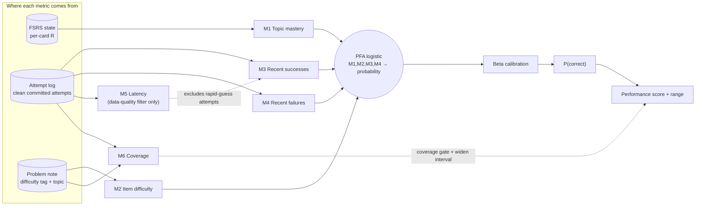
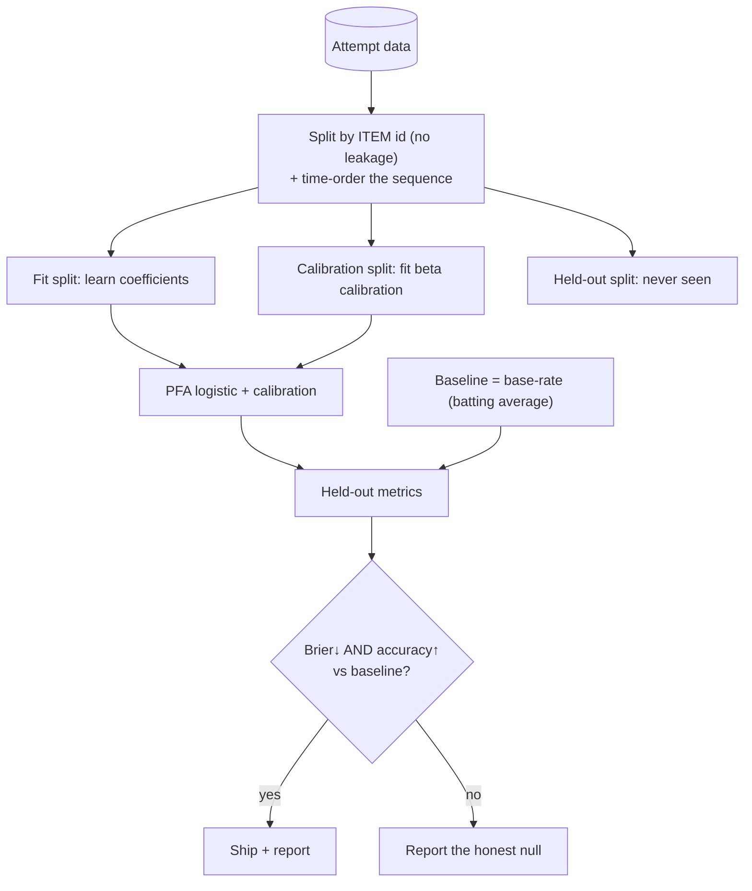
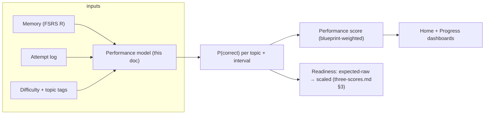

# Performance Model — the "smart formula" (metric-by-metric architecture)

**Status: designed, literature-grounded; architecture decisions resolved (§9); only empirical tuning left for L5.** This is the detailed spec for the **Performance score** (`P(correct on a new, unseen exam-style problem)`), decided as the **"smart formula"** over the batting-average baseline and over in-house IRT. It expands `three-scores.md` §2. Feeds build layer **L5**.

> **One-line identity.** The smart formula is **Performance Factors Analysis (PFA)** — a calibrated logistic model over interpretable features. This is the *education-data-mining standard* for "will the student get the next item right," not something we invented. We add post-hoc **calibration** (so the probabilities are honest) and **uncertainty intervals** (so we can show a range and abstain).

---

## 1. Why this model (decision recap + evidence)

| Option | Verdict | Why |
|---|---|---|
| Batting average (per-topic rate) | **Keep as the BASELINE** | Honest, robust, AI-off fallback. But it is the thing the spec wants us to *beat* ("beats a simpler method"). |
| In-house IRT / Rasch (chess rating) | **Rejected** | With one learner, item difficulty and ability are jointly unidentifiable (needs ~100–200 examinees per item). "Not defensible standalone" (cohort: Felipe; lit: Lord 1980; Embretson & Reise 2000). |
| **PFA / AFM logistic (the smart formula)** | **CHOSEN** | Field-standard, interpretable, small-data-friendly, difficulty-aware, and it **beats the base-rate baseline** (cohort: Isabella built + verified this; lit: Pavlik 2009, Cen 2006). |
| GBM / neural KT (DKT) | Deferred | Data-hungry, opaque; no advantage at our scale. |

**Cohort convergence (Nessie):** Felipe's n=1 analysis ranks a *calibrated supervised logistic classifier* as "the most defensible Performance engine"; Isabella implemented exactly this (features = mastery, difficulty, latency, coverage; held-out; beat a base-rate baseline on Brier + accuracy); Skye framed it as "card baseline + practice updates beats pure-recall." **Literature:** PFA (Pavlik, Cen & Koedinger 2009) and AFM (Cen et al. 2006) are LLTM/logistic models that predict correctness from skill mastery, item difficulty, and prior success/failure counts; PFA beats Bayesian Knowledge Tracing head-to-head (Gong, Beck & Heffernan 2011).

---

## 2. The metrics (features) — every input, diagrammed

The model turns a handful of **metrics** into one probability. Each metric below has a **source in our data model**, a **reason it predicts correctness** (literature), a **direction**, and a **v1 decision flag** for you.



| # | Metric | What it measures | How we compute it (source) | Why it predicts correctness (literature) | Direction | v1? |
|---|---|---|---|---|---|---|
| **M1** | **Topic mastery** | do you know the underlying facts/skills | mean FSRS retrievability `R` over the topic's cards (`extract_fsrs_retrievability`) | the memory→performance bridge; skill mastery is the core AFM/PFA term | ↑ higher → more likely | **Yes** |
| **M2** | **Item difficulty** | how hard this problem is | authored difficulty tag on the Problem note (numeric) | AFM item "bias" / IRT difficulty `b`; harder → lower odds | ↓ harder → less likely | **Yes** |
| **M3** | **Recent successes** | recent wins in this topic | recency-weighted count of correct clean attempts (attempt log) | PFA success count `γ_s`; recent success predicts next success (R-PFA, Galyardt & Goldin 2014) | ↑ | **Yes** |
| **M4** | **Recent failures** | recent misses in this topic | recency-weighted count of wrong attempts (attempt log) | PFA failure count `γ_f`; PFA's key idea is successes and failures carry *different* weight | data-signed | **Yes** |
| **M5** | **Response latency** | data quality + exam pace (NOT a practice predictor) | logged `response_ms`; used to **exclude rapid-guess attempts** from scoring, and to measure pace only in **timed Exam mode** | in untimed practice, time is confounded (thoughtful-slow ≈ struggling-slow) and penalizing it fights "reframe struggle as progress"; speed belongs to the timed exam | n/a | **No — filter only** |
| **M6** | **Coverage** | how much of the topic you've actually practiced | fraction of the topic's sub-skills with ≥1 attempt (attempt log + tags) | its job is the **coverage gate** (abstain when thin) + **widening the interval**, not per-item prediction; validate the gate later (Readiness unreliable below the line) | gate + uncertainty | **Yes — as gate, not a feature** |
| **M7** | **Recency window** | how far back M3/M4 look | a **simple recent window** (last ~N attempts / recent weeks) applied to M3/M4 | R-PFA: recent history carries most of the signal; a fixed window avoids a tunable decay knob in v1 | windowing for M3/M4 | **Yes — simple window** |
| M8 | *(opt) Global intercept* | your baseline skill | the model's bias term `β0` | AFM student ability `α` (one learner → this is just the intercept) | — | Yes (implicit) |

**Note on leakage-safe features:** every metric is computed from *attempts on OTHER items* up to the moment of prediction — never from the item being predicted. Difficulty (M2) must come from the authored tag or a disjoint fold, never estimated on the same data we evaluate (double-dipping = leakage; Kapoor & Narayanan 2023).

---

## 3. The formula itself

A plain logistic (PFA form). For a problem `j` in topic `t`:

```
P(correct) = σ( β0
              + β_m · mastery_t
              − β_d · difficulty_j
              + γ_s · recent_successes_t
              + γ_f · recent_failures_t )
```

**Lean v1, by decision (Frank, 2026-07-02):** four predictors only. **Latency (M5) is NOT a term** — it is a data-quality filter + Exam-mode pace signal. **Coverage (M6) is NOT a term** — it is the abstain gate + interval widener (§5). Fewer features = less noise, easier to fit and prove.

where `σ(x) = 1 / (1 + e^−x)`. Coefficients are **learned** (fit), not hand-set. Properties we want, and why this form gives them:

- **Interpretable** — each coefficient is "how much this metric moves the odds," so the dashboard can show *reasons* (spec's honesty rule).
- **Small-data stable** — few parameters + **L2 (ridge) regularization**; PFA drops the per-student parameter, which is ideal for one learner.
- **Difficulty-aware** — M2 puts item difficulty on the same scale as skill, giving most of IRT's benefit without needing to *estimate* difficulty from data.
- **The baseline it must beat** — the base-rate (topic mean `P(correct)`), i.e., the batting average. Success = held-out **Brier(model) < Brier(baseline) AND accuracy(model) > accuracy(baseline)** (Isabella's pre-registered rule).

---

## 4. Calibration — making the probabilities honest

A raw logistic score is not automatically calibrated (when it says 70%, is it right 70% of the time?). We add a **post-hoc calibration** step fit on a held-out calibration split.

| Method | When | Our use |
|---|---|---|
| **Beta calibration** (Kull et al. 2017) | small data default; 3 params, smooth, "contains the identity" (leaves an already-calibrated model alone), handles non-sigmoidal shapes | **LOCKED choice** (Frank, 2026-07-02). A tiny logistic on `log(s)`, `log(1−s)` — a few lines. |
| **Venn-Abers** (Vovk) | distribution-free validity, best log-loss at n≤1000 | **Deferred** — more machinery (outputs a probability *interval* + extra plumbing) for marginal gain at our scale. Revisit only if we need formal guarantees. |
| Platt scaling | only for very small (<~100), sigmoidal miscalibration | fallback only. |
| Isotonic | needs ~500–1000+ points, overfits small | **avoid at our scale.** |

_(This updates the earlier "logistic + Platt" note: current 2025 small-data benchmarks put **beta calibration / Venn-Abers** ahead of Platt, and flag isotonic as harmful small.)_ Always report calibration with a **proper score (Brier/log-loss) AND a calibration-error summary (ECE) AND a reliability diagram** — they disagree at small scale, so we show all three.

---

## 5. Uncertainty & abstain — the range and the give-up rule

The score must ship a **range**, not a bare number (spec honesty rule), and **abstain** when data is thin.

- **Interval:** an **80% central interval** (house convention, `statistics-and-evaluation.md`). Options to produce it (§9 decision): **Bayesian logistic with partial pooling** across topics (Felipe: "the only principled n=1 framing" — borrows strength, honest wide intervals), **bootstrap** over attempts, or **conformal prediction** (distribution-free coverage, Mondrian per topic).
- **Abstain (precision-based):** show "Not enough evidence yet" until the topic's estimate is precise enough (80% interval below a target width; **~8–10 attempts** as the starting proxy), tuned where held-out calibration stabilizes. Not a magic count — tied to precision (§9 #7).
- **Coverage (M6) widens the interval + gates Readiness:** low topic coverage → a wider range now, and Readiness abstains below the coverage line (`three-scores.md` §3). This is M6's whole job — not per-item prediction.
- **Honesty about n=1:** with one learner we cannot claim the *coefficients* are the true population coefficients. We say so, and treat real-cohort coefficients as the **bonus Step-4** validation.

---

## 6. Evaluation — held-out, reproducible, beats baseline (spec 4/6)

*(The shared eval methodology, meaning splits, the metric list, and reproducibility, lives in `statistics-and-evaluation.md`. This section is the Performance-specific depth: item-level splitting, the paraphrase bridge test, leakage layers, and the synthetic-data pipeline check.)*



- **Split by item/concept id** so the same item is never in both fit and held-out; time-order so we never use the future to predict the past.
- **Metrics:** held-out **Brier (primary), log-loss, accuracy, AUC, reliability diagram + ECE**, with bootstrap CIs.
- **Beat the baseline** (the pre-registered success rule above). Report honestly if it does not.
- **Leakage check (spec 7e):** layered pipeline — exact match → normalized text → n-gram/Jaccard (flag shared 13-grams, Jaccard > 0.7–0.8) → embedding cosine — because paraphrases defeat string matching.
- **Paraphrase test (spec 7d) — the bridge validity check:** 30 cards × 2 reworded questions; **McNemar's test (mid-p)** on the paired outcomes; pre-register a **TOST equivalence** margin. This proves Performance is *not just a copy of Memory* (if reworded accuracy ≈ card recall with no added signal, the bridge is not real).
- **Now (n=1 reality):** validate the *pipeline* on a **seeded, documented synthetic dataset** — outcomes `~ Bernoulli(σ(w·x + b))` with pre-registered coefficients + label noise, ~400–800 items so held-out bins fill. State clearly this validates the *methodology*; real coefficients need a real cohort (Step-4).

---

## 7. How it plugs into the system



- **AI-off:** the whole model is arithmetic over the attempt log + FSRS. No AI. Both apps score with AI off.
- **Data model:** reads the Attempt notes (`three-scores.md` §7, `attempt-log-storage.md`) + the Problem `difficulty` field + FSRS state. Every metric is already in the planned schema, except confirm **`difficulty`** is authored on every Problem (it is, per `technical-architecture.md` (d)).

---

## 8. Build notes (L5)

- Plain Python (or numpy) — no heavy deps required; logistic fit by gradient descent or IRLS. Beta calibration is a 3-parameter logistic on `log(s)` and `log(1−s)`.
- One re-runnable command produces `performance_results.json` (metrics + coeffs + seed + split sizes) + a short results markdown (Isabella's pattern).
- Ship the **baseline and the model side by side** in the report (the "beats a simpler method" evidence).

---

## 9. Architecture decisions (all resolved)

Final v1 choices. Only empirical tuning (the exact interval-width target and attempt proxy) remains for L5 — those are measurements, not decisions.

1. **Feature set** — predictors = **M1 mastery, M2 difficulty, M3 recent successes, M4 recent failures**. **M5 latency** = data-quality filter + Exam-mode pace only. **M6 coverage** = abstain gate + interval widener. (Neither M5 nor M6 is a predictor term.)
2. **Difficulty scale (M2)** — **numeric 1–5**, set by the author (you now, AI-drafted later), invisible to the learner; also drives the selector's 60–85% band.
3. **Successes vs failures (M3/M4)** — **kept separate** (full PFA; `γ_s`, `γ_f` learned independently) — more accurate than a net score.
4. **Recency (M7)** — **simple recent window** for v1; upgrade to decay only if it earns its keep.
5. **Calibration** — **beta calibration**. Venn-Abers deferred (interval output + more plumbing, marginal gain); Platt only as a tiny-n fallback.
6. **Uncertainty / range** — **Bayesian partial pooling** across topics (honest small-n intervals); conformal is the fallback if we want distribution-free coverage.
7. **Abstain** — **precision-based**: abstain until the topic's 80% interval is tight enough (and held-out calibration has stabilized); **~8–10 clean attempts** is the starting proxy, tuned in L5. Tied to precision, not a decreed count (Brown, Cai & DasGupta 2001; Peduzzi 1996 / van Smeden 2019; Corbett & Anderson 1995).

---

_Sources: cohort (Nessie) — Felipe Caicedo's n=1 model-defensibility report (IRT-not-defensible table; calibrated-classifier verdict; paraphrase/leakage protocols), Isabella Chen's held-out logistic eval (features, pre-registered baseline, seeded synthetic DGP, real beat-baseline numbers), Skye Flowers (baseline+update framing), Adarsh Rajesh (Elo/Rasch-with-tagged-difficulty caution), Ryan Deelstra (Pelánek Elo). Literature — PFA (Pavlik, Cen & Koedinger 2009); AFM (Cen, Koedinger & Junker 2006); R-PFA (Galyardt & Goldin 2014); PFA>BKT (Gong, Beck & Heffernan 2011); IRT floors (Lord 1980; Embretson & Reise 2000); calibration (Platt 1999; Zadrozny & Elkan 2002; Kull et al. 2017 beta; Vovk Venn-Abers; 2025 small-data calibration benchmarks); Brier 1950; DeGroot & Fienberg 1983; McNemar 1947; leakage (Kapoor & Narayanan 2023). Engine — `rslib` FSRS retrievability. Peer docs — `three-scores.md`, `attempt-log-storage.md`, `technical-architecture.md`._
