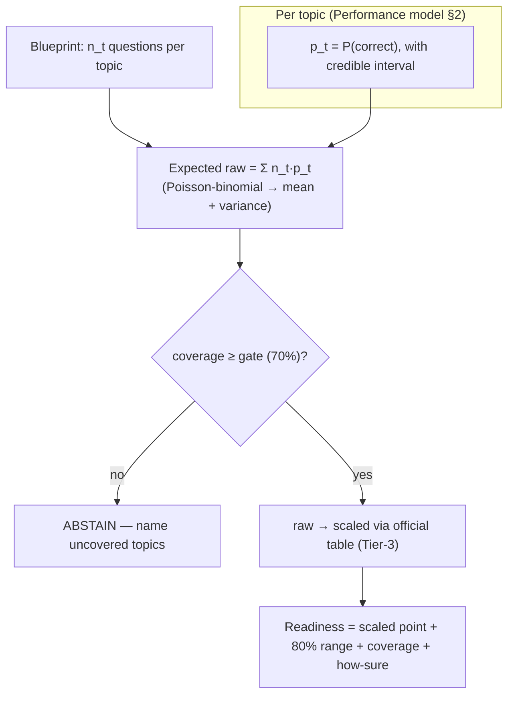
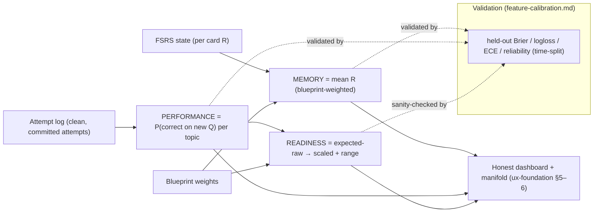

# Scoring & Readiness — how the three numbers are computed

**Status: designed (core); one open decision (the Performance model).** Shared context in `README.md`. This is the **product's core thesis made concrete** — the memory → performance → readiness bridge stock Anki lacks (spec constraint 3). `feature-calibration.md` covers *how honest* the numbers are (validation); **this doc covers how they are *derived*, their ranges, their coverage gates, and their abstain rules.** It also folds in the **held-out evaluation methodology** (spec constraint 4).

> **The through-line (Soderstrom & Bjork 2015, learning ≠ performance):** three different questions need three different instruments. **Memory** = can you recall it now. **Performance** = can you apply it to a *new* question. **Readiness** = what would you score. You can have high Memory and low Performance (recall ≠ transfer), so we never collapse them.

---

## 0. Design principles

1. **Every number carries its own honesty** — a point, a **likely range**, a "how sure," last-updated, and an **abstain** when data is thin (spec + `ux-foundation.md` §6).
2. **AI-off by construction** — all three scores are **pure math over FSRS state + the attempt log**. No LLM is involved in scoring, so both apps score with AI off (spec 7).
3. **Reuse the engine's primitives** — Memory reuses the exact retrievability the selector already uses (`1 − mean R`), so Memory and the interleaving selector never disagree.
4. **Uncertainty is first-class, and standardized** — every range is an **80% central interval**, computed the same way everywhere (§5).
5. **Abstain beats bluffing** — below a data threshold, a score refuses to render and names what is missing. This is the manifold's "holes" made literal.

---

## 1. Memory score — P(recall now)

**Definition.** The expected fraction of your due-and-known cards you would recall **right now**, blueprint-weighted. It answers "is the raw material in your head."

**Computation (reuses the engine).** FSRS gives each card a retrievability `R ∈ [0,1]` via the power forgetting curve `R(t,S) = (1 + FACTOR · t/S)^decay`, exposed in the engine as `current_retrievability_seconds(state, seconds, decay)` and the SQL UDF `extract_fsrs_retrievability(...)` (`rslib/src/stats/card.rs`, `rslib/src/storage/sqlite.rs`). Then:

- **Per topic:** `Memory(topic) = mean(R over that topic's cards)`. (Exactly `1 − weakness(topic)` from `anki-rooting-and-rust.md` — same primitive, so the score and the selector are consistent by construction.)
- **Overall:** `Memory = Σ_topic blueprint%(topic) · Memory(topic)` over covered topics.

**Range (§5).** Treat each card as `Bernoulli(R_i)`. The number recalled is a **Poisson-binomial**; its mean is `Σ R_i` and variance `Σ R_i(1−R_i)`. Report the point as mean R and the 80% central interval of the fraction-recallable.

**Abstain.** A topic with fewer than `k_mem` reviewed cards (default **5**) shows "Not enough cards yet," not a number.

**Validation (held-out, per `feature-calibration.md`).** FSRS predicts `R`; the revlog records the actual pass/fail. On a **time-split** hold-out (never random — no leakage across a card's trajectory), compute **Brier, log-loss, ECE**, and a **reliability diagram** (predicted R vs observed recall). This is the Memory calibration already locked in `feature-calibration.md`.

---

## 2. Performance score — P(correct on a *new* exam-style question)

**Definition.** The probability you get a **novel, unseen** exam-style problem right, per topic and overall. This is *transfer*, not recall, so it is computed from the **attempt log**, not FSRS.

**Inputs.** Each Attempt note carries `topic`, `correct`, `difficulty` (of the item), `answered_at` (for recency), and whether the item was help-free (only clean, committed, first-try attempts count toward the score; laddered/hinted attempts inform the tutor, not the score).

### The model — DECIDED: the "smart formula" (PFA calibrated logistic)

**Full spec: `performance-model.md`.** Locked (cohort- + literature-grounded): the Performance model is **Performance Factors Analysis (PFA)** — a calibrated logistic model over interpretable metrics (topic mastery, item difficulty, recent successes/failures, latency, coverage) — with the **batting average (base-rate) kept as the baseline it must beat**, and **in-house IRT rejected** (item difficulty + ability are unidentifiable with one learner). Calibration via **beta calibration** (small-data best practice), honest ranges via Bayesian partial pooling / conformal.

- Why not the batting average as the model: it *is* the baseline; the spec rewards beating a simpler method.
- Why not IRT/Rasch in-house: not defensible at n=1 (needs ~100–200 examinees per item). PFA gives most of the difficulty-awareness via the authored difficulty tag, no estimation required.

**Abstain.** A topic with fewer than `k_perf` scored attempts (default **8**) abstains.

**Validation (held-out).** Predict `P(correct)` on **held-out exam-style questions the student has never seen**, then compare to actual outcomes → **accuracy, AUC, Brier, reliability** (`feature-calibration.md`). Leakage rule: held-out items never enter the corpus, RAG index, or any prompt.

---

## 3. Readiness score — projected exam score, with a range

**Definition.** Your projected PGRE **scaled score** (the 200–990 band) with an explicit **range**, an explicit **coverage**, and an **abstain** when coverage is too thin. It leans on **Performance** (application under exam conditions), not Memory (Soderstrom & Bjork: the test measures transfer, not recall).

**Computation — expected-raw → scaled via the official table.**

1. **Per-topic:** `p_t` from the Performance model (§2); `n_t` = the number of exam questions that topic contributes (blueprint % × the exam's question count — see `README.md`).
2. **Expected raw:** each of the `n_t` questions is `Bernoulli(p_t)`; total correct is a **Poisson-binomial** across all topics → mean `Σ n_t·p_t`, variance `Σ n_t·p_t(1−p_t)`.
3. **Raw → scaled:** map the raw point and the raw interval endpoints through the **official raw→scaled conversion table** from a real practice test. **This table is an external data dependency** (Tier-3, private — see §7 and `setup-content-and-dependencies.md`). Absent it, Readiness shows a **raw/percentage** projection and says the scaled mapping is unavailable.
4. **Range (§5):** propagate the per-topic credible intervals through the sum and the table → an 80% scaled-score interval. Thin coverage widens it.

**Coverage gate + abstain (the honesty-by-construction).** `coverage = fraction of blueprint weight whose topics have ≥ k_perf scored attempts`. If `coverage < gate` (default **70%**), **Readiness abstains** — "Not enough of the exam is covered yet" — and points at the uncovered topics (the manifold's holes; `ux-foundation.md` §5–6). You cannot fake readiness over a hole.

**Validation (held-out, honest about n).** Predicted scaled vs **actual on a real practice mock** (Tier-3, private, held out) → mean absolute error in scaled points. With one or two mocks this is a **sanity check, not a full validation** — we report it as such.

---

## 4. The three scores at a glance

---

## 5. Uncertainty & abstain — the shared conventions

- **Interval:** always the **80% central interval**, labeled "likely range." One convention everywhere.
- **Aggregating heterogeneous probabilities:** **Poisson-binomial** (sum of independent, non-identical Bernoullis) for Memory (fraction recallable) and Readiness (raw score). Cheap analytic mean/variance; exact PMF if we want the full distribution.
- **Proportions from counts:** **Beta-Binomial** posterior (conjugate) for the per-topic **base-rate baseline** and any raw hit-rate → mean + credible interval, small-n abstains. (The Performance *model* itself is PFA logistic with beta-calibration + partial-pooling/conformal intervals — `performance-model.md`.)
- **Give-up / abstain rules (spec constraint 3 wants one per score):**

| Score | Abstains when | Default |
|---|---|---|
| Memory (topic) | fewer than `k_mem` reviewed cards | 5 |
| Performance (topic) | fewer than `k_perf` scored attempts | 8 |
| Readiness (overall) | `coverage < gate` | 70% |

All three thresholds are **tunable config** (not hard-coded), so they can be set from evidence during L5.

---

## 6. Held-out evaluation methodology (spec constraint 4)

The same discipline for every model, reproducibly:

- **Splits:** **time-based** (`TimeSeriesSplit`), never random — no leakage across a card/item trajectory (`feature-calibration.md`). Held-out items are excluded from the corpus, RAG index, and all prompts.
- **Metrics:** Brier (primary, binning-free), log-loss, ECE (equal-mass bins + per-bin CIs), reliability diagram; AUC/accuracy for Performance; scaled-point MAE for Readiness.
- **Baselines to beat (honesty):** Memory vs a fixed-interval/SM-2-style predictor; Performance vs topic base-rate (and vs a memory-only predictor, to prove Performance adds signal); Readiness vs "raw % = scaled guess."
- **Reproducibility:** fixed seeds, pinned splits, **one command** produces every number + a report. Bootstrap CIs on the metrics.
- **(AI generation eval is separate)** — the gold-set gate + beats-a-baseline for generated content lives in `feature-forced-generation.md` + `build-plan.md` L4.0 (spec constraint 6).

---

## 7. Data each score needs (tees up the end-to-end data plan)

| Score | Needs | Source / tier | Ships in app? |
|---|---|---|---|
| **Memory** | reviewed cards + revlog | generated by use (Frank authors cards) | yes (user data) |
| **Performance** | attempt log + **item difficulty** (for P-B) | generated by use; difficulty from expert tags | yes |
| **Readiness (map)** | **official raw→scaled conversion table** | **Tier-3, ETS practice test — private** | **no** (constants only) |
| **Readiness (validate)** | **1–2 real practice mocks** | **Tier-3, private, held out** | no |
| **All (validate)** | held-out reviews / questions | carved from Frank's authored content | no |
| **Blueprint `n_t`** | per-topic question counts | `README.md` blueprint + official test | yes |

The one **hard external dependency** is Tier-3: the **raw→scaled table** (to render a real PGRE-scale Readiness number) and **a mock** (to validate it). Everything else is generated by use or authored by Frank. Full procurement list in `setup-content-and-dependencies.md` §2.

---

## 8. Decisions

**Performance model: RESOLVED — the "smart formula" (PFA calibrated logistic).** Full spec + the remaining architecture knobs (feature set, difficulty scale, calibration method, uncertainty method) are in **`performance-model.md`** §9. Batting average = baseline; in-house IRT rejected (n=1).

Secondary (defaults fine for now, tune in L5): `k_mem=5`, `k_perf=8`, coverage `gate=70%`, interval `=80%`.

---

## 9. Evidence / literature

| Source | Used for |
|---|---|
| FSRS / DSR memory model (Ye et al.; Anki FSRS docs) | Memory = retrievability of the power forgetting curve |
| Soderstrom & Bjork 2015 | learning ≠ performance → three separate scores; Readiness leans on Performance |
| Rasch 1960; Lord & Novick 1968; ETS GRE **IRT equating** | Performance P-B; why difficulty-aware modeling matches the real exam |
| Brier 1950; DeGroot & Fienberg 1983; Guo et al. 2017 | calibration metrics + reliability diagrams |
| Wilson 1927; Beta-Binomial conjugacy (Gelman, BDA) | proportion intervals + small-n abstain |
| Poisson-binomial (Le Cam) | aggregating heterogeneous Bernoullis (Memory fraction, Readiness raw) |
| Practice-test predictive validity (test-prep literature) | Readiness projection + honest low-n caveat |

_Sources: `README.md` (thesis, blueprint, exam facts); `feature-calibration.md` (validation, locked); `anki-rooting-and-rust.md` (retrievability primitive, weakness); engine reads (`rslib/src/stats/card.rs`, `rslib/src/storage/sqlite.rs`); the PGRE BrainLift; the psychometrics + calibration literature above. Cohort eval code (`eval/metrics.py`) reused where possible [verify]._
