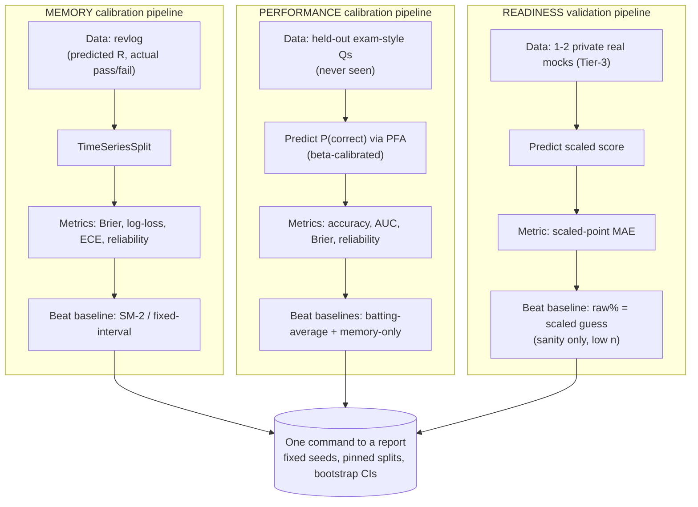

# Score Statistics & Evaluation — the range math and held-out testing behind the three scores

**Status: designed (core).** Companion to `three-scores.md`, which defines the three scores (Memory, Performance, Readiness). This doc holds the statistical methods, the shared uncertainty and abstain conventions, and the held-out evaluation pipelines (spec constraint 4). Validation is surfaced to the user by `feature-calibration.md`.

## Statistical methods at a glance (what each is actually for)

Every method below has exactly one job: **point estimate** (the number), **range** (its uncertainty), **calibration** (making probabilities honest), or **validation** (proving it on held-out data).

| Method                                      | Job                                           | Used for                        |
| ------------------------------------------- | --------------------------------------------- | ------------------------------- |
| FSRS retrievability `R`                     | point estimate                                | Memory                          |
| PFA calibrated logistic                     | point estimate                                | Performance                     |
| Expected-raw `Σ n_t·p_t` + raw→scaled table | point estimate                                | Readiness                       |
| Poisson-binomial                            | range (sum of unequal Bernoullis)             | Memory fraction, Readiness raw  |
| Beta-Binomial (conjugate)                   | range for a proportion + small-n abstain      | base-rate baseline, hit-rates   |
| Bayesian partial pooling / conformal        | range for the model's `P(correct)`            | Performance                     |
| 80% central interval                        | the one range convention                      | all three                       |
| Beta calibration                            | make model probabilities honest (post-hoc)    | Performance (inside the model)  |
| Brier (primary, binning-free)               | calibration metric                            | validation: Memory, Performance |
| Log-loss                                    | calibration metric (punishes confident-wrong) | validation: Memory, Performance |
| ECE (equal-mass bins + CIs)                 | calibration metric (binned)                   | validation: Memory, Performance |
| Reliability diagram                         | calibration, visual                           | validation + the F4 dashboard   |
| AUC / accuracy                              | discrimination                                | validation: Performance         |
| Scaled-point MAE                            | error in scaled points                        | validation: Readiness           |
| TimeSeriesSplit                             | leakage-free held-out split                   | all validation                  |
| Bootstrap CI                                | uncertainty on the metric itself              | all validation                  |

---

## Uncertainty & abstain — the shared conventions

- **Interval:** always the **80% central interval**, labeled "likely range." One convention everywhere.
- **Aggregating heterogeneous probabilities:** **Poisson-binomial** (sum of independent, non-identical Bernoullis) for Memory (fraction recallable) and Readiness (raw score). Cheap analytic mean/variance; exact PMF if we want the full distribution.
- **Proportions from counts:** **Beta-Binomial** posterior (conjugate) for the per-topic **base-rate baseline** and any raw hit-rate → mean + credible interval, small-n abstains. (The Performance _model_ itself is PFA logistic with beta-calibration + partial-pooling/conformal intervals — `performance-model.md`.)
- **Give-up / abstain rules (spec constraint 3 wants one per score):**

| Score               | Abstains when                       | Default |
| ------------------- | ----------------------------------- | ------- |
| Memory (topic)      | fewer than `k_mem` reviewed cards   | 5       |
| Performance (topic) | fewer than `k_perf` scored attempts | 8       |
| Readiness (overall) | `coverage < gate`                   | 70%     |

All three thresholds are **tunable config** (not hard-coded), so they can be set from evidence during L5.

---

## Held-out evaluation methodology (spec constraint 4)

The same discipline for every model, reproducibly. Three pipelines, one per score, run when we get to the eval phase (reusing `eval/metrics.py` where possible):

Written out as rules:

- **Splits:** **time-based** (`TimeSeriesSplit`), never random — no leakage across a card/item trajectory (`feature-calibration.md`). Held-out items are excluded from the corpus, RAG index, and all prompts.
- **Metrics:** Brier (primary, binning-free), log-loss, ECE (equal-mass bins + per-bin CIs), reliability diagram; AUC/accuracy for Performance; scaled-point MAE for Readiness.
- **Baselines to beat (honesty):** Memory vs a fixed-interval/SM-2-style predictor; Performance vs topic base-rate (and vs a memory-only predictor, to prove Performance adds signal); Readiness vs "raw % = scaled guess."
- **Reproducibility:** fixed seeds, pinned splits, **one command** produces every number + a report. Bootstrap CIs on the metrics.
- **(AI generation eval is separate)** — the gold-set gate + beats-a-baseline for generated content lives in `feature-forced-generation.md` + `feature-problem-generation.md` + `build-plan.md` L4.0 (spec constraint 6).

_Evidence and literature for these methods are in `three-scores.md` §9 (Brier, Poisson-binomial, Beta-Binomial, Wilson, and the rest)._
