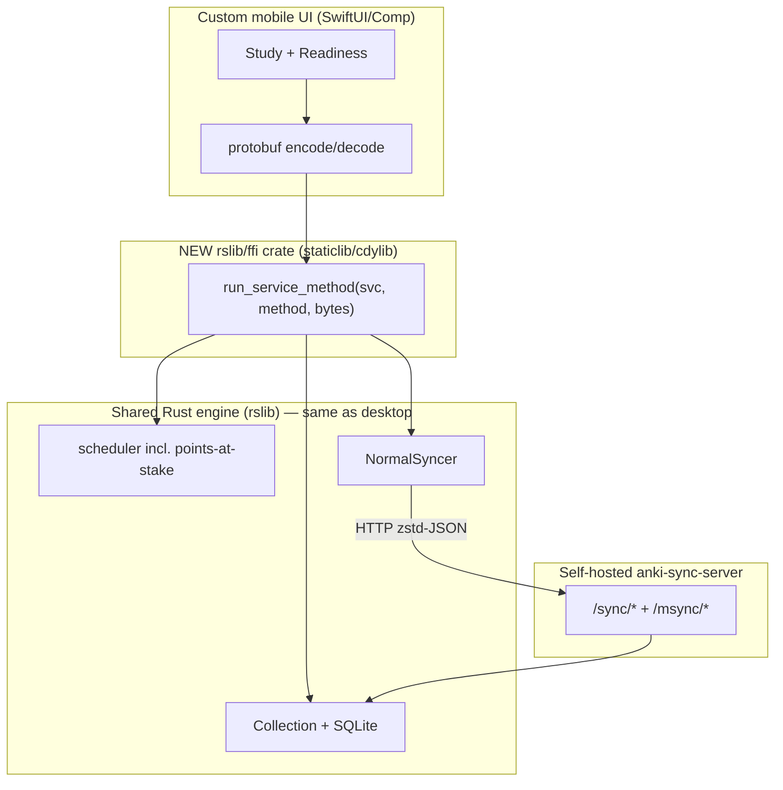
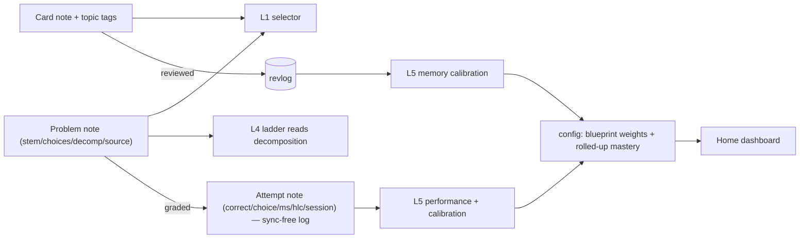
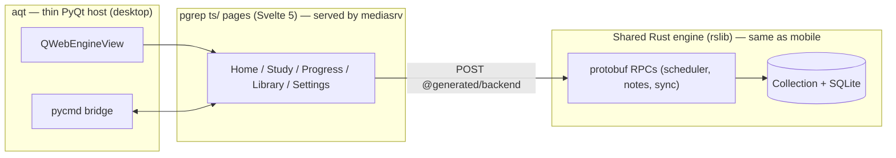

# Technical Architecture — Sync, Mobile, Desktop (Phase 4)

**Status: Phase 4 COMPLETE.** (a) mobile + (b) sync mapped (mobile = iOS-via-FFI, now implemented: SwiftUI app + `AnkiFfi.xcframework`, proven on simulator and a signed device install); (c) desktop shell + (d) data model + (e) cross-cutting designed. (d) attempt log = notes-as-log, **"A now, C-ready"**.
Shared context in `README.md`. Design/stack/dependency detail for the UI lives in `ux-foundation.md`. Unblocks build layer **L3** in `build-plan.md`.

_Grounding: exploration of the real code ([sync/mobile map](c406326e-1ffa-4583-80cd-74afb2b8f047)) + `.understand-anything/knowledge-graph.json` + cohort research (felipe's shared-engine sync report, ryan's `charged_up` iOS/FFI work, aadi's sync exploration). Cohort claims tagged _[cohort — verify]_._

## (b) Sync — reuse Anki's, self-hosted

**Finding: Anki already has a complete, self-hostable sync system in Rust (`rslib/src/sync/**`). We reuse it — no reason to build our own.**

- **Protocol:** HTTP POST, zstd-JSON. `/sync/*` (collection) + `/msync/*` (media). Methods: `meta → start(graves) → applyChanges → chunk/applyChunk (notes/cards/revlog) → sanityCheck2 → finish`; `upload`/`download` = full sync. (`rslib/src/sync/collection/`)
- **Change tracking:** **USN** (update sequence number) per object + `mod`/`scm`/`ls` timestamps; deletions via a **graves** table; client pending = `usn = -1`. Offline-first: local SQLite `collection.anki2`, engine fully offline.
- **Self-host server (in-repo!):** `anki-sync-server` binary (`rslib/sync/main.rs`, `SimpleServer` in `rslib/src/sync/http_server/`). Run: `SYNC_USER1=user:pass anki-sync-server` (or `python -m anki.syncserver`, or `--syncserver`); Docker in `docs/syncserver/`. Point clients at `customSyncUrl`. So we run our **own** sync endpoint — no AnkiWeb dependency.

### The conflict rule (spec test 7b) — adopt Anki's, document it

Anki is **not** global last-writer-wins. Per object type (`changes.rs`, `chunks.rs`):

| Object | Rule |
|---|---|
| **revlog (review history)** | **append-only, `INSERT OR IGNORE` by id** → two devices reviewing *different* cards offline both land, none lost/double-counted |
| **cards / notes** | pending-USN + **newer `mtime` wins** → same card reviewed on both → the newer review's scheduling state wins |
| notetypes / decks | newer mtime; structural count change → forced full sync |
| tags | union |
| deletions | graves exchanged first |
| schema mismatch / sanity fail | **mandatory one-way full sync** |

**Our documented winner (spec 7b):** *revlog is unioned by id (no loss/dup); for the same card, the review with the newer timestamp wins the scheduling state, with a deterministic device-id tie-break on equal timestamps.* This is Anki's real behavior, made explicit. _(felipe's cohort proposed the same rule [cohort — verify].)_

## (a) Shared engine on mobile — one FFI crate, custom UI

**Finding (updated 2026-07-03): the mobile FFI now exists.** `mobile/ios/PgrepStudy` is a **SwiftUI app driving the shared Anki Rust engine over a C ABI** (protobuf-generated Swift), built as **`AnkiFfi.xcframework`** with both `ios-arm64` (device) and `ios-arm64-simulator` slices, plus a Simulator-first `just` harness (`just ios-smoke` / `ios-run`). At design time there was none: `rslib` is an rlib; `pylib/rsbridge` is a PyO3 cdylib for Python only. The engine is driven entirely by protobuf: **`Backend::run_service_method(service_id, method_id, bytes) → bytes`**. AnkiDroid drives the *same* engine this way via `rsdroid`/JNI (`proto/anki/ankidroid.proto`, `rslib/src/ankidroid/`).

So to run the shared engine under a **custom pgrep mobile UI** (which we want — not Anki's UI):

1. Add a new crate (e.g. `rslib/ffi/`) with `crate-type = ["staticlib"/"cdylib"]` that links `anki` and exposes `init_backend` + `run_service_method` over a thin **C / UniFFI** boundary.
2. Cross-compile (Xcode for iOS `aarch64-apple-ios`; `cargo-ndk` for Android).
3. Generate Swift/Kotlin types from the same `proto/anki/*.proto`.
4. Mobile UI calls `OpenCollection`, the scheduler RPCs (incl. our points-at-stake selector), and `SyncCollection`/`FullUploadOrDownload`.

**Two platform paths:**

| Path | What you get | Cost | UI fit |
|---|---|---|---|
| **iOS via new FFI + SwiftUI** | clean custom pgrep UI; Mac-native (Xcode) | build the FFI crate + Swift bridge | ✅ custom (matches our goal) |
| **Android via AnkiDroid/`rsdroid`** | engine + a shipping app "for free" | fork/customize AnkiDroid (big app) | ✗ Anki's UI unless heavily reskinned |
| **Android via new FFI + Compose** | clean custom UI (same FFI crate) | FFI crate + Compose bridge | ✅ custom |

**Cohort head start (big):** ryan's `charged_up` (MCAT) fork already has — per its own notes _[cohort — verify]_ — a **self-hosted sync server running**, **engine conflict/dedup/offline proofs**, a **4-symbol FFI + iOS cross-compile script (`build_xcframework.sh`)**, desktop sync via `customSyncUrl`, and an **iOS SwiftUI companion scaffold** (`AnkiBridge.swift`, `SyncManager.swift`). That's a near-drop-in reference for the FFI + iOS path — which flips felipe's "defer iOS, do Android-via-AnkiDroid" recommendation: iOS-via-FFI is de-risked by a working sibling.

## Diagram

## Test recipes (spec 7b/7g) — brief

- **7b sync:** 10 cards offline on phone + 10 different on desktop → reconnect → all 20 land (revlog union). Then same card on both → reconnect → newer-mtime scheduling state wins (documented). 
- **7g crash/offline:** kill mid-review ×20 → zero corruption (SQLite transactions/WAL protect this); pull network → AI off cleanly, both apps still score.

## Decision — iOS via FFI + SwiftUI (implemented)

**Mobile platform = iOS via `AnkiFfi.xcframework` + a custom SwiftUI companion (`mobile/ios/PgrepStudy`).** Custom pgrep UI, Mac-native (Xcode). This is no longer provisional. The FFI is built (device + simulator slices), the Simulator `just` harness runs, and a **signed build has been installed and launched on a physical iPhone**.

**Signing model (verified 2026-07-03):** Simulator builds are unsigned, so the `just ios-smoke` / `ios-run` harness needs no Apple account. Device builds use **free provisioning** (a Personal Team plus a 7-day profile you Trust on the device), configured in `project.yml` so the Simulator stays unsigned and the device build is automatic-signed. The $99/yr Apple Developer Program is only needed for TestFlight and long-lived profiles, not for on-device development.

Because the FFI is shared work, **Android via the same FFI + Compose** stays a later option, and forking AnkiDroid remains the fallback.

## (d) Data model — extend Anki, ride its sync

**Principle (cohort-converged):** use **notes** for content *and* logs (they chunk-sync row-by-row with USN merge — two-way sync for free), **tags** for taxonomy, **config** only for tiny rolled-up state. Nothing custom-synced.

| Entity | Representation | Key fields |
|---|---|---|
| **Topic** | hierarchical **tags** `topic::mechanics::lagrangian` + a `config` map (tag → blueprint % + label) | — |
| **Card** (memory) | standard note + topic tags | `type` (conceptual/computational), `source_ref`, `created_by` (human/ai) |
| **Problem** (performance) | **new "Problem" notetype** → generates a schedulable card, syncs free | `stem`, `choices`, `correct`, `distractor_rationales`, `solution_decomposition` (JSON: sub-goals + rubrics for the ladder), `difficulty`, `source_ref`, `is_held_out`, `created_by`, `time_limit` |
| **Attempt** (event log) | **new "Attempt" notetype**, append-only + **immutable**, one note per graded event (**note guid = event id**), cards suspended in a hidden deck → **rides note sync**. Decided **"A now, C-ready"** (`attempt-log-storage.md`). | `event_json` (self-contained payload: `item_id`, `correct`, `selected_answer`, `response_ms`, `ladder_depth`, sub-goal productions, `answered_at`, `device_id`/HLC, `session_id`) **+ denormalized hot fields** `topic`, `correct`, `answered_at`; topic also on **tags** |
| **Exam** | an assembled problem set (query/tag) + Attempt notes tagged a timed `session_id` (no-help) | — |
| **Source** | bundled named-source corpus + `source_ref` (id + quote anchor) on items | — |
| **Derived** (per-topic mastery, readiness) | **recomputed** from the append-only log; small rolled-up snapshot in `config` | — |

**Why notes, not a custom table, for the log:** notes chunk-sync with USN conflict handling and merge cleanly; `config` is a whole-blob resend (few-KB budget); per-card `custom_data` (<100 B) only fits a last-attempt flag. So the append-only Attempt log **as notes** gives two-way sync *for free* — no custom sync code. (Cohort: stephen.zhang `PerformanceEvent`, alan.abraham `Performance Attempt`; linjian.ni explored a dedicated `attempts` table but it needs custom sync.) _[cohort — verify]_

**Cross-device:** Attempt notes union by note-id (same principle as revlog union-by-id) + `device_id`/HLC for ordering → consistent with the sync conflict rule above.

**A-now / C-ready (the log's evolution path):** the Attempt notetype is **immutable** and each note's **guid is the event id**, so the log is a clean event stream and any cache is a *pure fold of the notes*. All attempt analytics read through **one seam** — `attempts(topic, window) → [Event]` + `performance_fold(…)` — so callers (Performance/calibration L5, dashboard) never touch storage. Today that seam parses each note's `event_json` on demand (**pure A**). If it slows (~150 ms fold, or a few-thousand events), we drop in **C**: a **local, never-synced, recomputable** cache produced by the *same* fold — no caller change, no sync change, and it never touches `rslib/src/sync/**`. Capacity constraints K1–K5 in `attempt-log-storage.md`.

**How each layer uses it:** the **selector** (L1) reads topic tags + FSRS state; **forced-gen** (L4) writes Card/Problem notes with `source_ref` + `solution_decomposition`; the **ladder** (L4) reads `solution_decomposition`; **performance/calibration** (L5) folds the Attempt log; the **dashboard** reads recomputed snapshots.

### Decided (d) — attempt log = "A now, C-ready"
**Notes-as-log (A)** ships now as the synced source of truth; a **local recomputable cache (C)** is pre-engineered (K1–K5) and added only if the fold slows (flip trigger ~150 ms / few-thousand events). **Custom synced table (B) rejected** — needs risky custom sync and jeopardizes the graded R2 requirement. Full rationale + constraints: `attempt-log-storage.md`.

## (c) Desktop shell — custom `ts/` pages, `aqt` as a thin host

**Finding: the fork already hosts web UI exactly the way pgrep needs.** Anki runs a local HTTP server (**mediasrv**) that serves the built `ts/` pages at `http://localhost:40000/_anki/pages/*.html`; `aqt` (PyQt) shows them in a **`QWebEngineView`** and bridges JS↔Python via a `pycmd(...)` channel; the page talks to the Rust engine through the **same protobuf RPCs** the mobile FFI uses (POST to the backend, `@generated/backend` on the TS side). So the desktop and mobile hosts are two thin shells over **one engine + one RPC surface**.

**pgrep's desktop shell:**

1. **`aqt` = thin native host only** — window, menu, the webview widget, the `pycmd` bridge, file/OS integration, and lifecycle (open collection, sync trigger). No Anki study screens; pgrep's surfaces replace them.
2. **All UI is pgrep's own `ts/` pages** — `Home`, `Study`, `Progress`, `Library`, `Settings`, `Diagnostic` (the nav shell + surfaces in `ux-foundation.md`), built with Svelte 5 + the existing SCSS/CSS-variable theming (`.night-mode` for dark), served by mediasrv like Anki's own pages.
3. **One API, two hosts** — desktop pages and the mobile UI both call the scheduler RPCs (incl. our points-at-stake selector), read/write notes (Cards/Problems/Attempts), and drive `SyncCollection`. Parity is structural, not duplicated.
4. **Stack/deps/design are locked in `ux-foundation.md` §10** — Svelte 5 + TS, MathJax 3 (bundled), D3 7 (reliability/coverage/2D-contour), Three.js (the one net-new dep, for the manifold, with a D3 2D fallback), Inter/JetBrains Mono, Lucide. Not React, not Tailwind.

## (e) Cross-cutting — the guarantees every surface inherits

| Concern | Decision (source) |
|---|---|
| **AI-off, still scores (spec 7)** | Every feature degrades gracefully: F2 → authored/curated items + reveal-and-self-compare; F3 → stored `solution_decomposition` + self-compare; F4 → model calibration (no AI); F1 selector is pure engine logic. Both hosts run fully offline + AI-off and still produce all three scores. (`features.md`, `ux-foundation.md` §6.) |
| **Performance budgets (spec §10)** | No UI action freezes the screen > ~100 ms (`ux-foundation.md` §3.4); the L1 selector's Rust second pass is bounded to the due set; the manifold falls back to the D3 2D contour on weak/no-WebGL contexts; L6 ships a one-command benchmark on ~50k cards (p50/p95/worst). |
| **Crash + offline safety (spec 7g)** | SQLite transactions/WAL protect the collection; kill-mid-review ×20 → zero corruption; offline-first (local `collection.anki2`, engine fully offline), sync is opportunistic. The attempt log is append-only + undo-safe (notes undo; the future C cache is recomputable). |
| **Reproducible eval (spec 4/6)** | Held-out splits + fixed seeds + a gold-set gate + a named-baseline comparison, run by one command. Owned by the eval harness (`build-plan.md` L4.0/L5). Methodology now has its own doc, `statistics-and-evaluation.md`. |
| **Secrets + privacy** | LLM API keys live in Settings / OS secure storage — **never synced, never committed, never in notes**. Self-hosted sync auth via `SYNC_USER1=user:pass`. User data stays local-first; the sync server is ours (no AnkiWeb). |
| **Licensing / attribution (spec 9)** | The fork stays **AGPL-3.0-or-later**, credits Anki. Added deps are AGPL-compatible (Three.js MIT, Inter/JetBrains Mono OFL, Lucide ISC — `ux-foundation.md` §10). |
| **Packaging / installers (spec 8)** | Desktop installer (Briefcase templates in `qt/installer/`) + phone build (iOS TestFlight/sideload). Owned by **L6**; external accounts/signing in `../reference/content-and-dependencies.md`. |

_Sources: exploration agent c406326e; `.understand-anything/knowledge-graph.json`; `rslib/src/sync/**`, `rslib/src/ankidroid/**`, `proto/anki/{sync,ankidroid}.proto`, `docs/syncserver/`, `docs/architecture.md`; cohort chats (felipe shared-engine-sync; ryan charged_up iOS/FFI; aadi sync exploration). Spec §3, 7b, 7g._
